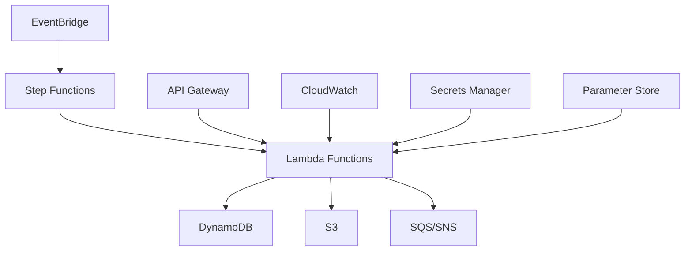

# Diretrizes de Desenvolvimento AWS - DATAMETRIA

<div align="center">

**Versão**: 1.0 | **Última Atualização**: 08/08/2025

[](https://aws.amazon.com) [](https://aws.amazon.com/cdk) [](https://aws.amazon.com/lambda)

[🔗 AWS CDK](https://aws.amazon.com/cdk/) • [🔗 Lambda](https://aws.amazon.com/lambda/) • [🔗 Step Functions](https://aws.amazon.com/step-functions/)

</div>

---

## 📋 Índice

1. [Visão Geral](#1-visão-geral)
2. [AWS Lambda](#2-aws-lambda)
3. [AWS CDK](#3-aws-cdk)
4. [Orquestração de Serviços](#4-orquestração-de-serviços)
5. [Segurança e Compliance](#5-segurança-e-compliance)
6. [Monitoramento e Observabilidade](#6-monitoramento-e-observabilidade)
7. [FinOps e Otimização](#7-finops-e-otimização)
8. [CI/CD para AWS](#8-cicd-para-aws)
9. [Checklist AWS](#9-checklist-aws)

---

## 1. Visão Geral

### 🎯 Objetivo

Estabelecer diretrizes para desenvolvimento de soluções AWS usando Python, com foco em Lambda, CDK, orquestração de serviços e melhores práticas de cloud computing.

### 🏗️ Arquitetura de Referência



### 📊 Princípios AWS

| Princípio | Descrição | Implementação |
|-----------|-----------|---------------|
| **⚡ Serverless First** | Priorizar serviços serverless | Lambda, DynamoDB, S3 |
| **🔄 Event-Driven** | Arquitetura orientada a eventos | EventBridge, SQS, SNS |
| **🔒 Security by Design** | Segurança desde o início | IAM, Secrets Manager |
| **💰 Cost Optimization** | Otimização contínua de custos | Right-sizing, monitoring |
| **📈 Observability** | Monitoramento completo | CloudWatch, X-Ray |

---

## 2. AWS Lambda

### 2.1. Estrutura de Função Lambda

#### Handler Otimizado
```python
# src/aws/lambda_handler.py
import json
import logging
from typing import Dict, Any
from pydantic import BaseModel, ValidationError

# Configurar logging
logger = logging.getLogger()
logger.setLevel(logging.INFO)

class LambdaRequest(BaseModel):
    """Modelo de request para Lambda."""
    action: str
    parameters: Dict[str, Any] = {}

class LambdaResponse(BaseModel):
    """Modelo de response para Lambda."""
    success: bool
    message: str
    data: Dict[str, Any] = {}

def lambda_handler(event: Dict[str, Any], context) -> Dict[str, Any]:
    """Handler principal da função Lambda."""
    try:
        # Validar entrada
        request = LambdaRequest(**event)
        
        # Processar ação
        result = process_action(request.action, request.parameters)
        
        # Retornar resposta
        response = LambdaResponse(
            success=True,
            message="Processado com sucesso",
            data=result
        )
        
        return response.dict()
        
    except ValidationError as e:
        logger.error(f"Erro de validação: {e}")
        return LambdaResponse(
            success=False,
            message=f"Dados inválidos: {e}"
        ).dict()
        
    except Exception as e:
        logger.error(f"Erro não tratado: {e}")
        return LambdaResponse(
            success=False,
            message="Erro interno do servidor"
        ).dict()

def process_action(action: str, parameters: Dict[str, Any]) -> Dict[str, Any]:
    """Processa ação específica."""
    actions = {
        "process_data": process_business_data,
        "send_notification": send_notification,
        "generate_report": generate_report
    }
    
    if action not in actions:
        raise ValueError(f"Ação não suportada: {action}")
    
    return actions[action](parameters)
```

### 2.2. Performance e Otimização

#### Cold Start Optimization
```python
# src/aws/optimized_handler.py
import boto3
import json
from typing import Dict, Any

# Inicializar clientes fora do handler (reutilização)
dynamodb = boto3.resource('dynamodb')
s3_client = boto3.client('s3')
secrets_client = boto3.client('secretsmanager')

# Cache para configurações
_config_cache = {}

def lambda_handler(event: Dict[str, Any], context) -> Dict[str, Any]:
    """Handler otimizado para cold starts."""
    
    # Usar conexões reutilizadas
    table = dynamodb.Table('ProcessingTable')
    
    # Cache de configurações
    config = get_cached_config()
    
    # Processar evento
    result = process_with_optimizations(event, table, config)
    
    return {
        'statusCode': 200,
        'body': json.dumps(result)
    }

def get_cached_config() -> Dict[str, Any]:
    """Obtém configuração com cache."""
    if not _config_cache:
        response = secrets_client.get_secret_value(
            SecretId='app/config'
        )
        _config_cache.update(json.loads(response['SecretString']))
    
    return _config_cache
```

### 2.3. Tratamento de Erros

#### Error Handling Strategy
```python
# src/aws/error_handler.py
import logging
from enum import Enum
from typing import Dict, Any, Optional

class ErrorType(Enum):
    VALIDATION = "validation_error"
    BUSINESS = "business_error"
    INTEGRATION = "integration_error"
    SYSTEM = "system_error"

class LambdaError(Exception):
    """Exceção customizada para Lambda."""
    
    def __init__(self, error_type: ErrorType, message: str, details: Optional[Dict] = None):
        self.error_type = error_type
        self.message = message
        self.details = details or {}
        super().__init__(message)

def handle_lambda_error(func):
    """Decorador para tratamento de erros."""
    def wrapper(event, context):
        try:
            return func(event, context)
        except LambdaError as e:
            logging.error(f"{e.error_type.value}: {e.message}", extra=e.details)
            return {
                'statusCode': 400 if e.error_type == ErrorType.VALIDATION else 500,
                'body': json.dumps({
                    'error': e.error_type.value,
                    'message': e.message
                })
            }
        except Exception as e:
            logging.error(f"Erro não tratado: {str(e)}")
            return {
                'statusCode': 500,
                'body': json.dumps({
                    'error': 'internal_error',
                    'message': 'Erro interno do servidor'
                })
            }
    return wrapper
```

### 2.4. Testes Lambda

#### Unit Tests
```python
# tests/test_lambda_handler.py
import pytest
import json
from unittest.mock import Mock, patch
from src.aws.lambda_handler import lambda_handler

class TestLambdaHandler:
    """Testes para handler Lambda."""
    
    def test_successful_processing(self):
        """Testa processamento bem-sucedido."""
        # Arrange
        event = {
            "action": "process_data",
            "parameters": {"data": "test"}
        }
        context = Mock()
        
        # Act
        with patch('src.aws.lambda_handler.process_action') as mock_process:
            mock_process.return_value = {"result": "success"}
            response = lambda_handler(event, context)
        
        # Assert
        assert response['success'] is True
        assert response['data']['result'] == "success"
    
    def test_validation_error(self):
        """Testa erro de validação."""
        # Arrange
        event = {"invalid": "data"}
        context = Mock()
        
        # Act
        response = lambda_handler(event, context)
        
        # Assert
        assert response['success'] is False
        assert "Dados inválidos" in response['message']
    
    @patch('boto3.client')
    def test_integration_with_aws(self, mock_boto):
        """Testa integração com serviços AWS."""
        # Arrange
        mock_client = Mock()
        mock_boto.return_value = mock_client
        
        event = {
            "action": "send_notification",
            "parameters": {"message": "test"}
        }
        
        # Act & Assert
        response = lambda_handler(event, Mock())
        assert response['success'] is True
```

---

## 3. AWS CDK

### 3.1. Estrutura de Projeto CDK

#### Organização de Stacks
```
infrastructure/
├── app.py                      # Entry point CDK
├── requirements.txt            # Dependências CDK
├── stacks/
│   ├── __init__.py
│   ├── compute_stack.py        # Lambda functions
│   ├── storage_stack.py        # DynamoDB, S3
│   ├── messaging_stack.py      # SQS, SNS, EventBridge
│   └── monitoring_stack.py     # CloudWatch, alarms
├── constructs/
│   ├── __init__.py
│   ├── lambda_construct.py     # Lambda reutilizável
│   └── api_construct.py        # API Gateway
└── config/
    ├── dev.py                  # Config desenvolvimento
    ├── staging.py              # Config staging
    └── prod.py                 # Config produção
```

#### Stack Principal
```python
# infrastructure/stacks/compute_stack.py
from aws_cdk import (
    Stack,
    aws_lambda as _lambda,
    aws_iam as iam,
    Duration,
    RemovalPolicy
)
from constructs import Construct
from typing import Dict, Any

class ComputeStack(Stack):
    """Stack de recursos computacionais."""
    
    def __init__(self, scope: Construct, construct_id: str, config: Dict[str, Any], **kwargs):
        super().__init__(scope, construct_id, **kwargs)
        
        self.config = config
        
        # Criar role IAM
        self.lambda_role = self._create_lambda_role()
        
        # Criar funções Lambda
        self.processor_lambda = self._create_processor_lambda()
        self.notifier_lambda = self._create_notifier_lambda()
    
    def _create_lambda_role(self) -> iam.Role:
        """Cria role IAM para Lambda."""
        return iam.Role(
            self, "LambdaExecutionRole",
            assumed_by=iam.ServicePrincipal("lambda.amazonaws.com"),
            managed_policies=[
                iam.ManagedPolicy.from_aws_managed_policy_name(
                    "service-role/AWSLambdaBasicExecutionRole"
                )
            ],
            inline_policies={
                "DynamoDBAccess": iam.PolicyDocument(
                    statements=[
                        iam.PolicyStatement(
                            effect=iam.Effect.ALLOW,
                            actions=[
                                "dynamodb:GetItem",
                                "dynamodb:PutItem",
                                "dynamodb:UpdateItem",
                                "dynamodb:DeleteItem",
                                "dynamodb:Query",
                                "dynamodb:Scan"
                            ],
                            resources=[f"arn:aws:dynamodb:*:*:table/{self.config['table_name']}"]
                        )
                    ]
                )
            }
        )
    
    def _create_processor_lambda(self) -> _lambda.Function:
        """Cria função Lambda de processamento."""
        return _lambda.Function(
            self, "ProcessorFunction",
            runtime=_lambda.Runtime.PYTHON_3_10,
            handler="lambda_handler.lambda_handler",
            code=_lambda.Code.from_asset("../src"),
            role=self.lambda_role,
            timeout=Duration.minutes(5),
            memory_size=512,
            environment={
                "TABLE_NAME": self.config['table_name'],
                "LOG_LEVEL": self.config['log_level']
            },
            dead_letter_queue_enabled=True,
            retry_attempts=2
        )
```

### 3.2. Constructs Reutilizáveis

#### Lambda Construct
```python
# infrastructure/constructs/lambda_construct.py
from aws_cdk import (
    aws_lambda as _lambda,
    aws_iam as iam,
    aws_logs as logs,
    Duration,
    RemovalPolicy
)
from constructs import Construct
from typing import Dict, List, Optional

class StandardLambda(Construct):
    """Construct padrão para funções Lambda."""
    
    def __init__(
        self,
        scope: Construct,
        construct_id: str,
        handler: str,
        code_path: str,
        environment: Optional[Dict[str, str]] = None,
        timeout_minutes: int = 5,
        memory_size: int = 512,
        additional_policies: Optional[List[iam.PolicyStatement]] = None
    ):
        super().__init__(scope, construct_id)
        
        # Criar role IAM
        self.role = self._create_role(additional_policies or [])
        
        # Criar função Lambda
        self.function = _lambda.Function(
            self, "Function",
            runtime=_lambda.Runtime.PYTHON_3_10,
            handler=handler,
            code=_lambda.Code.from_asset(code_path),
            role=self.role,
            timeout=Duration.minutes(timeout_minutes),
            memory_size=memory_size,
            environment=environment or {},
            dead_letter_queue_enabled=True,
            retry_attempts=2
        )
        
        # Configurar logs
        self._setup_logging()
    
    def _create_role(self, additional_policies: List[iam.PolicyStatement]) -> iam.Role:
        """Cria role IAM com políticas padrão."""
        statements = [
            # CloudWatch Logs
            iam.PolicyStatement(
                effect=iam.Effect.ALLOW,
                actions=[
                    "logs:CreateLogGroup",
                    "logs:CreateLogStream",
                    "logs:PutLogEvents"
                ],
                resources=["*"]
            ),
            # X-Ray
            iam.PolicyStatement(
                effect=iam.Effect.ALLOW,
                actions=[
                    "xray:PutTraceSegments",
                    "xray:PutTelemetryRecords"
                ],
                resources=["*"]
            )
        ]
        
        statements.extend(additional_policies)
        
        return iam.Role(
            self, "Role",
            assumed_by=iam.ServicePrincipal("lambda.amazonaws.com"),
            inline_policies={
                "LambdaPolicy": iam.PolicyDocument(statements=statements)
            }
        )
    
    def _setup_logging(self):
        """Configura logging para Lambda."""
        logs.LogGroup(
            self, "LogGroup",
            log_group_name=f"/aws/lambda/{self.function.function_name}",
            retention=logs.RetentionDays.ONE_MONTH,
            removal_policy=RemovalPolicy.DESTROY
        )
```

---

## 4. Orquestração de Serviços

### 4.1. Step Functions

#### State Machine Definition
```python
# infrastructure/stacks/orchestration_stack.py
from aws_cdk import (
    Stack,
    aws_stepfunctions as sfn,
    aws_stepfunctions_tasks as tasks,
    aws_lambda as _lambda,
    Duration
)
from constructs import Construct

class OrchestrationStack(Stack):
    """Stack de orquestração com Step Functions."""
    
    def __init__(self, scope: Construct, construct_id: str, lambda_functions: Dict[str, _lambda.Function], **kwargs):
        super().__init__(scope, construct_id, **kwargs)
        
        self.lambda_functions = lambda_functions
        self.state_machine = self._create_state_machine()
    
    def _create_state_machine(self) -> sfn.StateMachine:
        """Cria máquina de estados."""
        
        # Definir tarefas
        validate_input = tasks.LambdaInvoke(
            self, "ValidateInput",
            lambda_function=self.lambda_functions['validator'],
            payload=sfn.TaskInput.from_object({
                "input": sfn.JsonPath.string_at("$")
            }),
            result_path="$.validation"
        )
        
        process_data = tasks.LambdaInvoke(
            self, "ProcessData",
            lambda_function=self.lambda_functions['processor'],
            payload=sfn.TaskInput.from_object({
                "data": sfn.JsonPath.string_at("$.input"),
                "validation": sfn.JsonPath.string_at("$.validation")
            }),
            result_path="$.processing"
        )
        
        send_notification = tasks.LambdaInvoke(
            self, "SendNotification",
            lambda_function=self.lambda_functions['notifier'],
            payload=sfn.TaskInput.from_object({
                "result": sfn.JsonPath.string_at("$.processing")
            })
        )
        
        # Definir condições
        validation_choice = sfn.Choice(self, "ValidationChoice")
        
        validation_success = sfn.Condition.boolean_equals("$.validation.valid", True)
        
        # Definir fluxo
        definition = validate_input.next(
            validation_choice
            .when(validation_success, process_data.next(send_notification))
            .otherwise(sfn.Fail(self, "ValidationFailed", cause="Input validation failed"))
        )
        
        # Adicionar tratamento de erro
        definition.add_retry(
            errors=["States.TaskFailed"],
            interval=Duration.seconds(30),
            max_attempts=3,
            backoff_rate=2.0
        )
        
        return sfn.StateMachine(
            self, "ProcessingStateMachine",
            definition=definition,
            timeout=Duration.hours(1)
        )
```

### 4.2. EventBridge

#### Event Rules
```python
# infrastructure/stacks/messaging_stack.py
from aws_cdk import (
    Stack,
    aws_events as events,
    aws_events_targets as targets,
    aws_stepfunctions as sfn,
    aws_lambda as _lambda
)
from constructs import Construct

class MessagingStack(Stack):
    """Stack de mensageria e eventos."""
    
    def __init__(self, scope: Construct, construct_id: str, **kwargs):
        super().__init__(scope, construct_id, **kwargs)
        
        # Criar custom event bus
        self.event_bus = events.EventBus(
            self, "CustomEventBus",
            event_bus_name="datametria-events"
        )
        
        # Criar regras de eventos
        self._create_event_rules()
    
    def _create_event_rules(self):
        """Cria regras de eventos."""
        
        # Regra para processamento diário
        daily_rule = events.Rule(
            self, "DailyProcessingRule",
            event_bus=self.event_bus,
            schedule=events.Schedule.cron(
                hour="9",
                minute="0"
            ),
            description="Trigger daily processing"
        )
        
        # Regra para eventos customizados
        custom_rule = events.Rule(
            self, "CustomEventRule",
            event_bus=self.event_bus,
            event_pattern=events.EventPattern(
                source=["datametria.automation"],
                detail_type=["Processing Request"],
                detail={
                    "status": ["pending"]
                }
            )
        )
        
        # Adicionar targets (será configurado externamente)
        return daily_rule, custom_rule
```

### 4.3. SQS e SNS

#### Messaging Infrastructure
```python
# infrastructure/stacks/messaging_stack.py (continuação)
from aws_cdk import (
    aws_sqs as sqs,
    aws_sns as sns,
    aws_sns_subscriptions as subscriptions,
    Duration
)

class MessagingStack(Stack):
    """Stack de mensageria."""
    
    def _create_queues_and_topics(self):
        """Cria filas e tópicos."""
        
        # Dead Letter Queue
        dlq = sqs.Queue(
            self, "ProcessingDLQ",
            queue_name="processing-dlq",
            retention_period=Duration.days(14)
        )
        
        # Fila principal
        processing_queue = sqs.Queue(
            self, "ProcessingQueue",
            queue_name="processing-queue",
            visibility_timeout=Duration.minutes(5),
            dead_letter_queue=sqs.DeadLetterQueue(
                max_receive_count=3,
                queue=dlq
            )
        )
        
        # Tópico SNS
        notification_topic = sns.Topic(
            self, "NotificationTopic",
            topic_name="processing-notifications"
        )
        
        # Subscription email
        notification_topic.add_subscription(
            subscriptions.EmailSubscription("admin@datametria.io")
        )
        
        # Subscription SQS
        notification_topic.add_subscription(
            subscriptions.SqsSubscription(processing_queue)
        )
        
        return processing_queue, notification_topic, dlq
```

---

## 5. Segurança e Compliance

### 5.1. IAM Policies

#### Least Privilege Principle
```python
# infrastructure/security/iam_policies.py
from aws_cdk import aws_iam as iam
from typing import List

class SecurityPolicies:
    """Políticas de segurança padronizadas."""
    
    @staticmethod
    def lambda_dynamodb_policy(table_arn: str) -> iam.PolicyStatement:
        """Política para Lambda acessar DynamoDB."""
        return iam.PolicyStatement(
            effect=iam.Effect.ALLOW,
            actions=[
                "dynamodb:GetItem",
                "dynamodb:PutItem",
                "dynamodb:UpdateItem",
                "dynamodb:DeleteItem",
                "dynamodb:Query"
            ],
            resources=[table_arn, f"{table_arn}/index/*"]
        )
    
    @staticmethod
    def lambda_secrets_policy(secret_arn: str) -> iam.PolicyStatement:
        """Política para Lambda acessar Secrets Manager."""
        return iam.PolicyStatement(
            effect=iam.Effect.ALLOW,
            actions=["secretsmanager:GetSecretValue"],
            resources=[secret_arn]
        )
    
    @staticmethod
    def lambda_s3_policy(bucket_arn: str) -> iam.PolicyStatement:
        """Política para Lambda acessar S3."""
        return iam.PolicyStatement(
            effect=iam.Effect.ALLOW,
            actions=[
                "s3:GetObject",
                "s3:PutObject",
                "s3:DeleteObject"
            ],
            resources=[f"{bucket_arn}/*"]
        )
```

### 5.2. Secrets Management

#### Secrets Manager Integration
```python
# src/aws/secrets_manager.py
import boto3
import json
from typing import Dict, Any
from functools import lru_cache

class SecretsManager:
    """Gerenciador de secrets."""
    
    def __init__(self):
        self.client = boto3.client('secretsmanager')
    
    @lru_cache(maxsize=10)
    def get_secret(self, secret_name: str) -> Dict[str, Any]:
        """Obtém secret com cache."""
        try:
            response = self.client.get_secret_value(SecretId=secret_name)
            return json.loads(response['SecretString'])
        except Exception as e:
            logger.error(f"Erro ao obter secret {secret_name}: {e}")
            raise
    
    def get_database_credentials(self) -> Dict[str, str]:
        """Obtém credenciais do banco."""
        return self.get_secret('database/credentials')
    
    def get_api_keys(self) -> Dict[str, str]:
        """Obtém chaves de API."""
        return self.get_secret('api/keys')
```

---

## 6. Monitoramento e Observabilidade

### 6.1. CloudWatch

#### Logging Estruturado
```python
# src/aws/structured_logger.py
import json
import logging
from datetime import datetime
from typing import Dict, Any, Optional

class StructuredLogger:
    """Logger estruturado para AWS."""
    
    def __init__(self, name: str, level: str = "INFO"):
        self.logger = logging.getLogger(name)
        self.logger.setLevel(getattr(logging, level))
        
        # Configurar handler se não existir
        if not self.logger.handlers:
            handler = logging.StreamHandler()
            handler.setFormatter(logging.Formatter('%(message)s'))
            self.logger.addHandler(handler)
    
    def info(self, message: str, **kwargs):
        """Log de informação."""
        self._log("INFO", message, **kwargs)
    
    def error(self, message: str, error: Optional[Exception] = None, **kwargs):
        """Log de erro."""
        if error:
            kwargs['error_type'] = type(error).__name__
            kwargs['error_message'] = str(error)
        self._log("ERROR", message, **kwargs)
    
    def _log(self, level: str, message: str, **kwargs):
        """Log estruturado interno."""
        log_entry = {
            "timestamp": datetime.utcnow().isoformat(),
            "level": level,
            "message": message,
            **kwargs
        }
        
        self.logger.log(
            getattr(logging, level),
            json.dumps(log_entry, default=str)
        )
```

### 6.2. Métricas Customizadas

#### CloudWatch Metrics
```python
# src/aws/metrics.py
import boto3
from datetime import datetime
from typing import Dict, Any

class MetricsPublisher:
    """Publicador de métricas customizadas."""
    
    def __init__(self, namespace: str = "DATAMETRIA/Automation"):
        self.cloudwatch = boto3.client('cloudwatch')
        self.namespace = namespace
    
    def put_metric(self, metric_name: str, value: float, unit: str = "Count", dimensions: Dict[str, str] = None):
        """Publica métrica customizada."""
        try:
            self.cloudwatch.put_metric_data(
                Namespace=self.namespace,
                MetricData=[
                    {
                        'MetricName': metric_name,
                        'Value': value,
                        'Unit': unit,
                        'Timestamp': datetime.utcnow(),
                        'Dimensions': [
                            {'Name': k, 'Value': v}
                            for k, v in (dimensions or {}).items()
                        ]
                    }
                ]
            )
        except Exception as e:
            logger.error(f"Erro ao publicar métrica {metric_name}: {e}")
    
    def record_processing_time(self, function_name: str, duration_ms: float):
        """Registra tempo de processamento."""
        self.put_metric(
            "ProcessingDuration",
            duration_ms,
            "Milliseconds",
            {"FunctionName": function_name}
        )
    
    def record_error(self, function_name: str, error_type: str):
        """Registra erro."""
        self.put_metric(
            "ErrorCount",
            1,
            "Count",
            {"FunctionName": function_name, "ErrorType": error_type}
        )
```

---

## 7. FinOps e Otimização

### 7.1. Cost Monitoring

#### Cost Tracking
```python
# src/aws/cost_monitor.py
import boto3
from datetime import datetime, timedelta
from typing import Dict, List

class CostMonitor:
    """Monitor de custos AWS."""
    
    def __init__(self):
        self.ce_client = boto3.client('ce')
        self.cloudwatch = boto3.client('cloudwatch')
    
    def get_lambda_costs(self, days: int = 30) -> Dict:
        """Obtém custos das funções Lambda."""
        end_date = datetime.now().date()
        start_date = end_date - timedelta(days=days)
        
        response = self.ce_client.get_cost_and_usage(
            TimePeriod={
                'Start': start_date.strftime('%Y-%m-%d'),
                'End': end_date.strftime('%Y-%m-%d')
            },
            Granularity='DAILY',
            Metrics=['BlendedCost'],
            GroupBy=[
                {
                    'Type': 'DIMENSION',
                    'Key': 'SERVICE'
                }
            ],
            Filter={
                'Dimensions': {
                    'Key': 'SERVICE',
                    'Values': ['AWS Lambda']
                }
            }
        )
        
        return self._process_cost_data(response)
    
    def create_cost_alert(self, threshold: float):
        """Cria alerta de custo."""
        self.cloudwatch.put_metric_alarm(
            AlarmName='LambdaCostAlert',
            ComparisonOperator='GreaterThanThreshold',
            EvaluationPeriods=1,
            MetricName='EstimatedCharges',
            Namespace='AWS/Billing',
            Period=86400,
            Statistic='Maximum',
            Threshold=threshold,
            ActionsEnabled=True,
            AlarmDescription='Alerta de custo Lambda'
        )
```

### 7.2. Resource Optimization

#### Lambda Right-Sizing
```python
# scripts/lambda_optimizer.py
import boto3
import json
from typing import Dict, List

class LambdaOptimizer:
    """Otimizador de recursos Lambda."""
    
    def __init__(self):
        self.lambda_client = boto3.client('lambda')
        self.logs_client = boto3.client('logs')
    
    def analyze_memory_usage(self, function_name: str, days: int = 7) -> Dict:
        """Analisa uso de memória da função."""
        
        # Obter logs de execução
        log_group = f"/aws/lambda/{function_name}"
        
        response = self.logs_client.filter_log_events(
            logGroupName=log_group,
            startTime=int((datetime.now() - timedelta(days=days)).timestamp() * 1000),
            filterPattern="[timestamp, requestId, billedDuration, memorySize, maxMemoryUsed]"
        )
        
        memory_usage = []
        for event in response['events']:
            # Parse memory usage from log message
            if "Max Memory Used:" in event['message']:
                # Extract memory values
                pass
        
        return {
            'current_memory': self._get_function_memory(function_name),
            'average_usage': sum(memory_usage) / len(memory_usage) if memory_usage else 0,
            'recommendation': self._calculate_optimal_memory(memory_usage)
        }
    
    def _get_function_memory(self, function_name: str) -> int:
        """Obtém configuração atual de memória."""
        response = self.lambda_client.get_function_configuration(
            FunctionName=function_name
        )
        return response['MemorySize']
```

---

## 8. CI/CD para AWS

### 8.1. GitHub Actions

#### AWS Deployment Pipeline
```yaml
# .github/workflows/aws-deploy.yml
name: AWS Deployment

on:
  push:
    branches: [main]
    paths: ['src/**', 'infrastructure/**']

env:
  AWS_REGION: us-east-1

jobs:
  test:
    runs-on: ubuntu-latest
    steps:
      - uses: actions/checkout@v4
      
      - name: Setup Python
        uses: actions/setup-python@v4
        with:
          python-version: '3.10'
      
      - name: Install dependencies
        run: |
          pip install poetry
          poetry install
      
      - name: Run tests
        run: poetry run pytest tests/
      
      - name: Security scan
        run: poetry run bandit -r src/

  deploy-infrastructure:
    needs: test
    runs-on: ubuntu-latest
    steps:
      - uses: actions/checkout@v4
      
      - name: Setup Node.js
        uses: actions/setup-node@v4
        with:
          node-version: '18'
      
      - name: Install CDK
        run: npm install -g aws-cdk
      
      - name: Setup Python for CDK
        uses: actions/setup-python@v4
        with:
          python-version: '3.10'
      
      - name: Install CDK dependencies
        run: |
          cd infrastructure
          pip install -r requirements.txt
      
      - name: CDK diff
        run: |
          cd infrastructure
          cdk diff
        env:
          AWS_ACCESS_KEY_ID: ${{ secrets.AWS_ACCESS_KEY_ID }}
          AWS_SECRET_ACCESS_KEY: ${{ secrets.AWS_SECRET_ACCESS_KEY }}
      
      - name: CDK deploy
        run: |
          cd infrastructure
          cdk deploy --require-approval never
        env:
          AWS_ACCESS_KEY_ID: ${{ secrets.AWS_ACCESS_KEY_ID }}
          AWS_SECRET_ACCESS_KEY: ${{ secrets.AWS_SECRET_ACCESS_KEY }}

  deploy-functions:
    needs: [test, deploy-infrastructure]
    runs-on: ubuntu-latest
    steps:
      - uses: actions/checkout@v4
      
      - name: Package Lambda
        run: |
          cd src
          zip -r ../lambda-package.zip .
      
      - name: Update Lambda functions
        run: |
          aws lambda update-function-code \
            --function-name ProcessorFunction \
            --zip-file fileb://lambda-package.zip
        env:
          AWS_ACCESS_KEY_ID: ${{ secrets.AWS_ACCESS_KEY_ID }}
          AWS_SECRET_ACCESS_KEY: ${{ secrets.AWS_SECRET_ACCESS_KEY }}
          AWS_DEFAULT_REGION: ${{ env.AWS_REGION }}
```

---

## 9. Checklist AWS

### 9.1. Desenvolvimento

#### Lambda Functions
- [ ] Handler separado da lógica de negócio
- [ ] Validação de entrada com Pydantic
- [ ] Logging estruturado implementado
- [ ] Tratamento de erros robusto
- [ ] Timeout e memória otimizados
- [ ] Dead Letter Queue configurada
- [ ] Testes unitários > 85% cobertura

#### CDK Infrastructure
- [ ] Stacks organizados por domínio
- [ ] Constructs reutilizáveis criados
- [ ] IAM policies com least privilege
- [ ] Secrets Manager para credenciais
- [ ] Tags aplicadas a todos os recursos
- [ ] Removal policies definidas

### 9.2. Segurança

#### IAM e Permissions
- [ ] Princípio do menor privilégio aplicado
- [ ] Roles específicas por função
- [ ] Policies inline documentadas
- [ ] Cross-account access controlado
- [ ] MFA habilitado para usuários

#### Data Protection
- [ ] Encryption at rest habilitado
- [ ] Encryption in transit configurado
- [ ] Secrets Manager para credenciais
- [ ] Parameter Store para configurações
- [ ] VPC endpoints quando necessário

### 9.3. Monitoramento

#### CloudWatch
- [ ] Logs estruturados implementados
- [ ] Métricas customizadas definidas
- [ ] Alarmes configurados
- [ ] Dashboards criados
- [ ] Log retention configurado

#### Observability
- [ ] X-Ray tracing habilitado
- [ ] Distributed tracing implementado
- [ ] Error tracking configurado
- [ ] Performance monitoring ativo
- [ ] Cost monitoring implementado

### 9.4. FinOps

#### Cost Optimization
- [ ] Right-sizing de recursos
- [ ] Reserved instances avaliadas
- [ ] Spot instances quando apropriado
- [ ] Lifecycle policies para S3
- [ ] Cost alerts configurados

#### Resource Management
- [ ] Tags de cost allocation aplicadas
- [ ] Resource cleanup automatizado
- [ ] Unused resources identificados
- [ ] Cost reports automatizados
- [ ] Budget alerts configurados

---

## Versionamento do Documento

| Versão | Data | Alterações | Autor |
|--------|------|------------|-------|
| 1.0 | 08/08/2025 | Versão inicial - Separação do conteúdo AWS | Vander Loto |

---

## Manutenção

- **Revisão trimestral**: Atualização de serviços e práticas AWS
- **Feedback contínuo**: Melhorias baseadas no uso prático
- **Sincronização**: Alinhamento com AWS Well-Architected Framework

**Próxima revisão**: 08/11/2025  
**Responsável**: Cloud Architect  
**Aprovação**: CTO