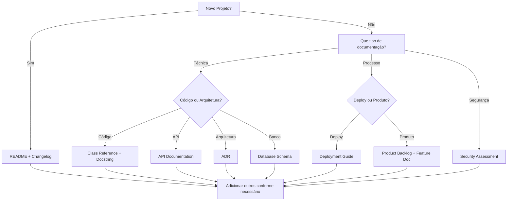
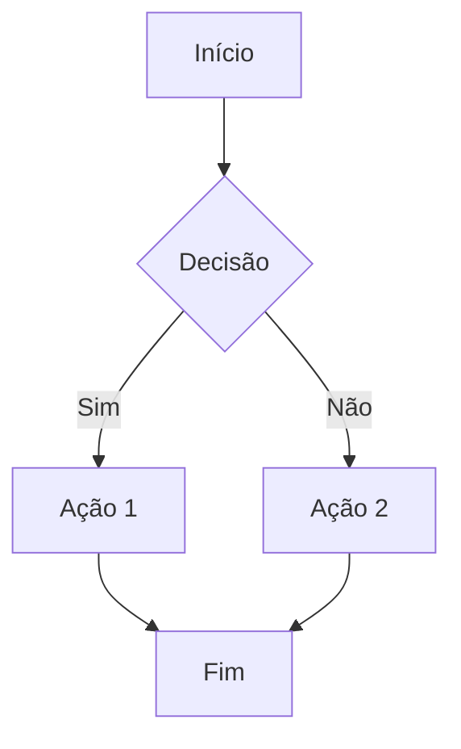
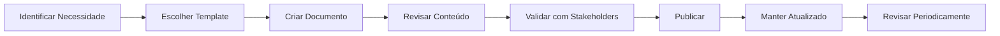
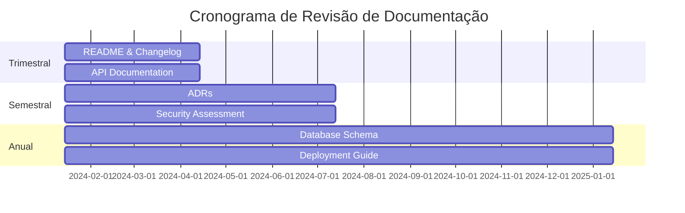
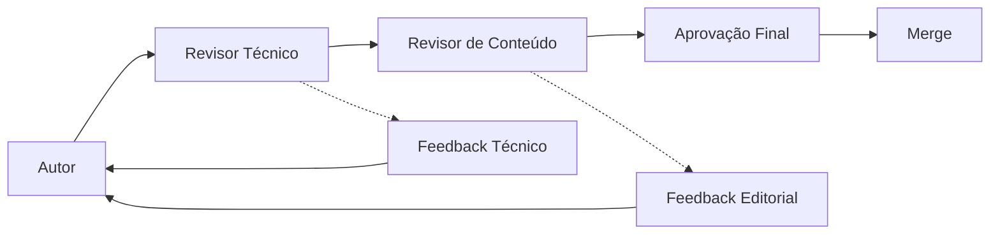
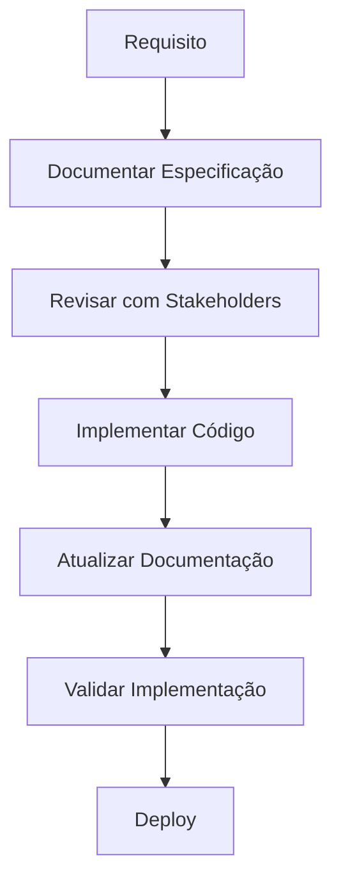

# Diretrizes de Documentação - Projetos DATAMETRIA

Este documento estabelece as diretrizes e melhores práticas de documentação para projetos da Datametria. O objetivo é promover a consistência, qualidade e padronização da documentação em todos os projetos da organização.

**Versão:** 1.0  
**Última atualização:** 08/08/2025  
**Autor:** Vander Loto - DATAMETRIA

---

## Índice

1. [Filosofia de Documentação](#1-filosofia-de-documentação)
2. [Templates Disponíveis](#2-templates-disponíveis)
3. [Quando Usar Cada Template](#3-quando-usar-cada-template)
4. [Estrutura de Documentação](#4-estrutura-de-documentação)
5. [Padrões de Escrita](#5-padrões-de-escrita)
6. [Processo de Documentação](#6-processo-de-documentação)
7. [Ferramentas e Automação](#7-ferramentas-e-automação)
8. [Manutenção e Versionamento](#8-manutenção-e-versionamento)
9. [Qualidade e Revisão](#9-qualidade-e-revisão)
10. [Integração com Desenvolvimento](#10-integração-com-desenvolvimento)
11. [Checklist de Documentação](#11-checklist-de-documentação)

---

## 1. Filosofia de Documentação

### Princípios Fundamentais

- **📖 Documentação como Código**: Tratada com a mesma importância que o código-fonte
- **🎯 Orientada ao Usuário**: Focada nas necessidades de quem vai usar
- **🔄 Viva e Atualizada**: Mantida sincronizada com o desenvolvimento
- **📱 Acessível**: Fácil de encontrar, ler e entender
- **🏗️ Estruturada**: Organizada de forma lógica e consistente

### Objetivos

| Objetivo | Descrição | Benefício |
|----------|-----------|-----------|
| **Consistência** | Padronização em todos os projetos | Reduz curva de aprendizado |
| **Qualidade** | Documentação clara e completa | Facilita manutenção e evolução |
| **Eficiência** | Templates prontos para uso | Acelera processo de documentação |
| **Colaboração** | Facilita trabalho em equipe | Melhora comunicação entre times |
| **Compliance** | Atende requisitos regulatórios | Reduz riscos legais e técnicos |

### Audiência-Alvo

- **Desenvolvedores**: Documentação técnica e APIs
- **Arquitetos**: Decisões arquiteturais e design
- **Product Owners**: Funcionalidades e roadmap
- **DevOps**: Deploy e infraestrutura
- **Auditores**: Segurança e compliance
- **Usuários Finais**: Guias de uso e tutoriais

---

## 2. Templates Disponíveis

### Visão Geral dos Templates

| Template | Arquivo | Propósito | Audiência |
|----------|---------|-----------|-----------|
| **README** | `template-readme.md` | Documentação principal do projeto | Todos |
| **ADR** | `template-adr.md` | Decisões arquiteturais | Arquitetos, Devs |
| **Changelog** | `template-changelog.md` | Histórico de mudanças | Todos |
| **Release Notes** | `template-release-notes.md` | Notas de lançamento | Stakeholders |
| **Product Backlog** | `template-product-backlog.md` | Gestão de produto | PO, Scrum Master |
| **Product Guide** | `template-product-guide.md` | Guia do produto | Usuários, Suporte |
| **Feature Documentation** | `template-feature-documentation.md` | Documentação de funcionalidades | Devs, QA |
| **Deployment Guide** | `template-deployment-guide.md` | Guia de deploy | DevOps, SRE |
| **Class Reference** | `template-class-reference.md` | Referência de classes | Desenvolvedores |
| **Docstring Google Style** | `template-docstring-google-style.md` | Documentação inline | Desenvolvedores |
| **API Documentation** | `template-api-documentation.md` | Documentação de APIs | Devs, Integradores |
| **Security Assessment** | `template-security-assessment.md` | Avaliação de segurança | Security, Auditores |
| **Database Schema** | `template-database-schema-documentation.md` | Documentação de BD | DBAs, Devs |

### Categorização por Tipo

#### 📋 Documentação de Projeto
- **README**: Ponto de entrada principal
- **Changelog**: Histórico de versões
- **Release Notes**: Comunicação de releases

#### 🏗️ Documentação Técnica
- **ADR**: Decisões arquiteturais
- **Class Reference**: Referência de código
- **Docstring**: Documentação inline
- **API Documentation**: Documentação de APIs
- **Database Schema**: Estrutura de dados

#### 📊 Documentação de Processo
- **Product Backlog**: Gestão de produto
- **Product Guide**: Guia do usuário do produto
- **Feature Documentation**: Especificação de funcionalidades
- **Deployment Guide**: Processos de deploy

#### 🔒 Documentação de Segurança
- **Security Assessment**: Avaliação de riscos
- **Compliance**: Conformidade regulatória

---

## 3. Quando Usar Cada Template

### Matriz de Decisão



### Cenários de Uso

#### 🚀 Início de Projeto
**Templates Obrigatórios:**
- `README.md` - Documentação principal
- `CHANGELOG.md` - Histórico de versões

**Templates Recomendados:**
- `template-product-backlog.md` - Se projeto ágil
- `template-adr.md` - Para decisões arquiteturais importantes

#### 📦 Release de Versão
**Templates Obrigatórios:**
- Atualizar `CHANGELOG.md`
- Criar `RELEASE_NOTES.md` para versão

**Templates Opcionais:**
- `template-deployment-guide.md` - Se mudanças de deploy
- `template-product-guide.md` - Para produtos com usuários finais

#### 🔧 Desenvolvimento de API
**Templates Obrigatórios:**
- `template-api-documentation.md` - Documentação da API
- `template-docstring-google-style.md` - Documentação inline

**Templates Recomendados:**
- `template-class-reference.md` - Para classes principais

#### 🗄️ Mudanças no Banco
**Templates Obrigatórios:**
- `template-database-schema-documentation.md` - Documentação do schema
- Atualizar `CHANGELOG.md` com migrations

#### 🔒 Auditoria de Segurança
**Templates Obrigatórios:**
- `template-security-assessment.md` - Relatório de segurança

**Templates Relacionados:**
- Atualizar `README.md` com práticas de segurança

### Critérios de Seleção

| Critério | Template Recomendado | Justificativa |
|----------|---------------------|---------------|
| **Projeto Novo** | README + Changelog | Base essencial |
| **API REST** | API Documentation | Facilita integração |
| **Decisão Técnica** | ADR | Registra contexto |
| **Nova Funcionalidade** | Feature Documentation | Especifica requisitos |
| **Deploy Complexo** | Deployment Guide | Reduz erros |
| **Produto para Usuários** | Product Guide | Facilita adoção |
| **Auditoria** | Security Assessment | Compliance |
| **Mudança de Schema** | Database Schema | Documenta estrutura |

---

## 4. Estrutura de Documentação

### Organização de Arquivos

```
projeto/
├── README.md                           # Documentação principal
├── CHANGELOG.md                        # Histórico de mudanças
├── docs/
│   ├── architecture/
│   │   ├── ADR-001-database-choice.md
│   │   ├── ADR-002-api-design.md
│   │   └── system-overview.md
│   ├── api/
│   │   ├── api-documentation.md
│   │   └── endpoints/
│   │       ├── users.md
│   │       └── projects.md
│   ├── database/
│   │   ├── schema-documentation.md
│   │   └── migrations/
│   │       ├── 001-initial.sql
│   │       └── 002-add-audit.sql
│   ├── deployment/
│   │   ├── deployment-guide.md
│   │   └── environments/
│   │       ├── staging.md
│   │       └── production.md
│   ├── features/
│   │   ├── user-management.md
│   │   └── project-tracking.md
│   ├── security/
│   │   ├── security-assessment.md
│   │   └── compliance/
│   │       ├── lgpd.md
│   │       └── iso27001.md
│   └── releases/
│       ├── v1.0.0-release-notes.md
│       └── v1.1.0-release-notes.md
├── src/
│   └── [código com docstrings]
└── tests/
    └── [testes documentados]
```

### Convenções de Nomenclatura

#### Arquivos de Documentação
- **README.md**: Sempre na raiz
- **CHANGELOG.md**: Sempre na raiz
- **docs/**: Pasta principal de documentação
- **[categoria]/**: Organização por categoria
- **kebab-case.md**: Nomes de arquivo em kebab-case

#### ADRs (Architectural Decision Records)
- **Formato**: `ADR-[NNNN]-[titulo-kebab-case].md`
- **Exemplos**: 
  - `ADR-0001-use-postgresql.md`
  - `ADR-0002-implement-jwt-auth.md`

#### Release Notes
- **Formato**: `v[X.Y.Z]-release-notes.md`
- **Exemplos**:
  - `v1.0.0-release-notes.md`
  - `v1.2.1-release-notes.md`

### Estrutura Interna dos Documentos

#### Header Padrão
```markdown
# [Título do Documento]

<div align="center">

**Versão**: [X.Y.Z] | **Última Atualização**: [DD/MM/AAAA]

[](url) [](url)

[🔗 Link1](url) • [🔗 Link2](url)

</div>

---

## 📋 Índice

- [Seção 1](#seção-1)
- [Seção 2](#seção-2)

---
```

#### Seções Obrigatórias
- **Índice**: Navegação clara
- **Visão Geral**: Contexto e propósito
- **Conteúdo Principal**: Informação detalhada
- **Referências**: Links e recursos externos

---

## 5. Padrões de Escrita

### Tom e Estilo

#### Diretrizes Gerais
- **👥 Pessoa**: Use terceira pessoa ou imperativo
- **📝 Clareza**: Frases curtas e objetivas
- **🎯 Foco**: Uma ideia por parágrafo
- **🔗 Contexto**: Explique o "porquê", não apenas o "como"

#### Exemplos de Escrita

**❌ Ruim:**
```markdown
Talvez você queira configurar o banco de dados. Isso pode ser meio complicado.
```

**✅ Bom:**
```markdown
Configure o banco de dados PostgreSQL seguindo os passos abaixo para garantir 
a conectividade da aplicação.
```

### Formatação e Estrutura

#### Títulos e Hierarquia
```markdown
# Título Principal (H1) - Apenas um por documento
## Seção Principal (H2) - Divisões principais
### Subseção (H3) - Subdivisões
#### Detalhes (H4) - Detalhamentos específicos
```

#### Listas e Enumerações
```markdown
# Lista não ordenada
- Item principal
  - Subitem
  - Subitem

# Lista ordenada
1. Primeiro passo
2. Segundo passo
   1. Subpasso
   2. Subpasso

# Lista de tarefas
- [x] Tarefa concluída
- [ ] Tarefa pendente
```

#### Tabelas
```markdown
| Coluna 1 | Coluna 2 | Coluna 3 |
|----------|----------|----------|
| **Negrito** | `código` | [Link](url) |
| Valor 1 | Valor 2 | Valor 3 |
```

#### Código e Exemplos
```markdown
# Código inline
Use o comando `git commit -m "message"` para confirmar.

# Bloco de código
```bash
# Comentário explicativo
git add .
git commit -m "feat: adiciona nova funcionalidade"
git push origin main
```

# Código com destaque de linguagem
```python
def exemplo_funcao(parametro: str) -> bool:
    """Exemplo de função documentada."""
    return len(parametro) > 0
```
```

### Elementos Visuais

#### Badges e Indicadores
```markdown
[](link)
[](link)
[](link)
```

#### Emojis e Ícones
```markdown
# Seções principais
📋 Índice
🎯 Visão Geral
🔧 Configuração
💡 Exemplos

# Status e indicadores
✅ Concluído
❌ Falhou
⚠️ Atenção
🔄 Em progresso
📋 Pendente
```

#### Diagramas Mermaid
```markdown

```

### Linguagem e Terminologia

#### Glossário de Termos Técnicos
- **API**: Application Programming Interface
- **CRUD**: Create, Read, Update, Delete
- **JWT**: JSON Web Token
- **REST**: Representational State Transfer
- **SPA**: Single Page Application

#### Convenções de Nomenclatura
- **Variáveis**: `snake_case` (Python) ou `camelCase` (JavaScript)
- **Constantes**: `UPPER_SNAKE_CASE`
- **Classes**: `PascalCase`
- **Arquivos**: `kebab-case.md`

---

## 6. Processo de Documentação

### Fluxo de Trabalho



### Responsabilidades

| Papel | Responsabilidades | Templates Principais |
|-------|------------------|---------------------|
| **Product Owner** | Backlog, features, releases | Product Backlog, Release Notes |
| **Tech Lead** | Arquitetura, decisões técnicas | ADR, Class Reference |
| **Desenvolvedor** | Código, APIs, funcionalidades | Docstring, API Docs, Feature Docs |
| **DevOps** | Deploy, infraestrutura | Deployment Guide |
| **Security** | Segurança, compliance | Security Assessment |
| **DBA** | Banco de dados, schema | Database Schema |

### Ciclo de Vida da Documentação

#### 1. Criação
- **Trigger**: Nova funcionalidade, decisão ou processo
- **Responsável**: Autor principal (conforme tabela acima)
- **Prazo**: Junto com o desenvolvimento

#### 2. Revisão
- **Processo**: Code review inclui documentação
- **Critérios**: Clareza, completude, precisão
- **Aprovação**: Tech Lead ou responsável da área

#### 3. Publicação
- **Local**: Repositório Git junto com código
- **Formato**: Markdown para versionamento
- **Acesso**: Disponível para toda equipe

#### 4. Manutenção
- **Frequência**: A cada mudança relevante
- **Responsável**: Quem faz a mudança no código
- **Validação**: Revisão periódica (trimestral)

### Integração com Git

#### Branch Strategy
```bash
# Documentação segue mesmo fluxo do código
git checkout -b feature/user-authentication
# Desenvolver funcionalidade + documentação
git add src/ docs/
git commit -m "feat: adiciona autenticação de usuários

- Implementa JWT authentication
- Adiciona documentação da API
- Atualiza ADR sobre segurança"
```

#### Commit Messages
```bash
# Padrão Conventional Commits
docs: adiciona documentação da API de usuários
docs: atualiza ADR sobre escolha do banco de dados
docs: corrige exemplos no deployment guide
```

---

## 7. Ferramentas e Automação

### Stack de Documentação

| Categoria | Ferramenta | Propósito | Integração |
|-----------|------------|-----------|------------|
| **Escrita** | Markdown | Formato padrão | Git nativo |
| **Diagramas** | Mermaid | Diagramas como código | GitHub/GitLab |
| **API Docs** | Swagger/OpenAPI | Documentação de APIs | Flask-RESTX |
| **Code Docs** | Sphinx | Documentação de código | Python docstrings |
| **Versionamento** | Git | Controle de versão | Repositório principal |
| **Publicação** | GitHub Pages | Site de documentação | CI/CD |

### Automação com CI/CD

#### GitHub Actions para Documentação
```yaml
# .github/workflows/docs.yml
name: Documentation

on:
  push:
    branches: [main]
    paths: ['docs/**', '*.md']

jobs:
  build-docs:
    runs-on: ubuntu-latest
    steps:
      - uses: actions/checkout@v4
      
      - name: Setup Python
        uses: actions/setup-python@v4
        with:
          python-version: '3.10'
      
      - name: Install dependencies
        run: |
          pip install mkdocs mkdocs-material
          pip install -r requirements.txt
      
      - name: Build documentation
        run: mkdocs build
      
      - name: Deploy to GitHub Pages
        uses: peaceiris/actions-gh-pages@v3
        with:
          github_token: ${{ secrets.GITHUB_TOKEN }}
          publish_dir: ./site
```

#### Validação Automática
```yaml
# Validar links e formato
- name: Validate Documentation
  run: |
    # Verificar links quebrados
    markdown-link-check docs/**/*.md
    
    # Validar formato dos templates
    python scripts/validate_templates.py
    
    # Verificar ortografia
    cspell "docs/**/*.md"
```

### Ferramentas de Produtividade

#### VS Code Extensions
```json
{
  "recommendations": [
    "yzhang.markdown-all-in-one",
    "bierner.markdown-mermaid",
    "davidanson.vscode-markdownlint",
    "streetsidesoftware.code-spell-checker"
  ]
}
```

#### Scripts de Automação
```python
# scripts/create_doc.py
import os
import sys
from datetime import datetime

def create_document(template_name, output_path, title):
    """Cria documento baseado em template."""
    template_path = f"docs/templates/{template_name}"
    
    with open(template_path, 'r') as f:
        content = f.read()
    
    # Substituir placeholders
    content = content.replace('[Nome do Projeto]', title)
    content = content.replace('[DD/MM/AAAA]', datetime.now().strftime('%d/%m/%Y'))
    
    with open(output_path, 'w') as f:
        f.write(content)
    
    print(f"Documento criado: {output_path}")

if __name__ == "__main__":
    if len(sys.argv) != 4:
        print("Uso: python create_doc.py <template> <output> <title>")
        sys.exit(1)
    
    create_document(sys.argv[1], sys.argv[2], sys.argv[3])
```

---

## 8. Manutenção e Versionamento

### Estratégia de Versionamento

#### Versionamento Semântico para Documentação
- **Major (X.0.0)**: Reestruturação completa
- **Minor (0.X.0)**: Novas seções ou templates
- **Patch (0.0.X)**: Correções e melhorias menores

#### Controle de Versão
```markdown
# No cabeçalho de cada documento
**Versão**: 1.2.3
**Última atualização**: 15/08/2025
**Próxima revisão**: 15/11/2025
```

### Processo de Manutenção

#### Revisão Periódica


#### Critérios de Atualização

| Trigger | Ação | Responsável | Prazo |
|---------|------|-------------|-------|
| **Nova funcionalidade** | Atualizar docs relacionadas | Desenvolvedor | Junto com feature |
| **Bug fix** | Atualizar se afeta documentação | Desenvolvedor | Junto com fix |
| **Mudança de arquitetura** | Criar/atualizar ADR | Arquiteto | Antes da implementação |
| **Nova versão** | Atualizar changelog e release notes | Tech Lead | No release |
| **Mudança de processo** | Atualizar guias de processo | Process Owner | Imediatamente |

### Métricas de Qualidade

#### KPIs de Documentação
```markdown
# Métricas coletadas mensalmente
- **Cobertura**: % de funcionalidades documentadas
- **Atualização**: % de docs atualizados nos últimos 3 meses
- **Uso**: Visualizações e acessos à documentação
- **Feedback**: Score de utilidade (1-5)
- **Completude**: % de templates preenchidos corretamente
```

#### Dashboard de Métricas
```python
# scripts/doc_metrics.py
def calculate_documentation_metrics():
    """Calcula métricas de qualidade da documentação."""
    metrics = {
        'coverage': calculate_coverage(),
        'freshness': calculate_freshness(),
        'completeness': calculate_completeness(),
        'usage': get_usage_stats()
    }
    return metrics

def generate_report():
    """Gera relatório de métricas."""
    metrics = calculate_documentation_metrics()
    
    report = f"""
    # Relatório de Documentação - {datetime.now().strftime('%B %Y')}
    
    ## Métricas Gerais
    - **Cobertura**: {metrics['coverage']:.1f}%
    - **Atualização**: {metrics['freshness']:.1f}%
    - **Completude**: {metrics['completeness']:.1f}%
    - **Uso Médio**: {metrics['usage']} visualizações/mês
    """
    
    return report
```

---

## 9. Qualidade e Revisão

### Critérios de Qualidade

#### Checklist de Qualidade
- [ ] **Clareza**: Linguagem simples e objetiva
- [ ] **Completude**: Todas as seções necessárias preenchidas
- [ ] **Precisão**: Informações corretas e atualizadas
- [ ] **Consistência**: Segue padrões estabelecidos
- [ ] **Utilidade**: Atende necessidades da audiência
- [ ] **Navegabilidade**: Índice e links funcionais
- [ ] **Exemplos**: Código e casos de uso práticos
- [ ] **Manutenibilidade**: Fácil de atualizar

#### Níveis de Qualidade

| Nível | Critérios | Ação |
|-------|-----------|------|
| **🔴 Crítico** | Informações incorretas ou ausentes | Correção imediata |
| **🟡 Atenção** | Formatação ou links quebrados | Correção em 1 semana |
| **🟢 Bom** | Atende todos os critérios | Manutenção regular |
| **⭐ Excelente** | Supera expectativas | Usar como referência |

### Processo de Revisão

#### Code Review para Documentação
```markdown
# Template de PR para documentação
## Tipo de Mudança
- [ ] Nova documentação
- [ ] Atualização de conteúdo
- [ ] Correção de erro
- [ ] Melhoria de formato

## Checklist do Autor
- [ ] Segue template apropriado
- [ ] Links funcionam corretamente
- [ ] Exemplos testados
- [ ] Ortografia verificada

## Checklist do Revisor
- [ ] Conteúdo preciso
- [ ] Linguagem clara
- [ ] Formatação consistente
- [ ] Atende necessidades da audiência
```

#### Revisão por Pares


### Ferramentas de Qualidade

#### Linters e Validadores
```yaml
# .markdownlint.yml
default: true
MD013: false  # Line length
MD033: false  # HTML tags allowed
MD041: false  # First line in file should be top level header

rules:
  MD007:
    indent: 2
  MD013:
    line_length: 120
```

#### Spell Check
```json
// cspell.json
{
  "version": "0.2",
  "language": "pt-BR,en",
  "words": [
    "DATAMETRIA",
    "Flask",
    "Vue.js",
    "SQLAlchemy",
    "PostgreSQL"
  ],
  "ignorePaths": [
    "node_modules/**",
    "*.log"
  ]
}
```

---

## 10. Integração com Desenvolvimento

### Documentation-Driven Development (DDD)

#### Fluxo DDD


#### Benefícios do DDD
- **🎯 Clareza**: Requisitos bem definidos antes da implementação
- **🤝 Alinhamento**: Stakeholders validam antes do desenvolvimento
- **📝 Rastreabilidade**: Ligação clara entre requisito e implementação
- **🔄 Feedback**: Ciclo rápido de validação

### Sincronização Código-Documentação

#### Hooks de Git
```bash
#!/bin/bash
# .git/hooks/pre-commit

# Verificar se documentação foi atualizada junto com código
if git diff --cached --name-only | grep -q "^src/"; then
    if ! git diff --cached --name-only | grep -q "^docs/\|\.md$"; then
        echo "⚠️  Código alterado sem atualização de documentação"
        echo "Considere atualizar a documentação relevante"
        exit 1
    fi
fi
```

#### Automação de Docstrings
```python
# scripts/generate_docs.py
import ast
import os

def extract_docstrings(file_path):
    """Extrai docstrings de arquivo Python."""
    with open(file_path, 'r') as f:
        tree = ast.parse(f.read())
    
    docstrings = []
    for node in ast.walk(tree):
        if isinstance(node, (ast.FunctionDef, ast.ClassDef)):
            if ast.get_docstring(node):
                docstrings.append({
                    'name': node.name,
                    'type': type(node).__name__,
                    'docstring': ast.get_docstring(node)
                })
    
    return docstrings

def generate_api_docs():
    """Gera documentação de API baseada em docstrings."""
    # Implementação da geração automática
    pass
```

### Testes de Documentação

#### Testes de Links
```python
# tests/test_documentation.py
import requests
import re
import os

def test_markdown_links():
    """Testa se todos os links em markdown funcionam."""
    for root, dirs, files in os.walk('docs'):
        for file in files:
            if file.endswith('.md'):
                file_path = os.path.join(root, file)
                with open(file_path, 'r') as f:
                    content = f.read()
                
                # Extrair links
                links = re.findall(r'\[.*?\]\((https?://.*?)\)', content)
                
                for link in links:
                    response = requests.head(link, timeout=10)
                    assert response.status_code < 400, f"Link quebrado: {link}"
```

#### Testes de Exemplos
```python
def test_code_examples():
    """Testa se exemplos de código funcionam."""
    # Extrair blocos de código dos documentos
    # Executar em ambiente isolado
    # Validar saída esperada
    pass
```

---

## 11. Checklist de Documentação

### Checklist por Fase do Projeto

#### 🚀 Início do Projeto
- [ ] **README.md** criado com informações básicas
- [ ] **CHANGELOG.md** inicializado
- [ ] Estrutura de pastas `docs/` criada
- [ ] Templates necessários identificados
- [ ] Responsáveis pela documentação definidos

#### 🔧 Durante o Desenvolvimento
- [ ] **Docstrings** adicionadas a funções e classes
- [ ] **ADRs** criadas para decisões importantes
- [ ] **Feature Documentation** para novas funcionalidades
- [ ] **API Documentation** atualizada
- [ ] **Database Schema** documentado se houver mudanças

#### 📦 Pré-Release
- [ ] **CHANGELOG.md** atualizado com mudanças
- [ ] **Release Notes** preparadas
- [ ] **Deployment Guide** revisado
- [ ] Documentação revisada por pares
- [ ] Links e exemplos testados

#### 🚀 Pós-Release
- [ ] Documentação publicada
- [ ] Feedback coletado
- [ ] Métricas de uso monitoradas
- [ ] Próxima revisão agendada

### Checklist por Template

#### README.md
- [ ] Título e descrição clara
- [ ] Badges de status atualizados
- [ ] Instruções de instalação
- [ ] Exemplos de uso
- [ ] Links para documentação adicional
- [ ] Informações de contato/suporte

#### ADR (Architectural Decision Record)
- [ ] Contexto bem explicado
- [ ] Alternativas consideradas documentadas
- [ ] Decisão justificada
- [ ] Consequências identificadas
- [ ] Status atualizado
- [ ] Links para documentação relacionada

#### API Documentation
- [ ] Todos os endpoints documentados
- [ ] Exemplos de request/response
- [ ] Códigos de erro explicados
- [ ] Autenticação documentada
- [ ] Rate limiting explicado
- [ ] SDKs e bibliotecas listados

#### Security Assessment
- [ ] Escopo claramente definido
- [ ] Metodologia explicada
- [ ] Vulnerabilidades categorizadas
- [ ] Plano de ação priorizado
- [ ] Compliance verificado
- [ ] Recomendações práticas

### Checklist de Qualidade Geral

#### Conteúdo
- [ ] Informações precisas e atualizadas
- [ ] Linguagem clara e objetiva
- [ ] Exemplos práticos incluídos
- [ ] Casos de uso cobertos
- [ ] Troubleshooting documentado

#### Estrutura
- [ ] Índice navegável
- [ ] Seções bem organizadas
- [ ] Headers hierárquicos corretos
- [ ] Links internos funcionais
- [ ] Referências externas válidas

#### Formato
- [ ] Markdown válido
- [ ] Formatação consistente
- [ ] Imagens otimizadas
- [ ] Diagramas legíveis
- [ ] Código com syntax highlighting

#### Manutenibilidade
- [ ] Versionamento claro
- [ ] Data de atualização
- [ ] Responsável identificado
- [ ] Processo de atualização definido
- [ ] Métricas de qualidade estabelecidas

---

## Versionamento do Documento

| Versão | Data | Alterações | Autor |
|--------|------|------------|-------|
| 1.0 | 08/08/2025 | Versão inicial | Vander Loto |

---

## Manutenção

- Revisão trimestral obrigatória
- Atualizações devem seguir processo de ADR
- Feedback da equipe incorporado via issues
- Métricas de uso monitoradas mensalmente

**Próxima revisão**: 08/11/2025  
**Responsável**: Tech Lead  
**Aprovação**: CTO