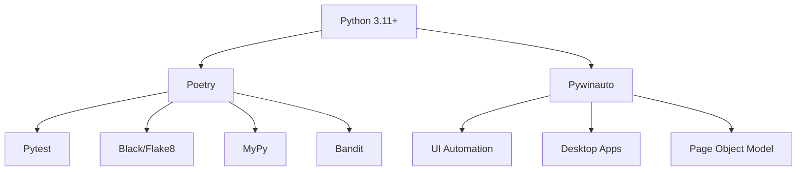
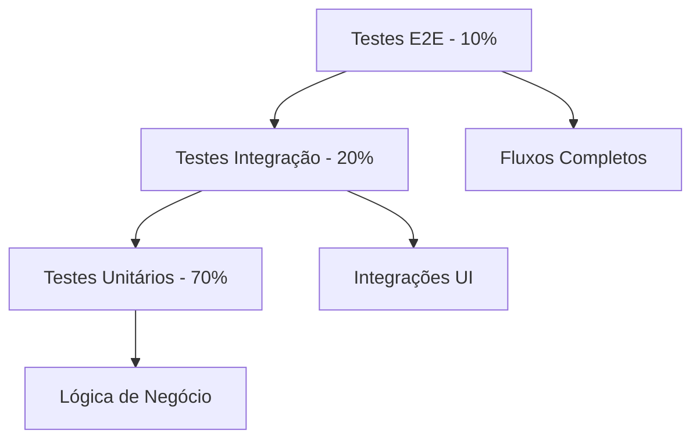

# Diretrizes de Desenvolvimento Python + Automação - DATAMETRIA

<div align="center">

**Versão**: 2.0 | **Última Atualização**: 08/08/2025

[](https://python.org) [](https://python-poetry.org) [](https://pywinauto.readthedocs.io)

[🔗 Templates](../templates/) • [🔗 Exemplos](../examples/) • [🔗 AWS Guidelines](datametria_std_aws_development.md)

</div>

---

## 📋 Índice

1. [Visão Geral](#1-visão-geral)
2. [Python com Poetry](#2-python-com-poetry)
3. [Automação UI com Pywinauto](#3-automação-ui-com-pywinauto)
4. [Qualidade e Testes](#4-qualidade-e-testes)
5. [Arquitetura e Design](#5-arquitetura-e-design)
6. [CI/CD e DevOps](#6-cicd-e-devops)
7. [Checklist de Desenvolvimento](#7-checklist-de-desenvolvimento)

---

## 1. Visão Geral

### 🎯 Objetivo

Este documento estabelece as diretrizes técnicas para desenvolvimento Python com foco em automação de UI usando Pywinauto. O objetivo é garantir código de alta qualidade, manutenível e escalável para automação de aplicações desktop.

### 🏗️ Princípios Fundamentais

| Princípio | Descrição | Benefício |
|-----------|-----------|-----------|
| **🔧 Automação First** | Priorizar automação em todos os processos | Reduz erros manuais |
| **📦 Modularidade** | Código organizado em módulos reutilizáveis | Facilita manutenção |
| **🧪 Testabilidade** | Cobertura de testes > 85% | Garante qualidade |
| **🔒 Segurança** | Security by design | Reduz vulnerabilidades |
| **⚡ Performance** | Otimização de recursos | Eficiência operacional |

### 🛠️ Stack Tecnológico



---

## 2. Python com Poetry

### 2.1. Estrutura de Projeto

#### Estrutura Padrão
```
projeto/
├── pyproject.toml              # Configuração Poetry
├── poetry.lock                 # Lock de dependências
├── README.md                   # Documentação principal
├── src/
│   └── projeto/
│       ├── __init__.py
│       ├── core/               # Lógica principal
│       ├── ui/                 # Automação UI
│       ├── services/           # Serviços de negócio
│       └── utils/              # Utilitários
├── tests/
│   ├── unit/                   # Testes unitários
│   ├── integration/            # Testes integração
│   └── e2e/                    # Testes ponta a ponta
├── docs/                       # Documentação
├── scripts/                    # Scripts auxiliares
└── resources/                  # Recursos estáticos
```

#### Inicialização de Projeto
```bash
# Criar novo projeto
poetry new projeto-automacao --src

# Configurar dependências básicas
poetry add pywinauto pydantic
poetry add --group dev pytest black flake8 mypy bandit
```

### 2.2. Gerenciamento de Dependências

#### pyproject.toml Exemplo
```toml
[tool.poetry]
name = "projeto-automacao"
version = "1.0.0"
description = "Automação UI com Python"
authors = ["Equipe DATAMETRIA <dev@datametria.io>"]

[tool.poetry.dependencies]
python = "^3.11"
pywinauto = "^0.6.8"
pydantic = "^2.0.0"
pillow = "^10.0.0"

[tool.poetry.group.dev.dependencies]
pytest = "^7.4.0"
pytest-cov = "^4.1.0"
black = "^23.7.0"
flake8 = "^6.0.0"
mypy = "^1.5.0"
bandit = "^1.7.5"

[tool.black]
line-length = 88
target-version = ['py311']

[tool.mypy]
python_version = "3.11"
strict = true

[tool.pytest.ini_options]
testpaths = ["tests"]
python_files = ["test_*.py"]
addopts = "--cov=src --cov-report=html --cov-fail-under=85"
```

#### Comandos Essenciais
```bash
# Instalar dependências
poetry install

# Executar testes
poetry run pytest

# Formatação e linting
poetry run black src/ tests/
poetry run flake8 src/ tests/
poetry run mypy src/

# Análise de segurança
poetry run bandit -r src/
```

### 2.3. Qualidade de Código

#### Configuração de Ferramentas

**`.flake8`**
```ini
[flake8]
max-line-length = 88
extend-ignore = E203, W503
exclude = .git,__pycache__,build,dist
```

**`.bandit`**
```yaml
exclude_dirs:
  - tests
  - venv
skips:
  - B101  # assert_used
```

#### Pre-commit Hooks
```yaml
# .pre-commit-config.yaml
repos:
  - repo: https://github.com/psf/black
    rev: 23.7.0
    hooks:
      - id: black
  - repo: https://github.com/pycqa/flake8
    rev: 6.0.0
    hooks:
      - id: flake8
  - repo: https://github.com/pre-commit/mirrors-mypy
    rev: v1.5.0
    hooks:
      - id: mypy
```

---

## 3. Automação UI com Pywinauto

### 3.1. Arquitetura de Automação

#### Padrão Page Object Model
```python
# src/projeto/ui/base_page.py
from abc import ABC, abstractmethod
from pywinauto import Application
from typing import Optional
import logging

class BasePage(ABC):
    """Classe base para páginas da aplicação."""
    
    def __init__(self, app: Application, window_title: str):
        self.app = app
        self.window_title = window_title
        self.window = None
        self.logger = logging.getLogger(self.__class__.__name__)
    
    def connect(self, timeout: int = 10) -> bool:
        """Conecta à janela da aplicação."""
        try:
            self.window = self.app.window(title=self.window_title)
            self.window.wait('ready', timeout=timeout)
            return True
        except Exception as e:
            self.logger.error(f"Erro ao conectar: {e}")
            return False
    
    @abstractmethod
    def is_loaded(self) -> bool:
        """Verifica se a página está carregada."""
        pass
```

#### Mapeamento de Elementos
```python
# src/projeto/ui/elements.py
from dataclasses import dataclass
from typing import Dict, Any

@dataclass
class UIElement:
    """Representa um elemento da UI."""
    control_type: str
    identifier: Dict[str, Any]
    description: str = ""

class LoginPageElements:
    """Elementos da página de login."""
    
    USERNAME_FIELD = UIElement(
        control_type="Edit",
        identifier={"auto_id": "txtUsername"},
        description="Campo de usuário"
    )
    
    PASSWORD_FIELD = UIElement(
        control_type="Edit",
        identifier={"auto_id": "txtPassword"},
        description="Campo de senha"
    )
    
    LOGIN_BUTTON = UIElement(
        control_type="Button",
        identifier={"title": "Entrar"},
        description="Botão de login"
    )
```

### 3.2. Implementação Robusta

#### Classe de Automação
```python
# src/projeto/ui/login_page.py
from .base_page import BasePage
from .elements import LoginPageElements
from pywinauto.findwindows import ElementNotFoundError
import time

class LoginPage(BasePage):
    """Página de login da aplicação."""
    
    def __init__(self, app):
        super().__init__(app, "Sistema - Login")
        self.elements = LoginPageElements()
    
    def is_loaded(self) -> bool:
        """Verifica se a página de login está carregada."""
        try:
            username_field = self._get_element(self.elements.USERNAME_FIELD)
            return username_field.exists()
        except ElementNotFoundError:
            return False
    
    def login(self, username: str, password: str) -> bool:
        """Realiza login no sistema."""
        try:
            # Aguardar página carregar
            if not self.is_loaded():
                self.logger.error("Página de login não carregada")
                return False
            
            # Preencher campos
            self._fill_field(self.elements.USERNAME_FIELD, username)
            self._fill_field(self.elements.PASSWORD_FIELD, password)
            
            # Clicar em entrar
            self._click_element(self.elements.LOGIN_BUTTON)
            
            # Aguardar processamento
            time.sleep(2)
            
            return self._verify_login_success()
            
        except Exception as e:
            self.logger.error(f"Erro no login: {e}")
            return False
    
    def _get_element(self, ui_element: UIElement):
        """Obtém elemento da UI com retry."""
        for attempt in range(3):
            try:
                element = self.window.child_window(**ui_element.identifier)
                element.wait('ready', timeout=5)
                return element
            except ElementNotFoundError:
                if attempt == 2:
                    raise
                time.sleep(1)
    
    def _fill_field(self, ui_element: UIElement, value: str):
        """Preenche campo de texto."""
        element = self._get_element(ui_element)
        element.click_input()
        element.type_keys("^a")  # Ctrl+A
        element.type_keys(value)
    
    def _click_element(self, ui_element: UIElement):
        """Clica em elemento."""
        element = self._get_element(ui_element)
        element.click()
```

### 3.3. Tratamento de Erros e Resiliência

#### Decorador para Retry
```python
# src/projeto/ui/decorators.py
import functools
import time
from typing import Callable, Any

def retry_on_failure(max_attempts: int = 3, delay: float = 1.0):
    """Decorador para retry automático."""
    def decorator(func: Callable) -> Callable:
        @functools.wraps(func)
        def wrapper(*args, **kwargs) -> Any:
            last_exception = None
            
            for attempt in range(max_attempts):
                try:
                    return func(*args, **kwargs)
                except Exception as e:
                    last_exception = e
                    if attempt < max_attempts - 1:
                        time.sleep(delay)
                    
            raise last_exception
        return wrapper
    return decorator
```

#### Captura de Screenshots
```python
# src/projeto/ui/screenshot.py
import os
from datetime import datetime
from pywinauto import Application

class ScreenshotManager:
    """Gerenciador de screenshots para debug."""
    
    def __init__(self, output_dir: str = "screenshots"):
        self.output_dir = output_dir
        os.makedirs(output_dir, exist_ok=True)
    
    def capture_on_error(self, app: Application, error_msg: str) -> str:
        """Captura screenshot em caso de erro."""
        timestamp = datetime.now().strftime("%Y%m%d_%H%M%S")
        filename = f"error_{timestamp}.png"
        filepath = os.path.join(self.output_dir, filename)
        
        try:
            app.top_window().capture_as_image().save(filepath)
            return filepath
        except Exception as e:
            print(f"Erro ao capturar screenshot: {e}")
            return ""
```

---

## 4. Qualidade e Testes

### 4.1. Estratégia de Testes

#### Pirâmide de Testes


#### Configuração Pytest
```python
# tests/conftest.py
import pytest
from unittest.mock import Mock
from pywinauto import Application

@pytest.fixture
def mock_application():
    """Mock da aplicação Pywinauto."""
    app = Mock(spec=Application)
    window = Mock()
    app.window.return_value = window
    return app

@pytest.fixture
def sample_automation_data():
    """Dados de exemplo para automação."""
    return {
        "username": "test_user",
        "password": "test_pass",
        "target_window": "Sistema Principal"
    }
```

### 4.2. Testes Unitários

#### Teste de Automação UI
```python
# tests/unit/test_login_page.py
import pytest
from unittest.mock import Mock, patch
from src.projeto.ui.login_page import LoginPage

class TestLoginPage:
    """Testes da página de login."""
    
    def test_login_success(self, mock_application):
        """Testa login bem-sucedido."""
        # Arrange
        login_page = LoginPage(mock_application)
        login_page.window = Mock()
        
        # Mock dos elementos
        username_field = Mock()
        password_field = Mock()
        login_button = Mock()
        
        login_page.window.child_window.side_effect = [
            username_field, password_field, login_button
        ]
        
        # Act
        with patch.object(login_page, '_verify_login_success', return_value=True):
            result = login_page.login("user", "pass")
        
        # Assert
        assert result is True
        username_field.type_keys.assert_called()
        password_field.type_keys.assert_called()
        login_button.click.assert_called_once()
    
    def test_login_failure_page_not_loaded(self, mock_application):
        """Testa falha quando página não carrega."""
        # Arrange
        login_page = LoginPage(mock_application)
        
        # Act
        with patch.object(login_page, 'is_loaded', return_value=False):
            result = login_page.login("user", "pass")
        
        # Assert
        assert result is False
```

### 4.3. Testes de Integração

#### Teste de Integração UI
```python
# tests/integration/test_ui_integration.py
import pytest
from unittest.mock import Mock, patch
from src.projeto.ui.login_page import LoginPage
from pywinauto import Application

class TestUIIntegration:
    """Testes de integração UI."""
    
    @patch('pywinauto.Application')
    def test_full_login_flow(self, mock_app):
        """Testa fluxo completo de login."""
        # Arrange
        mock_window = Mock()
        mock_app.return_value.window.return_value = mock_window
        
        login_page = LoginPage(mock_app.return_value)
        
        # Act
        with patch.object(login_page, 'is_loaded', return_value=True):
            with patch.object(login_page, '_verify_login_success', return_value=True):
                result = login_page.login("test_user", "test_pass")
        
        # Assert
        assert result is True
        mock_app.return_value.window.assert_called_once()
```

### 4.4. Cobertura de Testes

#### Configuração Coverage
```ini
# .coveragerc
[run]
source = src/
omit = 
    */tests/*
    */venv/*
    */__pycache__/*

[report]
exclude_lines =
    pragma: no cover
    def __repr__
    raise AssertionError
    raise NotImplementedError

[html]
directory = htmlcov
```

#### Script de Cobertura
```bash
#!/bin/bash
# scripts/run_tests.sh

echo "🧪 Executando testes com cobertura..."

poetry run pytest \
    --cov=src \
    --cov-report=html \
    --cov-report=term-missing \
    --cov-fail-under=85 \
    -v

echo "📊 Relatório de cobertura gerado em htmlcov/"
```

---

## 5. Arquitetura e Design

### 5.1. Princípios SOLID

#### Single Responsibility Principle
```python
# ❌ Violação do SRP
class AutomationManager:
    def login(self, username, password):
        # Lógica de login
        pass
    
    def send_email(self, recipient, message):
        # Lógica de email
        pass
    
    def generate_report(self, data):
        # Lógica de relatório
        pass

# ✅ Seguindo SRP
class LoginService:
    def login(self, username, password):
        # Apenas lógica de login
        pass

class EmailService:
    def send_email(self, recipient, message):
        # Apenas lógica de email
        pass

class ReportService:
    def generate_report(self, data):
        # Apenas lógica de relatório
        pass
```

#### Dependency Injection
```python
# src/projeto/core/container.py
from abc import ABC, abstractmethod
from typing import Protocol

class EmailServiceProtocol(Protocol):
    def send_email(self, recipient: str, message: str) -> bool:
        ...

class AutomationService:
    """Serviço de automação com DI."""
    
    def __init__(self, email_service: EmailServiceProtocol):
        self.email_service = email_service
    
    def process_automation(self, data):
        # Processar automação
        result = self._execute_automation(data)
        
        # Enviar notificação
        self.email_service.send_email(
            "admin@datametria.io",
            f"Automação concluída: {result}"
        )
        
        return result
```

### 5.2. Padrões de Design

#### Factory Pattern
```python
# src/projeto/ui/page_factory.py
from abc import ABC, abstractmethod
from typing import Dict, Type
from .login_page import LoginPage
from .dashboard_page import DashboardPage

class PageFactory:
    """Factory para criação de páginas."""
    
    _pages: Dict[str, Type] = {
        'login': LoginPage,
        'dashboard': DashboardPage
    }
    
    @classmethod
    def create_page(cls, page_type: str, app):
        """Cria página baseada no tipo."""
        if page_type not in cls._pages:
            raise ValueError(f"Tipo de página não suportado: {page_type}")
        
        return cls._pages[page_type](app)
```

#### Observer Pattern
```python
# src/projeto/core/events.py
from abc import ABC, abstractmethod
from typing import List, Any

class EventObserver(ABC):
    @abstractmethod
    def update(self, event_type: str, data: Any):
        pass

class AutomationEventManager:
    """Gerenciador de eventos de automação."""
    
    def __init__(self):
        self._observers: List[EventObserver] = []
    
    def subscribe(self, observer: EventObserver):
        self._observers.append(observer)
    
    def notify(self, event_type: str, data: Any):
        for observer in self._observers:
            observer.update(event_type, data)
```

---

## 6. CI/CD e DevOps

### 6.1. Pipeline CI/CD

#### GitHub Actions
```yaml
# .github/workflows/ci-cd.yml
name: CI/CD Pipeline

on:
  push:
    branches: [main, develop]
  pull_request:
    branches: [main]

jobs:
  test:
    runs-on: windows-latest  # Para testes Pywinauto
    steps:
      - uses: actions/checkout@v4
      
      - name: Setup Python
        uses: actions/setup-python@v4
        with:
          python-version: '3.11'
      
      - name: Install Poetry
        uses: snok/install-poetry@v1
        with:
          version: 1.5.1
      
      - name: Install dependencies
        run: poetry install
      
      - name: Run linting
        run: |
          poetry run black --check src/ tests/
          poetry run flake8 src/ tests/
          poetry run mypy src/
      
      - name: Run security scan
        run: poetry run bandit -r src/
      
      - name: Run tests
        run: poetry run pytest --cov=src --cov-fail-under=85
      
      - name: Upload coverage
        uses: codecov/codecov-action@v3

  package:
    needs: test
    runs-on: ubuntu-latest
    if: github.ref == 'refs/heads/main'
    steps:
      - uses: actions/checkout@v4
      
      - name: Setup Python
        uses: actions/setup-python@v4
        with:
          python-version: '3.11'
      
      - name: Install Poetry
        uses: snok/install-poetry@v1
      
      - name: Build package
        run: poetry build
      
      - name: Upload artifacts
        uses: actions/upload-artifact@v3
        with:
          name: dist
          path: dist/
```

### 6.2. Segurança (DevSecOps)

#### Análise de Segurança
```python
# scripts/security_scan.py
import subprocess
import sys
from pathlib import Path

def run_security_scans():
    """Executa análises de segurança."""
    
    print("🔒 Executando análises de segurança...")
    
    # Bandit - SAST
    print("📊 Executando Bandit (SAST)...")
    result = subprocess.run([
        "poetry", "run", "bandit", "-r", "src/",
        "-f", "json", "-o", "bandit-report.json"
    ], capture_output=True, text=True)
    
    if result.returncode != 0:
        print("❌ Vulnerabilidades encontradas pelo Bandit")
        return False
    
    # Safety - Dependências
    print("📦 Verificando dependências com Safety...")
    result = subprocess.run([
        "poetry", "run", "safety", "check", "--json"
    ], capture_output=True, text=True)
    
    if result.returncode != 0:
        print("❌ Vulnerabilidades em dependências encontradas")
        return False
    
    print("✅ Análises de segurança concluídas com sucesso")
    return True

if __name__ == "__main__":
    success = run_security_scans()
    sys.exit(0 if success else 1)
```

### 6.3. Performance e Monitoramento

#### Monitoramento de Performance
```python
# src/projeto/monitoring/performance.py
import time
import psutil
from functools import wraps
from typing import Dict, Any

class PerformanceMonitor:
    """Monitor de performance para automação."""
    
    def __init__(self):
        self.metrics = []
    
    def measure_execution_time(self, func):
        """Decorador para medir tempo de execução."""
        @wraps(func)
        def wrapper(*args, **kwargs):
            start_time = time.time()
            start_memory = psutil.Process().memory_info().rss
            
            try:
                result = func(*args, **kwargs)
                success = True
            except Exception as e:
                result = None
                success = False
                raise
            finally:
                end_time = time.time()
                end_memory = psutil.Process().memory_info().rss
                
                self.metrics.append({
                    'function': func.__name__,
                    'duration': end_time - start_time,
                    'memory_used': end_memory - start_memory,
                    'success': success,
                    'timestamp': time.time()
                })
            
            return result
        return wrapper
    
    def get_performance_report(self) -> Dict[str, Any]:
        """Gera relatório de performance."""
        if not self.metrics:
            return {"message": "Nenhuma métrica coletada"}
        
        total_executions = len(self.metrics)
        successful_executions = sum(1 for m in self.metrics if m['success'])
        avg_duration = sum(m['duration'] for m in self.metrics) / total_executions
        
        return {
            'total_executions': total_executions,
            'success_rate': successful_executions / total_executions * 100,
            'average_duration': avg_duration,
            'total_memory_used': sum(m['memory_used'] for m in self.metrics)
        }
```

---

## 7. Checklist de Desenvolvimento

### 7.1. Checklist de Projeto

#### 🚀 Início de Projeto
- [ ] Projeto criado com `poetry new --src`
- [ ] Dependências básicas adicionadas (pywinauto, pydantic, pytest)
- [ ] Estrutura de pastas organizada
- [ ] README.md documentado
- [ ] Pre-commit hooks configurados
- [ ] Pipeline CI/CD configurado

#### 🔧 Durante Desenvolvimento
- [ ] Type hints adicionados
- [ ] Docstrings em Google Style
- [ ] Testes unitários escritos
- [ ] Cobertura de testes > 85%
- [ ] Linting e formatação aplicados
- [ ] Análise de segurança executada

#### 📦 Pré-Deploy
- [ ] Testes de integração passando
- [ ] Documentação atualizada
- [ ] Configurações externalizadas
- [ ] Performance testada
- [ ] Package criado e testado

### 7.2. Checklist de Qualidade

#### Código Python
- [ ] PEP 8 seguido (black + flake8)
- [ ] Type hints completos (mypy)
- [ ] Docstrings em todas as funções
- [ ] Tratamento de exceções adequado
- [ ] Logging estruturado implementado

#### Automação UI
- [ ] Page Object Model implementado
- [ ] Elementos mapeados em arquivo separado
- [ ] Waits explícitos utilizados
- [ ] Tratamento de erros robusto
- [ ] Screenshots em caso de falha

#### Performance
- [ ] Tempo de execução monitorado
- [ ] Uso de memória otimizado
- [ ] Screenshots em caso de erro
- [ ] Retry automático implementado
- [ ] Logs de performance coletados

#### Testes
- [ ] Cobertura > 85%
- [ ] Testes unitários focados
- [ ] Testes de integração para UI
- [ ] Mocks apropriados utilizados
- [ ] Fixtures reutilizáveis criadas

### 7.3. Checklist de Segurança

#### Código
- [ ] Bandit executado sem vulnerabilidades
- [ ] Safety check das dependências
- [ ] Secrets não hardcoded
- [ ] Validação de entrada implementada
- [ ] Princípio do menor privilégio aplicado

#### Aplicação
- [ ] Credenciais não hardcoded
- [ ] Validação de entrada de dados
- [ ] Tratamento seguro de exceções
- [ ] Logs não expõem informações sensíveis
- [ ] Conexões seguras implementadas

---

## Versionamento do Documento

| Versão | Data | Alterações | Autor |
|--------|------|------------|-------|
| 2.0 | 08/08/2025 | Separação do conteúdo AWS - Foco em Python + Pywinauto | Vander Loto |
| 1.0 | 15/07/2025 | Versão inicial | Equipe Dev |

---

## Manutenção

- **Revisão trimestral**: Atualização de versões e práticas
- **Feedback contínuo**: Melhorias baseadas no uso prático  
- **Sincronização**: Alinhamento com outras diretrizes DATAMETRIA

**Próxima revisão**: 08/11/2025  
**Responsável**: Tech Lead Python  
**Aprovação**: CTO