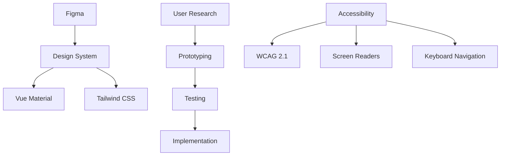
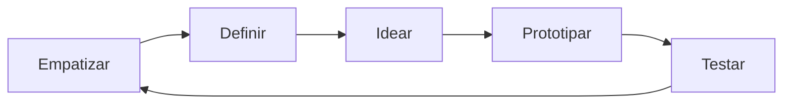
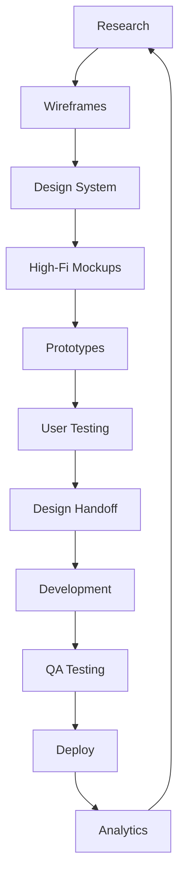

# Diretrizes de UX/UI - DATAMETRIA

<div align="center">

**Versão**: 1.0 | **Última Atualização**: 08/08/2025

[](link-design-system) [](link-figma) [](link-accessibility)

[🎨 Design System](link-design-system) • [📱 Components](link-components) • [🔍 Usability](link-usability)

</div>

---

## 📋 Índice

1. [Visão Geral](#1-visão-geral)
2. [Princípios de Design](#2-princípios-de-design)
3. [Design System](#3-design-system)
4. [Componentes UI](#4-componentes-ui)
5. [Experiência do Usuário](#5-experiência-do-usuário)
6. [Responsividade](#6-responsividade)
7. [Acessibilidade](#7-acessibilidade)
8. [Prototipagem](#8-prototipagem)
9. [Testes de Usabilidade](#9-testes-de-usabilidade)
10. [Ferramentas e Workflow](#10-ferramentas-e-workflow)
11. [Checklist UX/UI](#11-checklist-uxui)

---

## 1. Visão Geral

### 🎯 Objetivo

Estabelecer diretrizes consistentes para criação de interfaces intuitivas, acessíveis e eficientes que proporcionem excelente experiência do usuário em todos os produtos DATAMETRIA.

### 🏗️ Princípios Fundamentais

| Princípio | Descrição | Benefício |
|-----------|-----------|-----------|
| **👤 User-Centered** | Foco nas necessidades do usuário | Maior satisfação e adoção |
| **🎨 Consistência** | Padrões visuais e comportamentais | Reduz curva de aprendizado |
| **♿ Acessibilidade** | Inclusivo para todos os usuários | Amplia alcance e compliance |
| **📱 Responsivo** | Adaptável a diferentes dispositivos | Experiência universal |
| **⚡ Performance** | Interfaces rápidas e eficientes | Melhor usabilidade |

### 🛠️ Stack de Design



---

## 2. Princípios de Design

### 2.1. Hierarquia Visual

#### Estrutura de Informação
```css
/* Hierarquia tipográfica */
.heading-1 { font-size: 2.5rem; font-weight: 700; line-height: 1.2; }
.heading-2 { font-size: 2rem; font-weight: 600; line-height: 1.3; }
.heading-3 { font-size: 1.5rem; font-weight: 600; line-height: 1.4; }
.body-large { font-size: 1.125rem; font-weight: 400; line-height: 1.6; }
.body-regular { font-size: 1rem; font-weight: 400; line-height: 1.6; }
.body-small { font-size: 0.875rem; font-weight: 400; line-height: 1.5; }
.caption { font-size: 0.75rem; font-weight: 400; line-height: 1.4; }
```

#### Grid System
```css
/* Sistema de grid responsivo */
.container {
  max-width: 1200px;
  margin: 0 auto;
  padding: 0 1rem;
}

.grid {
  display: grid;
  grid-template-columns: repeat(12, 1fr);
  gap: 1.5rem;
}

.col-span-6 { grid-column: span 6; }
.col-span-4 { grid-column: span 4; }
.col-span-3 { grid-column: span 3; }
```

### 2.2. Paleta de Cores

#### Cores Primárias
```css
:root {
  /* Azul DATAMETRIA */
  --primary-50: #eff6ff;
  --primary-100: #dbeafe;
  --primary-500: #3b82f6;
  --primary-600: #2563eb;
  --primary-700: #1d4ed8;
  --primary-900: #1e3a8a;
  
  /* Cinzas */
  --gray-50: #f9fafb;
  --gray-100: #f3f4f6;
  --gray-200: #e5e7eb;
  --gray-500: #6b7280;
  --gray-700: #374151;
  --gray-900: #111827;
  
  /* Estados */
  --success: #10b981;
  --warning: #f59e0b;
  --error: #ef4444;
  --info: #06b6d4;
}
```

### 2.3. Espaçamento

#### Sistema de Espaçamento
```css
:root {
  --space-1: 0.25rem;  /* 4px */
  --space-2: 0.5rem;   /* 8px */
  --space-3: 0.75rem;  /* 12px */
  --space-4: 1rem;     /* 16px */
  --space-6: 1.5rem;   /* 24px */
  --space-8: 2rem;     /* 32px */
  --space-12: 3rem;    /* 48px */
  --space-16: 4rem;    /* 64px */
}
```

---

## 3. Design System

### 3.1. Tokens de Design

#### Arquivo de Tokens
```json
{
  "color": {
    "primary": {
      "50": "#eff6ff",
      "500": "#3b82f6",
      "900": "#1e3a8a"
    },
    "semantic": {
      "success": "#10b981",
      "warning": "#f59e0b",
      "error": "#ef4444"
    }
  },
  "typography": {
    "fontFamily": {
      "sans": ["Inter", "system-ui", "sans-serif"],
      "mono": ["JetBrains Mono", "monospace"]
    },
    "fontSize": {
      "xs": "0.75rem",
      "sm": "0.875rem",
      "base": "1rem",
      "lg": "1.125rem",
      "xl": "1.25rem",
      "2xl": "1.5rem"
    }
  },
  "spacing": {
    "1": "0.25rem",
    "2": "0.5rem",
    "4": "1rem",
    "8": "2rem"
  }
}
```

### 3.2. Componentes Base

#### Button Component
```vue
<template>
  <button
    :class="buttonClasses"
    :disabled="disabled"
    @click="$emit('click', $event)"
  >
    <Icon v-if="icon" :name="icon" class="mr-2" />
    <slot />
  </button>
</template>

<script setup>
import { computed } from 'vue'

const props = defineProps({
  variant: {
    type: String,
    default: 'primary',
    validator: (value) => ['primary', 'secondary', 'outline', 'ghost'].includes(value)
  },
  size: {
    type: String,
    default: 'md',
    validator: (value) => ['sm', 'md', 'lg'].includes(value)
  },
  disabled: Boolean,
  icon: String
})

const buttonClasses = computed(() => {
  const base = 'inline-flex items-center justify-center font-medium rounded-lg transition-colors focus:outline-none focus:ring-2 focus:ring-offset-2'
  
  const variants = {
    primary: 'bg-primary-600 text-white hover:bg-primary-700 focus:ring-primary-500',
    secondary: 'bg-gray-200 text-gray-900 hover:bg-gray-300 focus:ring-gray-500',
    outline: 'border border-gray-300 bg-white text-gray-700 hover:bg-gray-50 focus:ring-primary-500',
    ghost: 'text-gray-700 hover:bg-gray-100 focus:ring-gray-500'
  }
  
  const sizes = {
    sm: 'px-3 py-1.5 text-sm',
    md: 'px-4 py-2 text-base',
    lg: 'px-6 py-3 text-lg'
  }
  
  const disabled = props.disabled ? 'opacity-50 cursor-not-allowed' : ''
  
  return `${base} ${variants[props.variant]} ${sizes[props.size]} ${disabled}`
})
</script>
```

---

## 4. Componentes UI

### 4.1. Navegação

#### Header Component
```vue
<template>
  <header class="bg-white shadow-sm border-b border-gray-200">
    <div class="container mx-auto px-4">
      <div class="flex items-center justify-between h-16">
        <!-- Logo -->
        <div class="flex items-center">
          
        </div>
        
        <!-- Navigation -->
        <nav class="hidden md:flex space-x-8">
          <a
            v-for="item in navigation"
            :key="item.name"
            :href="item.href"
            :class="[
              'text-sm font-medium transition-colors',
              item.current 
                ? 'text-primary-600' 
                : 'text-gray-700 hover:text-primary-600'
            ]"
          >
            {{ item.name }}
          </a>
        </nav>
        
        <!-- User Menu -->
        <div class="flex items-center space-x-4">
          <Button variant="outline" size="sm">
            Configurações
          </Button>
          <UserDropdown />
        </div>
      </div>
    </div>
  </header>
</template>
```

### 4.2. Formulários

#### Form Layout
```vue
<template>
  <form @submit.prevent="onSubmit" class="space-y-6">
    <div class="grid grid-cols-1 md:grid-cols-2 gap-6">
      <FormField
        v-model="form.firstName"
        label="Nome"
        required
        :error="errors.firstName"
      />
      
      <FormField
        v-model="form.lastName"
        label="Sobrenome"
        required
        :error="errors.lastName"
      />
    </div>
    
    <FormField
      v-model="form.email"
      label="Email"
      type="email"
      required
      :error="errors.email"
      hint="Será usado para login no sistema"
    />
    
    <div class="flex justify-end space-x-3">
      <Button variant="outline" type="button" @click="onCancel">
        Cancelar
      </Button>
      <Button type="submit" :loading="loading">
        Salvar
      </Button>
    </div>
  </form>
</template>
```

---

## 5. Experiência do Usuário

### 5.1. Fluxos de Usuário

#### Estados de Loading
```vue
<template>
  <div class="loading-states">
    <!-- Skeleton Loading -->
    <div v-if="loading" class="animate-pulse">
      <div class="h-4 bg-gray-200 rounded w-3/4 mb-2"></div>
      <div class="h-4 bg-gray-200 rounded w-1/2 mb-2"></div>
      <div class="h-4 bg-gray-200 rounded w-5/6"></div>
    </div>
    
    <!-- Spinner Loading -->
    <div v-if="processing" class="flex items-center justify-center p-4">
      <div class="animate-spin rounded-full h-8 w-8 border-b-2 border-primary-600"></div>
      <span class="ml-2 text-sm text-gray-600">Processando...</span>
    </div>
  </div>
</template>
```

### 5.2. Micro-interações

#### Hover Effects
```css
/* Botões com micro-interações */
.btn-interactive {
  @apply transition-all duration-200 ease-in-out;
  @apply hover:scale-105 hover:shadow-lg;
  @apply active:scale-95;
}

/* Cards com hover */
.card-hover {
  @apply transition-all duration-300 ease-in-out;
  @apply hover:shadow-xl hover:-translate-y-1;
}
```

---

## 6. Responsividade

### 6.1. Breakpoints

#### Sistema de Breakpoints
```css
:root {
  --breakpoint-sm: 640px;   /* Mobile landscape */
  --breakpoint-md: 768px;   /* Tablet */
  --breakpoint-lg: 1024px;  /* Desktop */
  --breakpoint-xl: 1280px;  /* Large desktop */
  --breakpoint-2xl: 1536px; /* Extra large */
}
```

### 6.2. Layout Responsivo

#### Grid Responsivo
```vue
<template>
  <div class="responsive-grid">
    <!-- Mobile: 1 coluna, Tablet: 2 colunas, Desktop: 3 colunas -->
    <div class="grid grid-cols-1 md:grid-cols-2 lg:grid-cols-3 gap-6">
      <Card v-for="item in items" :key="item.id">
        <!-- Conteúdo do card -->
      </Card>
    </div>
  </div>
</template>
```

---

## 7. Acessibilidade

### 7.1. WCAG 2.1 Guidelines

#### Contraste de Cores
```css
/* Garantir contraste mínimo 4.5:1 para texto normal */
.text-primary { color: #1d4ed8; } /* Contraste: 7.2:1 */
.text-secondary { color: #374151; } /* Contraste: 9.8:1 */
.text-muted { color: #6b7280; } /* Contraste: 4.6:1 */
```

#### Navegação por Teclado
```vue
<template>
  <div class="keyboard-navigation">
    <!-- Skip links -->
    <a
      href="#main-content"
      class="sr-only focus:not-sr-only focus:absolute focus:top-4 focus:left-4 bg-primary-600 text-white px-4 py-2 rounded-lg z-50"
    >
      Pular para conteúdo principal
    </a>
    
    <!-- Indicadores de foco visíveis -->
    <button class="focus:ring-2 focus:ring-primary-500 focus:ring-offset-2">
      Botão acessível
    </button>
  </div>
</template>
```

### 7.2. ARIA Labels e Roles

#### Componentes Acessíveis
```vue
<template>
  <div class="accessible-components">
    <!-- Botão com estado -->
    <button
      :aria-pressed="isActive"
      :aria-label="isActive ? 'Desativar filtro' : 'Ativar filtro'"
      @click="toggle"
    >
      <Icon :name="isActive ? 'filter-active' : 'filter'" />
    </button>
    
    <!-- Lista com navegação -->
    <ul role="list" aria-label="Lista de produtos">
      <li
        v-for="(item, index) in items"
        :key="item.id"
        role="listitem"
        :aria-posinset="index + 1"
        :aria-setsize="items.length"
      >
        {{ item.name }}
      </li>
    </ul>
  </div>
</template>
```

---

## 8. Prototipagem

### 8.1. Processo de Design

#### Design Thinking Flow


#### Fidelidade de Protótipos
```
Baixa Fidelidade (Wireframes)
├── Estrutura e layout
├── Fluxo de navegação
└── Hierarquia de informação

Média Fidelidade (Mockups)
├── Cores e tipografia
├── Componentes definidos
└── Conteúdo real

Alta Fidelidade (Protótipos)
├── Interações completas
├── Micro-animações
└── Estados de erro/sucesso
```

---

## 9. Testes de Usabilidade

### 9.1. Metodologias de Teste

#### Tipos de Teste
```
Testes Qualitativos
├── Entrevistas com usuários
├── Observação de uso
├── Think-aloud protocol
└── Card sorting

Testes Quantitativos
├── A/B Testing
├── Métricas de uso
├── Heatmaps
└── Analytics
```

#### Métricas de Usabilidade
```javascript
// Métricas de UX
const uxMetrics = {
  // Eficiência
  taskCompletionTime: 'Tempo para completar tarefa',
  clicksToComplete: 'Número de cliques necessários',
  
  // Eficácia
  taskSuccessRate: 'Taxa de sucesso da tarefa',
  errorRate: 'Taxa de erros',
  
  // Satisfação
  nps: 'Net Promoter Score',
  sus: 'System Usability Scale'
}
```

---

## 10. Ferramentas e Workflow

### 10.1. Stack de Ferramentas

#### Design Tools
```
Design & Prototipagem
├── Figma (Design principal)
├── FigJam (Brainstorming)
├── Principle (Micro-interações)
└── Lottie (Animações)

Desenvolvimento
├── Storybook (Component library)
├── Chromatic (Visual testing)
├── Vue DevTools (Debug)
└── Tailwind CSS (Styling)

Testes & Analytics
├── Hotjar (Heatmaps)
├── Google Analytics (Métricas)
├── Maze (Testes usabilidade)
└── UserTesting (Feedback)
```

### 10.2. Workflow de Design

#### Design to Code Process


---

## 11. Checklist UX/UI

### 11.1. Design System

#### Tokens e Componentes
- [ ] Paleta de cores definida e documentada
- [ ] Sistema tipográfico implementado
- [ ] Espaçamentos padronizados
- [ ] Componentes base criados
- [ ] Estados de componentes definidos
- [ ] Variações responsivas implementadas
- [ ] Tokens de design sincronizados
- [ ] Documentação no Storybook

### 11.2. Usabilidade

#### Interface
- [ ] Hierarquia visual clara
- [ ] Navegação intuitiva
- [ ] Feedback visual adequado
- [ ] Estados de loading implementados
- [ ] Mensagens de erro claras
- [ ] Confirmações para ações críticas
- [ ] Breadcrumbs quando necessário
- [ ] Search functionality otimizada

#### Formulários
- [ ] Labels claros e descritivos
- [ ] Validação em tempo real
- [ ] Mensagens de erro específicas
- [ ] Campos obrigatórios indicados
- [ ] Auto-complete implementado
- [ ] Formatação automática
- [ ] Salvamento automático
- [ ] Prevenção de perda de dados

### 11.3. Responsividade

#### Layout
- [ ] Design mobile-first
- [ ] Breakpoints definidos
- [ ] Grid system implementado
- [ ] Imagens responsivas
- [ ] Tipografia escalável
- [ ] Touch targets adequados (44px mín.)
- [ ] Orientação landscape suportada
- [ ] Testes em dispositivos reais

### 11.4. Acessibilidade

#### WCAG 2.1 AA
- [ ] Contraste mínimo 4.5:1
- [ ] Navegação por teclado
- [ ] Screen reader compatibility
- [ ] ARIA labels implementados
- [ ] Focus indicators visíveis
- [ ] Skip links disponíveis
- [ ] Texto alternativo em imagens
- [ ] Estrutura semântica HTML

#### Testes
- [ ] Teste com screen reader
- [ ] Navegação apenas por teclado
- [ ] Teste de contraste
- [ ] Validação HTML semântico
- [ ] Teste com usuários com deficiência
- [ ] Auditoria automatizada (axe)

### 11.5. Performance

#### Otimização
- [ ] Imagens otimizadas e lazy loading
- [ ] Fontes web otimizadas
- [ ] CSS crítico inline
- [ ] JavaScript code splitting
- [ ] Compressão gzip/brotli
- [ ] CDN para assets estáticos
- [ ] Service worker implementado
- [ ] Métricas Core Web Vitals

#### Métricas
- [ ] LCP < 2.5s
- [ ] FID < 100ms
- [ ] CLS < 0.1
- [ ] TTI < 3.8s
- [ ] Speed Index < 3.4s

### 11.6. Testes

#### Funcionalidade
- [ ] Testes unitários de componentes
- [ ] Testes de integração
- [ ] Testes E2E críticos
- [ ] Testes de regressão visual
- [ ] Cross-browser testing
- [ ] Testes de performance
- [ ] Testes de acessibilidade
- [ ] Testes de usabilidade

#### Qualidade
- [ ] Code review obrigatório
- [ ] Linting automatizado
- [ ] Type checking (TypeScript)
- [ ] Bundle size monitoring
- [ ] Lighthouse audits
- [ ] A11y audits automatizados

---

## Versionamento do Documento

| Versão | Data | Alterações | Autor |
|--------|------|------------|-------|
| 1.0 | 08/08/2025 | Versão inicial - Diretrizes UX/UI completas | Vander Loto |

---

## Manutenção

- **Revisão trimestral**: Atualização de componentes e padrões
- **Feedback contínuo**: Melhorias baseadas em testes de usabilidade
- **Sincronização**: Alinhamento com outras diretrizes DATAMETRIA

**Próxima revisão**: 08/11/2025  
**Responsável**: UX/UI Lead  
**Aprovação**: CTO