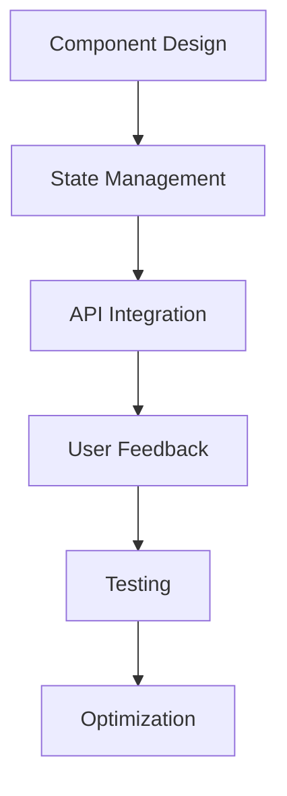
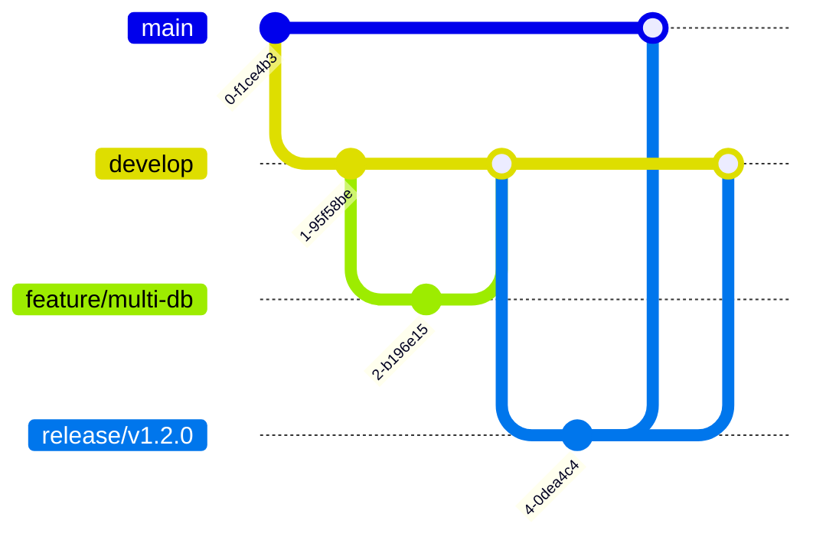

# Diretrizes de Desenvolvimento - Projetos Web

Este documento estabelece as diretrizes e melhores práticas de desenvolvimento web dos projetos na Datametria. O objetivo é promover a consistência, segurança, manutenibilidade e escalabilidade em projetos futuros.

**Versão:** 1.1  
**Última atualização:** 08/08/2025  
**Autor:** Vander Loto - Datametria

---

## Índice

1. [Stack Tecnológica](#1-stack-tecnológica)
2. [Estrutura de Pastas](#2-estrutura-de-pastas)
3. [Desenvolvimento Backend (Flask)](#3-desenvolvimento-backend-flask)
4. [Desenvolvimento Frontend (Vue.js 3)](#4-desenvolvimento-frontend-vuejs-3)
5. [Segurança (Flask + Vue.js)](#5-segurança-flask--vuejs)
6. [Testes](#6-testes)
7. [Deployment e Operações](#7-deployment-e-operações)
8. [Reutilização de Código e Manutenibilidade](#8-reutilização-de-código-e-manutenibilidade)
9. [Padrões de Documentação](#9-padrões-de-documentação)
10. [UI Framework & CDN Strategy](#10-ui-framework--cdn-strategy)
11. [Framework de Desenvolvimento](#11-framework-de-desenvolvimento)
12. [Melhores Práticas Essenciais](#12-melhores-práticas-essenciais)
13. [ADR (Architectural Decision Record)](#13-adr-architectural-decision-record)
14. [Checklist de Implantação](#14-checklist-de-implantação)

---

## 1. Stack Tecnológica

| Componente | Tecnologias | Observações |
|------------|-------------|-------------|
| **Backend** | Flask + Flask-RESTX, SQLAlchemy Core, Celery, Redis | Suporte multi-banco via SQLAlchemy |
| **Frontend** | Vue.js 3 (Composition API), Pinia, Vite | SSR opcional com Vite-SSG |
| **UI Framework** | Vue Material (MDC) via CDN + Fallback Local | Implementado com estratégia de resiliência |
| **Banco de Dados** | SQLAlchemy + Drivers: cx_Oracle, pyodbc, psycopg2 | Conexões para Oracle, SQL Server, PostgreSQL e SQLite |
| **Infraestrutura** | Docker, Nginx, Gunicorn | Configuração de produção otimizada |
| **Monitoramento** | Flower (Celery), Sentry, Prometheus + Grafana | Observabilidade completa |

---

## 2. Estrutura de Pastas

A organização do projeto deve seguir uma estrutura modular e clara, facilitando a navegação e o entendimento do código.

```
project-root/
├── backend/
│   ├── app/
│   │   ├── api/           # Blueprints e recursos (Módulos REST)
│   │   ├── core/          # Configs, middlewares e extensões
│   │   ├── db/            # Multi-banco (sessions.py, models/)
│   │   ├── tasks/         # Celery tasks (rpa_integration.py)
│   │   ├── utils/         # Helpers, validators e segurança
│   │   └── services/      # Lógica de negócio
│   ├── tests/             # Pytest (unit, integration)
│   ├── Dockerfile
│   └── requirements.txt
│
├── frontend/
│   ├── public/            # Assets estáticos (fallback/)
│   ├── src/
│   │   ├── assets/        # Fonts/imagens locais (fallback)
│   │   ├── composables/   # Lógica reutilizável Vue
│   │   ├── layouts/       # Templates de layout
│   │   ├── router/        # Vue Router
│   │   ├── services/      # API service (axios com interceptors)
│   │   ├── stores/        # Pinia (gerenciamento de estado)
│   │   └── views/         # Páginas (components/)
│   ├── Dockerfile
│   └── vite.config.js     # Config CDN fallback
│
├── docs/
│   ├── ADRs/              # Architectural Decision Records
│   ├── API_DOCS.md        # Swagger exportado
│   ├── DEPLOY_GUIDE.md
│   └── DB_SCHEMAS.md
│
├── scripts/
│   ├── deploy/
│   └── infra/             # Terraform/Ansible (opcional)
│
├── .github/
│   ├── workflows/         # CI/CD pipelines
│   └── ISSUE_TEMPLATE.md
│
├── CHANGELOG.md           # Histórico de versões (Keep a Changelog)
├── BACKLOG.md             # Roadmap priorizado
├── RELEASE_NOTES.md       # Notas por versão (template abaixo)
└── README.md              # Documentação principal
```

**Princípios:**
- **Separação de Responsabilidades:** Cada módulo/pasta deve ter uma responsabilidade única.
- **Coesão:** Agrupar arquivos relacionados.
- **Baixo Acoplamento:** Minimizar dependências entre módulos.

---

## 3. Desenvolvimento Backend (Flask)

### 3.1. Estrutura da Aplicação

- **Blueprints:** Utilizar Blueprints para organizar rotas e views em módulos reutilizáveis e escaláveis.
- **Configuração:** Centralizar configurações em `config.py` e utilizar variáveis de ambiente para dados sensíveis e específicos de ambiente.
- **Modelos (ORM):** Utilizar SQLAlchemy para mapeamento objeto-relacional, definindo modelos claros e com validação de dados.
- **Validação de Entrada:** Usar WTForms para validação de formulários e Pydantic (ou similar) para validação de dados de entrada da API (JSON).

### 3.2. Design de API RESTful

- **Endpoints Claros:** Nomes de endpoints devem ser substantivos e representar recursos (ex: `/parameters`, `/users`).
- **Métodos HTTP:** Utilizar os métodos HTTP corretamente (GET para leitura, POST para criação, PUT/PATCH para atualização, DELETE para remoção).
- **Códigos de Status:** Retornar códigos de status HTTP apropriados (200 OK, 201 Created, 400 Bad Request, 404 Not Found, 429 Too Many Requests, 500 Internal Server Error).
- **JSON como Padrão:** Usar JSON para requisições e respostas.
- **Paginação e Filtros:** Implementar paginação e filtros para endpoints que retornam grandes coleções de dados.

### 3.3. Tratamento de Erros

- Implementar um tratamento de erros global com mensagens padronizadas em JSON, incluindo códigos de erro e detalhes quando aplicável.
- Utilizar `try-except` para capturar exceções específicas e retornar respostas adequadas.

### 3.4. Logging

- Configurar logging robusto para registrar eventos da aplicação, erros e atividades de segurança.
- Utilizar diferentes níveis de log (DEBUG, INFO, WARNING, ERROR, CRITICAL).

---

## 4. Desenvolvimento Frontend (Vue.js 3)

### 4.1. Estrutura e Organização

**Componentes Single-File (SFC):** Utilizar arquivos .vue com estrutura `<template>`, `<script setup>`, e `<style scoped>`

**Composition API:** Preferir `setup()` e funções reativas (`ref`, `reactive`, `computed`)

**Design System:** Implementar Vue Material (MDC) via CDN com fallback local

**Organização Modular:**
```
src/
├── components/      # Componentes reutilizáveis
├── composables/     # Lógica reutilizável (hooks)
├── layouts/         # Componentes de layout
├── services/        # Integração com APIs
├── stores/          # Gerenciamento de estado (Pinia)
└── views/           # Páginas/rotas
```

### 4.2. Responsividade

**Mobile-First:** Implementar com:
```vue
<template>
  <div :class="{'mobile-layout': isMobile}">
    <!-- Conteúdo responsivo -->
  </div>
</template>

<script setup>
import { useBreakpoints } from '@vueuse/core'

const breakpoints = useBreakpoints({
  mobile: 640,
  tablet: 1024,
})

const isMobile = breakpoints.smaller('tablet')
</script>
```

**Grid Adaptativo:** Utilizar CSS Grid/Flexbox com media queries ou bibliotecas como vue-grid-layout

### 4.3. Interatividade

**Reatividade:** Gerenciar estado com Pinia:
```javascript
// stores/user.js
import { defineStore } from 'pinia'

export const useUserStore = defineStore('user', {
  state: () => ({ user: null }),
  actions: {
    async fetchUser() {
      this.user = await userService.getUser()
    }
  }
})
```

**Requisições:** Usar Axios com interceptors:
```javascript
// services/api.js
import axios from 'axios'

const api = axios.create({
  baseURL: import.meta.env.VITE_API_BASE
})

api.interceptors.response.use(
  response => response,
  error => {
    // Tratamento global de erros
    return Promise.reject(error)
  }
)
```

**Renderização Eficiente:** Utilizar virtualização para listas grandes:
```vue
<template>
  <RecycleScroller
    :items="largeList"
    :item-size="50"
    key-field="id"
  >
    <template #default="{ item }">
      <!-- Item renderizado -->
    </template>
  </RecycleScroller>
</template>
```

### 4.4. Experiência do Usuário (UX)

**Feedback Visual:**
```vue
<template>
  <button @click="submit" :disabled="isLoading">
    <span v-if="!isLoading">Enviar</span>
    <ProgressSpinner v-else />
  </button>
  <Toast position="top-right" />
</template>

<script setup>
import { useToast } from 'vue-toastification'

const toast = useToast()
const isLoading = ref(false)

async function submit() {
  isLoading.value = true
  try {
    await api.post('/data')
    toast.success('Operação concluída!')
  } catch (error) {
    toast.error('Falha na operação')
  } finally {
    isLoading.value = false
  }
}
</script>
```

**Navegação:** Gerenciamento de rotas com Vue Router:
```javascript
// router/index.js
import { createRouter, createWebHistory } from 'vue-router'

const routes = [
  {
    path: '/',
    component: () => import('@/views/Dashboard.vue'),
    meta: { requiresAuth: true }
  },
  // ...
]
```

### 4.5. Padrões Essenciais

**TypeScript:** Adotar tipagem estática
```vue
<script setup lang="ts">
interface User {
  id: number
  name: string
}

const user = ref<User | null>(null)
</script>
```

**Testes:**
- Unitários: Vitest + Testing Library
- E2E: Cypress ou Playwright

**Performance:**
- Lazy loading de componentes:
```javascript
const UserProfile = defineAsyncComponent(() =>
  import('@/views/UserProfile.vue')
)
```
- Otimização de bundles com Vite

**Acessibilidade:**
- Uso de aria-* attributes
- Biblioteca vue-axe para auditoria

### 4.6. Fluxo de Trabalho



### 4.7. Recursos Recomendados

- Vue.js Styleguide
- Vuetify Component Library
- VueUse Utilities
- Pinia Documentation

---

## 5. Segurança (Flask + Vue.js)

### 5.1. Validação e Sanitização de Entrada

**Backend (Flask):**

Utilizar marshmallow para validação de schemas em endpoints:
```python
from marshmallow import Schema, fields, validate

class UserSchema(Schema):
    email = fields.Email(required=True)
    password = fields.Str(required=True, validate=validate.Length(min=8))
```

- Sanitizar entradas com bleach para prevenir XSS
- Usar consultas parametrizadas com SQLAlchemy para evitar SQL Injection

**Frontend (Vue.js):**

Implementar validação reativa com vee-validate:
```vue
<template>
  <Form @submit="onSubmit">
    <Field name="email" rules="required|email" v-slot="{ field, errors }">
      <input v-bind="field" type="email" :class="{'error': errors.length}">
      <span v-if="errors">{{ errors[0] }}</span>
    </Field>
  </Form>
</template>
```

### 5.2. Autenticação e Autorização

**Autenticação:**

Implementar JWT com flask-jwt-extended:
```python
from flask_jwt_extended import create_access_token, jwt_required

@app.route('/login', methods=['POST'])
def login():
    # Validação de credenciais
    access_token = create_access_token(identity=user.id)
    return jsonify(access_token=access_token)
```

**Autorização:**

RBAC com decoradores no Flask:
```python
from flask_jwt_extended import jwt_required, get_jwt_identity

def admin_required(fn):
    @wraps(fn)
    @jwt_required()
    def wrapper(*args, **kwargs):
        current_user = get_jwt_identity()
        if not current_user['is_admin']:
            return {'error': 'Admin required'}, 403
        return fn(*args, **kwargs)
    return wrapper
```

**Frontend:** Gerenciar permissões com Pinia:
```javascript
// stores/auth.js
export const useAuthStore = defineStore('auth', {
  state: () => ({ user: null }),
  getters: {
    canEdit: (state) => state.user?.roles.includes('editor')
  }
})
```

### 5.3. Proteção contra Ataques Comuns

**CSRF Protection:**

- Flask: Habilitar proteção nativa com `WTF_CSRF_ENABLED = True`
- Vue.js: Incluir token CSRF em requisições:

```javascript
// services/api.js
axios.defaults.xsrfCookieName = 'csrf_token'
axios.defaults.xsrfHeaderName = 'X-CSRFToken'
```

**XSS Prevention:**

- Backend: Sanitizar outputs com `bleach.clean()`
- Frontend: Evitar `v-html` com dados dinâmicos; usar sanitizadores como DOMPurify

**Rate Limiting (Flask):**
```python
from flask_limiter import Limiter
from flask_limiter.util import get_remote_address

limiter = Limiter(app, key_func=get_remote_address)

@app.route('/login')
@limiter.limit("5 per minute")
def login():
    return render_template('login.html')
```

**HTTP Security Headers (Flask):**
```python
# Usar Flask-Talisman
from flask_talisman import Talisman

Talisman(app, content_security_policy={
    'default-src': ["'self'"],
    'script-src': ["'self'", 'trusted.cdn.com']
})
```

### 5.4. Proteções Adicionais

**CORS Management (Flask):**
```python
from flask_cors import CORS

# Configuração restritiva
CORS(app, resources={
    r"/api/*": {
        "origins": ["https://meudominio.com"],
        "methods": ["GET", "POST"]
    }
})
```

**Segurança de Cookies:**
```python
app.config.update(
    SESSION_COOKIE_HTTPONLY=True,
    SESSION_COOKIE_SECURE=True,  # HTTPS only
    SESSION_COOKIE_SAMESITE='Lax'
)
```

**Logging e Monitoramento:**

- Registrar tentativas de acesso suspeitas
- Implementar Sentry para captura de erros
- Monitorar atividade incomum com Flask-Admin

### 5.5. Melhores Práticas de Segurança

| Camada | Prática |
|--------|--------|
| **Flask** | • Validar todos os inputs<br>• Usar .env para secrets<br>• Atualizar dependências |
| **Vue.js** | • Sanitizar outputs<br>• Gerenciar tokens JWT em HttpOnly cookies<br>• Validar inputs no client |
| **Comunicação** | • Usar HTTPS exclusivamente<br>• Implementar HSTS<br>• Validar certificados SSL |
| **Infra** | • WAF (Web Application Firewall)<br>• Scans regulares de vulnerabilidade |

### 5.6. Gerenciamento de Segredos

- Nunca armazenar credenciais ou chaves sensíveis diretamente no código-fonte
- Utilizar variáveis de ambiente ou serviços de gerenciamento de segredos:
  - AWS Secrets Manager
  - HashiCorp Vault
  - Azure Key Vault
  - Google Secret Manager

---

## 6. Testes

### 6.1. Testes Unitários

- Escrever testes unitários para funções e componentes individuais no backend e frontend
- **Backend (Flask):** pytest com fixtures e mocks
- **Frontend (Vue.js):** Vitest + Vue Testing Library

### 6.2. Testes de Integração

- Testar a integração entre diferentes módulos e serviços
- Exemplos: API com banco de dados, frontend com API
- Usar containers para ambientes de teste isolados

### 6.3. Testes de Aceitação/E2E

- Realizar testes de ponta a ponta para simular o fluxo do usuário
- Garantir que o sistema atenda aos requisitos funcionais
- **Ferramentas:** Cypress, Playwright, Selenium

---

## 7. Deployment e Operações

### 7.1. Containerização (Docker)

- Utilizar Docker para empacotar a aplicação e suas dependências
- Garantir ambientes consistentes entre desenvolvimento, teste e produção
- Criar `Dockerfile` e `docker-compose.yml` para facilitar o build e a orquestração

### 7.2. Orquestração

- Para ambientes de produção, considerar orquestradores de containers:
  - **Kubernetes** (on-premises ou cloud)
  - **Docker Swarm** (simplicidade)
  - **Serviços gerenciados:** ECS, GKE, AKS

### 7.3. Monitoramento e Logging

- **Monitoramento:** Prometheus + Grafana para métricas
- **Logging:** Centralizar logs com ELK Stack ou Splunk
- **APM:** New Relic, Datadog para performance
- **Alertas:** PagerDuty, Slack integrations

### 7.4. CI/CD (Integração Contínua/Entrega Contínua)

- Automatizar o processo de build, teste e deployment
- **Pipeline stages:**
  1. Code commit
  2. Automated tests
  3. Security scans
  4. Build & package
  5. Deploy to staging
  6. Integration tests
  7. Deploy to production

### 7.5. Backup e Recuperação

- Estabelecer rotinas de backup regulares para:
  - Banco de dados (automated snapshots)
  - Arquivos importantes (object storage)
  - Configurações de infraestrutura
- Definir um plano de recuperação de desastres (RTO/RPO)

---

## 8. Reutilização de Código e Manutenibilidade

### 8.1. Componentização

- **Frontend:** Quebrar a UI em componentes reutilizáveis
- **Backend:** Criar módulos e serviços bem definidos
- Seguir princípios SOLID e DRY

### 8.2. Funções Utilitárias

- Criar bibliotecas de funções utilitárias para tarefas comuns
- Centralizar validações, formatações e transformações
- Documentar APIs internas

### 8.3. Comentários e Documentação

- Manter o código bem comentado e a documentação atualizada:
  - README detalhado
  - Documentação de API (Swagger/OpenAPI)
  - Guias de deployment
  - Arquitetura e decisões técnicas

### 8.4. Padrões de Código

- **Python:** Seguir PEP 8, usar Black para formatação
- **JavaScript/Vue:** ESLint + Prettier
- **Commits:** Conventional Commits
- **Code Review:** Obrigatório para todas as mudanças

---

## 9. Padrões de Documentação

### a) Padrão Google Style

**Exemplo Python:**
```python
def connect_db(dbdef connect_db(db_type: str) -> Engine:
    """Cria engine de conexão para banco específico.
    
    Args:
        db_type (str): Tipo de banco ('oracle', 'mssql', 'postgres', 'sqlite')
    
    Returns:
        Engine: Instância SQLAlchemy Engine
        
    Raises:
        ValueError: Se tipo de banco inválido
    """
```

**Exemplo JavaScript:**
```javascript
/**
 * Obtém dados da API com tratamento de erro
 * @param {string} endpoint - Endpoint da API
 * @returns {Promise<Object>} Dados da resposta
 * @throws {Error} Em caso de falha na requisição
 */
async function fetchApiData(endpoint) {
  // Implementação
}
```

### b) Documentos do Projeto

| Documento | Conteúdo | Manutenção |
|-----------|----------|------------|
| README.md | Visão geral, setup local, URLs importantes | Sempre que houver mudanças significativas |
| BACKLOG.md | `- [ ] Feature A`<br>`- [x] Task B`<br>`- [ ] Refactor C` | Atualização semanal |
| CHANGELOG.md | Seguir padrão Keep a Changelog | Por release |
| RELEASE_NOTES.md | Notas detalhadas por versão com instruções de upgrade | Por versão lançada |

### c) Templates

**CHANGELOG.md:**
```markdown
## [1.2.0] - 2025-08-20
### Added
- Suporte inicial ao Oracle Database
- Painel de monitoramento

### Changed
- Atualizado Vue Material para v3.0.1

### Fixed
- Fallback de CDN em redes restritas
```

**RELEASE_NOTES.md:**
```markdown
# Release Notes - v1.2.0
**Data de Release**: 20/08/2025  
**RC Tag**: `v1.2.0-rc`

## Novas Funcionalidades
- Integração com Oracle Database
- Painel de monitoramento de conexões

## Correções Críticas
- [HIGH] Falha no fallback de CDN
- [MEDIUM] Vazamento de sessões SQLAlchemy

## Instruções de Upgrade
```bash
docker-compose down
git fetch --tags
git checkout v1.2.0
docker-compose up --build -d
```
```

---

## 10. UI Framework & CDN Strategy

### a) Implementação CDN com Fallback

```html
<!-- frontend/public/index.html -->
<head>
  <!-- Primary CDN -->
  <link rel="stylesheet" href="https://fonts.googleapis.com/css?family=Roboto:300,400,500">
  <link rel="stylesheet" href="https://fonts.googleapis.com/icon?family=Material+Icons">
  <script src="https://unpkg.com/vue-material@3.0.1/dist/vue-material.min.js"></script>

  <!-- Fallback Local -->
  <script>
    const cdnLoaded = () => 
      window.VueMaterial && document.fonts.check('12px Roboto');
    
    if (!cdnLoaded()) {
      // Carrega recursos locais
      const loadLocalResource = (path, type = 'script') => {
        const el = type === 'script' 
          ? document.createElement('script') 
          : document.createElement('link');
        
        if (type === 'script') {
          el.src = path;
        } else {
          el.rel = 'stylesheet';
          el.href = path;
        }
        document.head.appendChild(el);
      };

      loadLocalResource('/assets/fonts/roboto.css', 'style');
      loadLocalResource('/assets/fonts/material-icons.css', 'style');
      loadLocalResource('/assets/scripts/vue-material.js', 'script');
    }
  </script>
</head>
```

### b) Estrutura de Fallback

```
frontend/public/
├── assets/
│   ├── fonts/
│   │   ├── roboto.css          # Fonte local
│   │   └── material-icons.css  # Ícones locais
│   └── scripts/
│       └── vue-material.js      # Biblioteca local
```

---

## 11. Framework de Desenvolvimento
### a) Fluxo Git



### b) Versionamento Semântico

**Formato:** `MAJOR.MINOR.PATCH`

- **MAJOR:** Breaking changes (ex: v2.0.0)
- **MINOR:** Novas funcionalidades (ex: v1.3.0)
- **PATCH:** Correções de bugs (ex: v1.2.1)

### c) CI/CD (Exemplo GitHub Actions)

```yaml
name: Build & Test
on: [push, pull_request]

jobs:
  test:
    runs-on: ubuntu-latest
    steps:
      - uses: actions/checkout@v4
      - name: Setup Python
        uses: actions/setup-python@v4
        with:
          python-version: '3.10'
      - name: Run Tests
        run: |
          pip install -r backend/requirements.txt
          pytest backend/tests
          
  deploy-staging:
    needs: test
    if: github.ref == 'refs/heads/develop'
    runs-on: ubuntu-latest
    steps:
      - uses: actions/checkout@v4
      - name: Build and Push
        run: |
          docker build -t myapp:staging .
          docker push myapp:staging
```

## 12. Melhores Práticas Essenciais

| Área | Prática | Ferramentas/Implementação |
|------|---------|---------------------------|
| **Segurança** | • Scan de dependências<br>• Secret rotation automática | Snyk, GitGuardian, HashiCorp Vault |
| **Performance** | • Cache de queries<br>• Lazy loading de componentes | Redis, defineAsyncComponent (Vue) |
| **Testes** | • 80%+ cobertura backend<br>• E2E críticos | pytest, Vitest, Playwright |
| **Logs** | • Formato JSON<br>• Correlação de IDs | structlog (Python), Pinia logger middleware |
| **Code Quality** | • Revisão obrigatória<br>• Linters automáticos | ESLint, Black, SonarCloud |
| **Error Handling** | • Tratamento global<br>• Retry automático | Sentry, Celery retry policies |

---

## 13. ADR (Architectural Decision Record)

### Template ADR

**Localização:** `/docs/ADRs/template.md`

```markdown
# [Data]: [Título Conciso]

## Status
[Proposto | Rejeitado | Aceito | Depreciado]

## Contexto
[Problema ou oportunidade que motivou a decisão]

## Decisão
[Descrição clara da opção escolhida]

## Consequências
[Impactos positivos e negativos]
```

### Exemplo ADR

**Arquivo:** `2025-08-20_cdn_fallback.md`

```markdown
# 2025-08-20: Estratégia de CDN com Fallback Local

## Status
Aprovado

## Contexto
Necessidade de operar em ambientes com restrições de internet

## Decisão
Implementar sistema dual-layer com:
1. Carregamento primário via CDN
2. Fallback automático para recursos locais

## Consequências
- ✅ Funcionamento em redes restritas
- ⚠️ Aumento de 15% no tamanho do build
- ⚠️ Complexidade adicional no entrypoint
```

---

## 14. Checklist de Implantação

### Setup Inicial
- [ ] Configurar fallback de CDN no index.html
- [ ] Incluir assets locais no public/assets
- [ ] Validar drivers multi-banco no Dockerfile
- [ ] Implementar health check para todos os bancos
- [ ] Configurar logging estruturado

### CI/CD
- [ ] Criar pipeline CI/CD mínima
- [ ] Estabelecer política de branch protection
- [ ] Configurar linters no pre-commit hook

### Monitoramento
- [ ] Configurar monitoramento (Sentry + Flower)
- [ ] Documentar variáveis de ambiente críticas

### Pré-Deploy
- [ ] Testes automatizados passando (>80% cobertura)
- [ ] Code review aprovado
- [ ] Documentação atualizada
- [ ] Variáveis de ambiente configuradas
- [ ] Backup do banco de dados

### Deploy
- [ ] Build da aplicação
- [ ] Migração de banco (se necessário)
- [ ] Deploy em staging
- [ ] Testes de fumaça
- [ ] Deploy em produção
- [ ] Verificação de saúde da aplicação

### Pós-Deploy
- [ ] Monitoramento ativo
- [ ] Logs sem erros críticos
- [ ] Performance dentro dos SLAs
- [ ] Rollback plan testado
- [ ] Comunicação às partes interessadas

---

## Versionamento do Documento

| Versão | Data | Alterações | Autor |
|--------|------|------------|-------|
| 1.0 | 15/08/2025 | Versão inicial | Vander Loto |
| 1.1 | 20/08/2025 | Adicionado ADR e checklist | Vander Loto |

---

## Manutenção

- Atualizações devem seguir o processo de ADR
- Mudanças devem ser refletidas no CHANGELOG.md
- Revisão trimestral obrigatória
- Feedback da equipe deve ser incorporado via issues |
| **Logs** | • Formato JSON<br>• Correlação de IDs | structlog (Python), Pinia logger middleware |
| **Code Quality** | • Revisão obrigatória<br>• Linters automáticos | ESLint, Black, SonarCloud |
| **Error Handling** | • Tratamento global<br>• Retry automático | Sentry, Celery retry policies |

---

## 7. ADR (Architectural Decision Record)

### Template ADR

**Localização:** `/docs/ADRs/template.md`

```markdown
# [Data]: [Título Conciso]

## Status
[Proposto | Rejeitado | Aceito | Depreciado]

## Contexto
[Problema ou oportunidade que motivou a decisão]

## Decisão
[Descrição clara da opção escolhida]

## Consequências
[Impactos positivos e negativos]
```

### Exemplo ADR

**Arquivo:** `2025-08-20_cdn_fallback.md`

```markdown
# 2025-08-20: Estratégia de CDN com Fallback Local

## Status
Aprovado

## Contexto
Necessidade de operar em ambientes com restrições de internet

## Decisão
Implementar sistema dual-layer com:
1. Carregamento primário via CDN
2. Fallback automático para recursos locais

## Consequências
- ✅ Funcionamento em redes restritas
- ⚠️ Aumento de 15% no tamanho do build
- ⚠️ Complexidade adicional no entrypoint
```

---

## 8. Checklist de Implantação

### Setup Inicial
- [ ] Configurar fallback de CDN no index.html
- [ ] Incluir assets locais no public/assets
- [ ] Validar drivers multi-banco no Dockerfile
- [ ] Implementar health check para todos os bancos
- [ ] Configurar logging estruturado

### CI/CD
- [ ] Criar pipeline CI/CD mínima
- [ ] Estabelecer política de branch protection
- [ ] Configurar linters no pre-commit hook

### Monitoramento
- [ ] Configurar monitoramento (Sentry + Flower)
- [ ] Documentar variáveis de ambiente críticas

### Pré-Deploy
- [ ] Testes automatizados passando (>80% cobertura)
- [ ] Code review aprovado
- [ ] Documentação atualizada
- [ ] Variáveis de ambiente configuradas
- [ ] Backup do banco de dados

### Deploy
- [ ] Build da aplicação
- [ ] Migração de banco (se necessário)
- [ ] Deploy em staging
- [ ] Testes de fumaça
- [ ] Deploy em produção
- [ ] Verificação de saúde da aplicação

### Pós-Deploy
- [ ] Monitoramento ativo
- [ ] Logs sem erros críticos
- [ ] Performance dentro dos SLAs
- [ ] Rollback plan testado
- [ ] Comunicação às partes interessadas

---

## Versionamento do Documento

| Versão | Data | Alterações | Autor |
|--------|------|------------|-------|
| 1.0 | 15/08/2025 | Versão inicial | Vander Loto |
| 1.1 | 20/08/2025 | Adicionado ADR e checklist | Vander Loto |

---

## Manutenção

- Atualizações devem seguir o processo de ADR
- Mudanças devem ser refletidas no CHANGELOG.md
- Revisão trimestral obrigatória
- Feedback da equipe deve ser incorporado via issues
