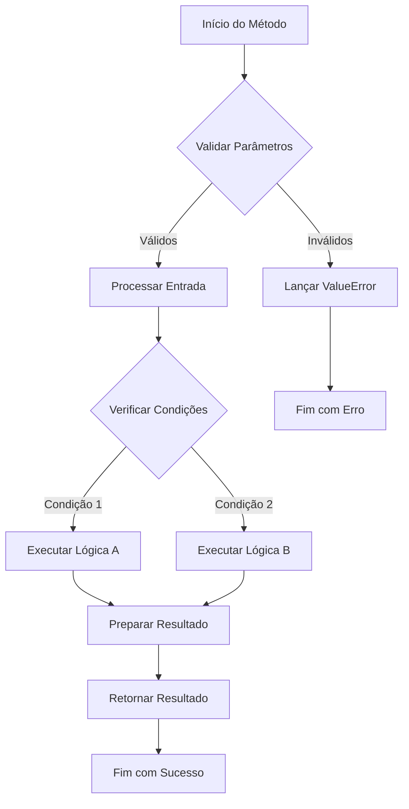
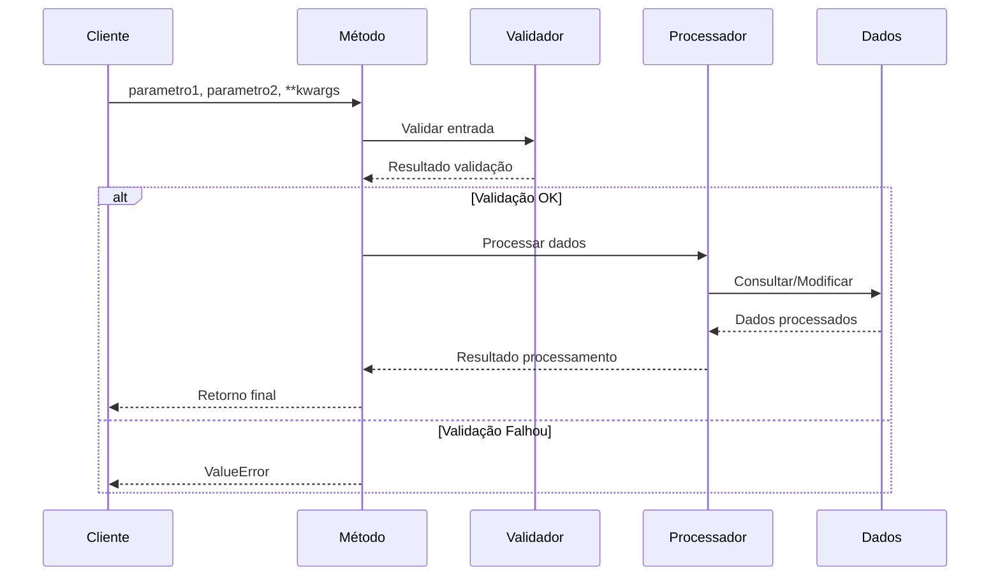
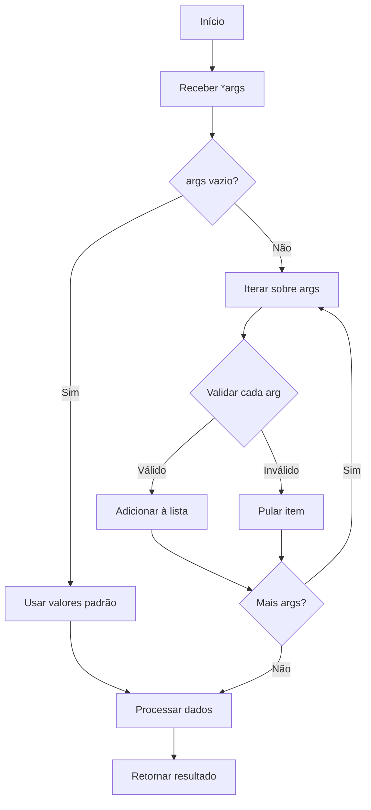
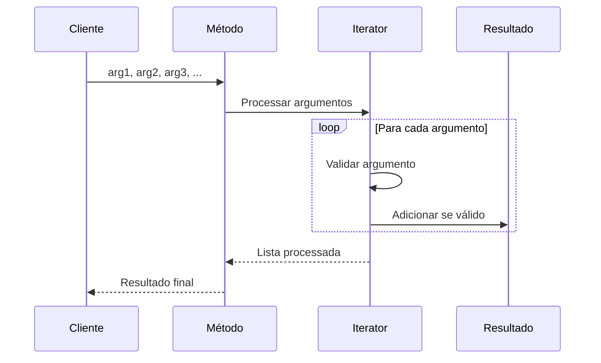

# Referência de Classe - [Nome da Classe]

<div align="center">

**Versão**: [X.Y.Z] | **Módulo**: [nome.do.modulo] | **Última Atualização**: [DD/MM/AAAA]

[](link-versao)
[](link-docs)
[](link-cobertura)

</div>

---

## 📋 Índice

- [Visão Geral](#-visão-geral)
- [Hierarquia de Classes](#-hierarquia-de-classes)
- [Construtor](#-construtor)
- [Atributos](#-atributos)
- [Métodos Públicos](#-métodos-públicos)
- [Métodos Privados](#-métodos-privados)
- [Propriedades](#-propriedades)
- [Métodos Estáticos](#-métodos-estáticos)
- [Métodos de Classe](#-métodos-de-classe)
- [Exemplos de Uso](#-exemplos-de-uso)
- [Exceções](#-exceções)
- [Notas e Observações](#-notas-e-observações)
- [Referências Externas](#-referências-externas)

---

## 🎯 Visão Geral

### Descrição

[Descrição clara e concisa do propósito da classe, seu papel no sistema e quando deve ser utilizada]

### Localização

```python
from [modulo.submodulo] import [NomeDaClasse]
```

**Arquivo**: `[caminho/para/arquivo.py]`  
**Linha**: [número da linha]

### Características Principais

- **[Característica 1]**: [Descrição]
- **[Característica 2]**: [Descrição]
- **[Característica 3]**: [Descrição]

### Casos de Uso

| Cenário | Descrição | Exemplo |
|---------|-----------|---------|
| **[Caso 1]** | [Descrição do caso] | `[codigo_exemplo]` |
| **[Caso 2]** | [Descrição do caso] | `[codigo_exemplo]` |

---

## 🏗️ Hierarquia de Classes

### Diagrama de Herança

```mermaid
classDiagram
    class BaseClass {
        +metodo_base()
    }
    
    class [NomeDaClasse] {
        -atributo_privado
        +atributo_publico
        +__init__(args)
        +metodo_publico()
        -_metodo_privado()
        +propriedade
    }
    
    class SubClasse {
        +metodo_especializado()
    }
    
    BaseClass <|-- [NomeDaClasse]
    [NomeDaClasse] <|-- SubClasse
```

### Herança

| Classe Pai | Descrição | Métodos Herdados |
|------------|-----------|------------------|
| **[ClassePai]** | [Descrição da classe pai] | `metodo1()`, `metodo2()` |
| **[Interface]** | [Descrição da interface] | `metodo_interface()` |

### Classes Filhas

| Classe Filha | Descrição | Especialização |
|--------------|-----------|----------------|
| **[ClasseFilha1]** | [Descrição] | [Métodos especializados] |
| **[ClasseFilha2]** | [Descrição] | [Métodos especializados] |

---

## 🏗️ Construtor

### `__init__(self, *args, **kwargs)`

**Descrição**: [Descrição do que o construtor faz e como inicializa a instância]

#### Sintaxe

```python
[NomeDaClasse](
    parametro1: [tipo],
    parametro2: [tipo] = [valor_padrao],
    *args,
    **kwargs
) -> [NomeDaClasse]
```

#### Parâmetros

| Parâmetro | Tipo | Obrigatório | Padrão | Descrição |
|-----------|------|-------------|--------|-----------|
| `parametro1` | `[tipo]` | ✅ | - | [Descrição do parâmetro] |
| `parametro2` | `[tipo]` | ❌ | `[valor]` | [Descrição do parâmetro] |
| `*args` | `tuple` | ❌ | `()` | [Argumentos posicionais adicionais] |
| `**kwargs` | `dict` | ❌ | `{}` | [Argumentos nomeados adicionais] |

#### Exemplo

```python
# Exemplo básico
instancia = [NomeDaClasse](parametro1="valor")

# Exemplo com todos os parâmetros
instancia = [NomeDaClasse](
    parametro1="valor1",
    parametro2="valor2",
    opcao_extra=True
)
```

#### Exceções

| Exceção | Condição | Descrição |
|---------|----------|-----------|
| `ValueError` | [Condição] | [Descrição do erro] |
| `TypeError` | [Condição] | [Descrição do erro] |

---

## 📊 Atributos

### Atributos de Instância

#### `atributo_publico`
- **Tipo**: `[tipo]`
- **Descrição**: [Descrição do atributo]
- **Acesso**: Leitura/Escrita
- **Exemplo**: `instancia.atributo_publico = "valor"`

#### `_atributo_protegido`
- **Tipo**: `[tipo]`
- **Descrição**: [Descrição do atributo protegido]
- **Acesso**: Protegido (convenção)
- **Uso**: [Quando e como usar]

### Atributos de Classe

#### `CONSTANTE_CLASSE`
- **Tipo**: `[tipo]`
- **Valor**: `[valor]`
- **Descrição**: [Descrição da constante]
- **Exemplo**: `[NomeDaClasse].CONSTANTE_CLASSE`

---

## 🔧 Métodos Públicos

### `metodo_principal(self, parametro1, parametro2=None, **kwargs)`

**Descrição**: [Descrição clara do que o método faz e seu propósito]

#### Sintaxe

```python
instancia.metodo_principal(
    parametro1: [tipo],
    parametro2: [tipo] = None,
    **kwargs
) -> [tipo_retorno]
```

#### Parâmetros

| Parâmetro | Tipo | Obrigatório | Padrão | Descrição |
|-----------|------|-------------|--------|-----------|
| `parametro1` | `[tipo]` | ✅ | - | [Descrição detalhada] |
| `parametro2` | `[tipo]` | ❌ | `None` | [Descrição detalhada] |
| `**kwargs` | `dict` | ❌ | `{}` | [Opções adicionais] |

#### Retorno

- **Tipo**: `[tipo_retorno]`
- **Descrição**: [Descrição do valor retornado]

#### Fluxo Visual do Método



#### Fluxo de Dados



#### Exemplo

```python
# Exemplo básico
resultado = instancia.metodo_principal("valor1")

# Exemplo com parâmetros opcionais
resultado = instancia.metodo_principal(
    parametro1="valor1",
    parametro2="valor2",
    opcao_extra=True
)

# Exemplo de uso em contexto
try:
    dados = instancia.metodo_principal("entrada")
    print(f"Resultado: {dados}")
except ValueError as e:
    print(f"Erro: {e}")
```

#### Exceções

| Exceção | Condição | Descrição |
|---------|----------|-----------|
| `ValueError` | [Condição específica] | [Descrição do erro] |
| `RuntimeError` | [Condição específica] | [Descrição do erro] |

#### Observações

- **Performance**: [Notas sobre performance]
- **Thread Safety**: [Informações sobre segurança em threads]
- **Dependências**: [Dependências externas necessárias]

#### Veja Também

- [`metodo_relacionado()`](#metodo_relacionado) - [Relação]
- [`propriedade_relacionada`](#propriedade_relacionada) - [Relação]

---

### `metodo_secundario(self, *args)`

**Descrição**: [Descrição do método secundário]

#### Sintaxe

```python
instancia.metodo_secundario(*args) -> [tipo_retorno]
```

#### Parâmetros

| Parâmetro | Tipo | Descrição |
|-----------|------|-----------|
| `*args` | `tuple` | [Argumentos variáveis] |

#### Fluxo Visual do Método



#### Fluxo de Dados



#### Exemplo

```python
resultado = instancia.metodo_secundario("arg1", "arg2", "arg3")
```

---

## 🔒 Métodos Privados

### `_metodo_interno(self, parametro)`

**Descrição**: [Descrição do método interno - uso apenas pela própria classe]

#### Sintaxe

```python
self._metodo_interno(parametro: [tipo]) -> [tipo_retorno]
```

#### Uso Interno

```python
# Usado internamente por outros métodos
def metodo_publico(self):
    resultado = self._metodo_interno("valor")
    return resultado
```

#### Observações

- **Acesso**: Método privado, não deve ser chamado externamente
- **Propósito**: [Finalidade específica dentro da classe]

---

## 🏷️ Propriedades

### `propriedade_principal`

**Descrição**: [Descrição da propriedade e seu comportamento]

#### Getter

```python
@property
def propriedade_principal(self) -> [tipo]:
    """[Descrição do getter]"""
```

#### Setter

```python
@propriedade_principal.setter
def propriedade_principal(self, valor: [tipo]) -> None:
    """[Descrição do setter]"""
```

#### Exemplo

```python
# Leitura da propriedade
valor = instancia.propriedade_principal

# Escrita na propriedade
instancia.propriedade_principal = "novo_valor"

# Validação automática
try:
    instancia.propriedade_principal = "valor_invalido"
except ValueError as e:
    print(f"Valor inválido: {e}")
```

#### Validações

- **Tipo**: [Validações de tipo aplicadas]
- **Valor**: [Validações de valor aplicadas]
- **Estado**: [Validações de estado aplicadas]

---

## ⚡ Métodos Estáticos

### `@staticmethod metodo_estatico(parametro1, parametro2)`

**Descrição**: [Descrição do método estático e quando usar]

#### Sintaxe

```python
[NomeDaClasse].metodo_estatico(
    parametro1: [tipo],
    parametro2: [tipo]
) -> [tipo_retorno]
```

#### Exemplo

```python
# Chamada sem instância
resultado = [NomeDaClasse].metodo_estatico("valor1", "valor2")

# Também pode ser chamado via instância
instancia = [NomeDaClasse]()
resultado = instancia.metodo_estatico("valor1", "valor2")
```

#### Casos de Uso

- [Caso de uso 1]
- [Caso de uso 2]
- [Caso de uso 3]

---

## 🏭 Métodos de Classe

### `@classmethod metodo_de_classe(cls, parametro)`

**Descrição**: [Descrição do método de classe e seu propósito]

#### Sintaxe

```python
[NomeDaClasse].metodo_de_classe(parametro: [tipo]) -> [NomeDaClasse]
```

#### Exemplo

```python
# Factory method
instancia = [NomeDaClasse].metodo_de_classe("configuracao_especial")

# Método alternativo de criação
instancia = [NomeDaClasse].metodo_de_classe({
    "opcao1": "valor1",
    "opcao2": "valor2"
})
```

#### Padrões Implementados

- **Factory Method**: [Descrição]
- **Builder**: [Descrição]
- **Singleton**: [Descrição]

---

## 💡 Exemplos de Uso

### Exemplo Básico

```python
from [modulo] import [NomeDaClasse]

# Criar instância
instancia = [NomeDaClasse](parametro_inicial="valor")

# Usar métodos principais
resultado = instancia.metodo_principal("entrada")
print(f"Resultado: {resultado}")

# Acessar propriedades
instancia.propriedade_principal = "novo_valor"
valor = instancia.propriedade_principal
```

### Exemplo Avançado

```python
from [modulo] import [NomeDaClasse]
import logging

# Configurar logging
logging.basicConfig(level=logging.INFO)

class MeuProcessador([NomeDaClasse]):
    """Exemplo de extensão da classe base."""
    
    def __init__(self, config):
        super().__init__(config)
        self.logger = logging.getLogger(__name__)
    
    def processar_dados(self, dados):
        """Processa dados usando a classe base."""
        try:
            # Usar método da classe pai
            resultado = self.metodo_principal(dados)
            
            # Processar resultado
            resultado_processado = self._processar_resultado(resultado)
            
            self.logger.info(f"Dados processados: {len(resultado_processado)} itens")
            return resultado_processado
            
        except Exception as e:
            self.logger.error(f"Erro no processamento: {e}")
            raise

# Uso da classe estendida
processador = MeuProcessador({
    "opcao1": "valor1",
    "opcao2": "valor2"
})

dados = ["item1", "item2", "item3"]
resultado = processador.processar_dados(dados)
```

### Exemplo com Context Manager

```python
from [modulo] import [NomeDaClasse]

# Usar como context manager (se implementado)
with [NomeDaClasse]("configuracao") as instancia:
    resultado = instancia.metodo_principal("dados")
    print(f"Processado: {resultado}")
# Cleanup automático
```

### Exemplo de Integração

```python
from [modulo] import [NomeDaClasse]
from outro_modulo import OutraClasse

class IntegradorSistemas:
    """Exemplo de integração com outras classes."""
    
    def __init__(self):
        self.processador = [NomeDaClasse]("config_padrao")
        self.outro_sistema = OutraClasse()
    
    def sincronizar_dados(self, fonte, destino):
        """Sincroniza dados entre sistemas."""
        # Obter dados do sistema fonte
        dados = self.processador.metodo_principal(fonte)
        
        # Transformar dados
        dados_transformados = self._transformar_dados(dados)
        
        # Enviar para sistema destino
        self.outro_sistema.enviar_dados(destino, dados_transformados)
        
        return len(dados_transformados)
```

---

## ⚠️ Exceções

### Exceções Específicas da Classe

#### `[NomeDaClasse]Error`

**Herança**: `Exception`  
**Descrição**: [Exceção base para erros específicos da classe]

```python
class [NomeDaClasse]Error(Exception):
    """Exceção base para erros da classe [NomeDaClasse]."""
    pass
```

#### `[NomeDaClasse]ValidationError`

**Herança**: `[NomeDaClasse]Error`  
**Descrição**: [Erro de validação de dados]

```python
try:
    instancia = [NomeDaClasse](parametro_invalido="valor")
except [NomeDaClasse]ValidationError as e:
    print(f"Erro de validação: {e}")
```

### Exceções Padrão

| Exceção | Métodos | Condição | Tratamento Recomendado |
|---------|---------|----------|------------------------|
| `ValueError` | `metodo_principal()` | [Condição] | [Como tratar] |
| `TypeError` | `__init__()` | [Condição] | [Como tratar] |
| `RuntimeError` | `metodo_secundario()` | [Condição] | [Como tratar] |
| `KeyError` | `propriedade_principal` | [Condição] | [Como tratar] |

### Tratamento de Exceções

```python
from [modulo] import [NomeDaClasse], [NomeDaClasse]Error

try:
    instancia = [NomeDaClasse]("configuracao")
    resultado = instancia.metodo_principal("dados")
    
except [NomeDaClasse]ValidationError as e:
    # Erro de validação específico
    print(f"Dados inválidos: {e}")
    
except [NomeDaClasse]Error as e:
    # Outros erros da classe
    print(f"Erro da classe: {e}")
    
except Exception as e:
    # Erros gerais
    print(f"Erro inesperado: {e}")
    
finally:
    # Cleanup se necessário
    if 'instancia' in locals():
        instancia.cleanup()
```

---

## 📝 Notas e Observações

### Performance

- **Complexidade**: [Análise de complexidade dos métodos principais]
- **Memória**: [Uso de memória e otimizações]
- **I/O**: [Operações de entrada/saída e impacto]

### Thread Safety

- **Segurança**: [Informações sobre thread safety]
- **Locks**: [Uso de locks internos]
- **Recomendações**: [Como usar em ambiente multi-thread]

### Compatibilidade

| Versão Python | Suporte | Observações |
|---------------|---------|-------------|
| **3.8+** | ✅ Completo | [Observações específicas] |
| **3.7** | ⚠️ Limitado | [Limitações conhecidas] |
| **3.6** | ❌ Não suportado | [Motivos da incompatibilidade] |

### Dependências

#### Obrigatórias

- **[biblioteca1]**: [versão] - [propósito]
- **[biblioteca2]**: [versão] - [propósito]

#### Opcionais

- **[biblioteca_opcional]**: [versão] - [funcionalidade adicional]

### Limitações Conhecidas

- **[Limitação 1]**: [Descrição e workaround]
- **[Limitação 2]**: [Descrição e workaround]

### Changelog da Classe

| Versão | Data | Mudanças |
|--------|------|----------|
| **[X.Y.Z]** | [DD/MM/AAAA] | [Mudanças principais] |
| **[X.Y.Z-1]** | [DD/MM/AAAA] | [Mudanças anteriores] |

---

## 🔗 Referências Externas

### Documentação Oficial

- **[Python Official Docs](https://docs.python.org/3/)** - Documentação oficial do Python
- **[PEP 8](https://pep8.org/)** - Style Guide for Python Code
- **[Type Hints](https://docs.python.org/3/library/typing.html)** - Typing module documentation

### Bibliotecas Relacionadas

- **[Nome da Biblioteca](link)** - [Descrição da relação]
- **[Outra Biblioteca](link)** - [Descrição da relação]

### Artigos e Tutoriais

- **[Título do Artigo](link)** - [Autor] - [Descrição]
- **[Tutorial Relacionado](link)** - [Plataforma] - [Descrição]

### Stack Overflow

- **[Pergunta Relevante 1](link-stackoverflow)** - [Descrição do problema]
- **[Pergunta Relevante 2](link-stackoverflow)** - [Descrição do problema]

### MSDN (Microsoft Developer Network)

- **[Documentação .NET](link-msdn)** - [Para comparação com implementações .NET]
- **[Best Practices](link-msdn)** - [Práticas recomendadas]

### GitHub e Repositórios

- **[Repositório Principal](link-github)** - Código fonte da classe
- **[Issues](link-issues)** - Problemas conhecidos e discussões
- **[Pull Requests](link-prs)** - Contribuições e melhorias

### Benchmarks e Performance

- **[Benchmark Results](link)** - [Resultados de performance]
- **[Comparison Study](link)** - [Comparação com outras implementações]

---

<div align="center">

**Documentação gerada automaticamente por**: [Ferramenta] v[versão]  
**Baseada no código fonte**: [commit hash]  
**Última atualização**: [DD/MM/AAAA HH:MM]

---

**Para reportar erros na documentação**: [link-issues]  
**Para contribuir com melhorias**: [link-contributing]

</div>