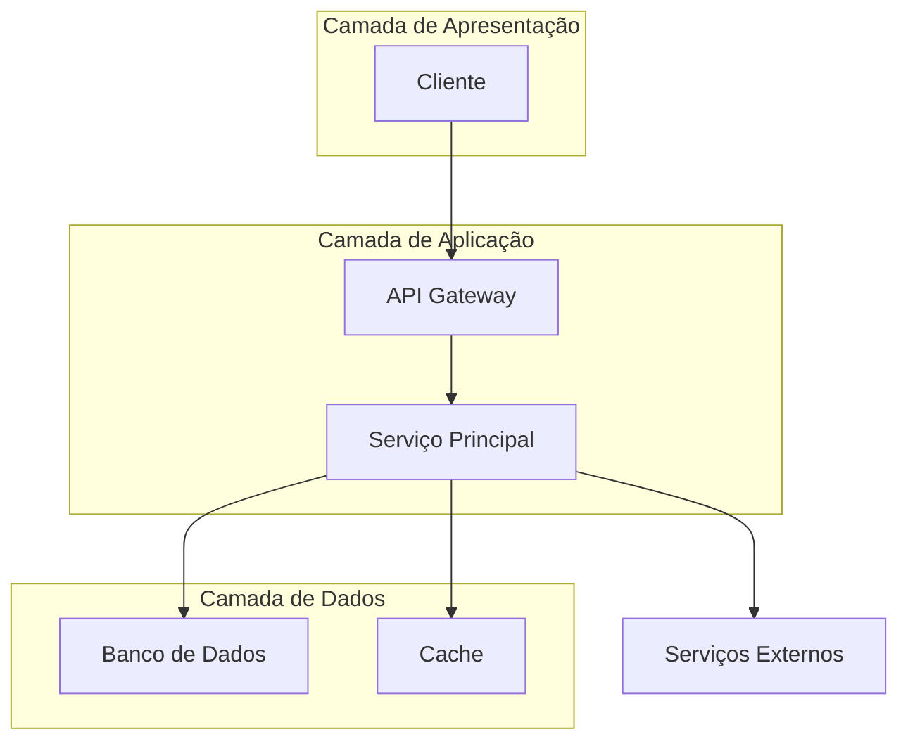
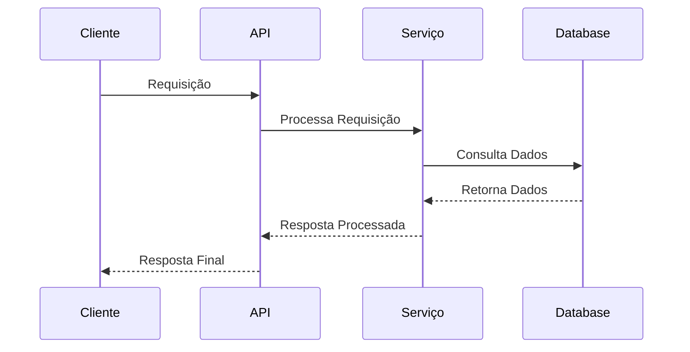

# Documentação de Funcionalidade - [Nome da Funcionalidade]

<div align="center">

**Versão**: [X.Y.Z] | **Status**: [Em Desenvolvimento/Ativo/Descontinuado] | **Última Atualização**: [DD/MM/AAAA]

[](link-status)
[](link-versao)
[](link-cobertura)

</div>

---

## 📋 Índice

- [Visão Geral](#-visão-geral)
- [Especificações Técnicas](#-especificações-técnicas)
- [Arquitetura](#-arquitetura)
- [API/Interface](#-apiinterface)
- [Casos de Uso](#-casos-de-uso)
- [Configuração](#-configuração)
- [Exemplos de Implementação](#-exemplos-de-implementação)
- [Testes](#-testes)
- [Troubleshooting](#-troubleshooting)
- [Limitações](#-limitações)
- [Roadmap](#-roadmap)
- [Referências](#-referências)

---

## 🎯 Visão Geral

### Propósito

[Descrição clara e concisa do que a funcionalidade faz e por que existe]

### Objetivos

- **Objetivo Principal**: [Objetivo primário da funcionalidade]
- **Objetivos Secundários**:
  - [Objetivo secundário 1]
  - [Objetivo secundário 2]
  - [Objetivo secundário 3]

### Benefícios

| Benefício | Descrição | Impacto |
|-----------|-----------|---------|
| **[Benefício 1]** | [Descrição detalhada] | [Alto/Médio/Baixo] |
| **[Benefício 2]** | [Descrição detalhada] | [Alto/Médio/Baixo] |
| **[Benefício 3]** | [Descrição detalhada] | [Alto/Médio/Baixo] |

### Contexto de Negócio

[Explicação do contexto de negócio, problema que resolve e valor entregue]

---

## 🔧 Especificações Técnicas

### Requisitos Funcionais

| ID | Requisito | Prioridade | Status |
|----|-----------|------------|--------|
| **RF-001** | [Descrição do requisito funcional] | [Alta/Média/Baixa] | [✅/🔄/📋] |
| **RF-002** | [Descrição do requisito funcional] | [Alta/Média/Baixa] | [✅/🔄/📋] |
| **RF-003** | [Descrição do requisito funcional] | [Alta/Média/Baixa] | [✅/🔄/📋] |

### Requisitos Não Funcionais

| ID | Categoria | Requisito | Métrica | Status |
|----|-----------|-----------|---------|--------|
| **RNF-001** | Performance | [Descrição] | [Métrica específica] | [✅/🔄/📋] |
| **RNF-002** | Segurança | [Descrição] | [Métrica específica] | [✅/🔄/📋] |
| **RNF-003** | Usabilidade | [Descrição] | [Métrica específica] | [✅/🔄/📋] |
| **RNF-004** | Escalabilidade | [Descrição] | [Métrica específica] | [✅/🔄/📋] |

### Dependências

#### Dependências Internas
- **[Módulo/Serviço 1]**: [Versão] - [Descrição da dependência]
- **[Módulo/Serviço 2]**: [Versão] - [Descrição da dependência]

#### Dependências Externas
- **[Biblioteca/Serviço 1]**: [Versão] - [Descrição da dependência]
- **[Biblioteca/Serviço 2]**: [Versão] - [Descrição da dependência]

### Tecnologias Utilizadas

| Categoria | Tecnologia | Versão | Propósito |
|-----------|------------|--------|-----------|
| **Backend** | [Tecnologia] | [Versão] | [Propósito específico] |
| **Frontend** | [Tecnologia] | [Versão] | [Propósito específico] |
| **Banco de Dados** | [Tecnologia] | [Versão] | [Propósito específico] |
| **Cache** | [Tecnologia] | [Versão] | [Propósito específico] |

---

## 🏗️ Arquitetura

### Visão Geral da Arquitetura



### Componentes Principais

#### [Nome do Componente 1]
- **Responsabilidade**: [Descrição da responsabilidade]
- **Tecnologia**: [Tecnologia utilizada]
- **Localização**: [Caminho/módulo no código]
- **Interfaces**: [APIs/interfaces expostas]

#### [Nome do Componente 2]
- **Responsabilidade**: [Descrição da responsabilidade]
- **Tecnologia**: [Tecnologia utilizada]
- **Localização**: [Caminho/módulo no código]
- **Interfaces**: [APIs/interfaces expostas]

### Fluxo de Dados



### Modelo de Dados

#### Entidades Principais

```sql
-- Exemplo de estrutura de dados
CREATE TABLE [nome_tabela] (
    id SERIAL PRIMARY KEY,
    [campo1] VARCHAR(255) NOT NULL,
    [campo2] INTEGER DEFAULT 0,
    [campo3] TIMESTAMP DEFAULT CURRENT_TIMESTAMP,
    [campo4] BOOLEAN DEFAULT FALSE
);
```

#### Relacionamentos

- **[Entidade A]** → **[Entidade B]**: [Tipo de relacionamento] ([1:1/1:N/N:N])
- **[Entidade B]** → **[Entidade C]**: [Tipo de relacionamento] ([1:1/1:N/N:N])

---

## 🔌 API/Interface

### Endpoints Principais

#### [Nome do Endpoint 1]

```http
[MÉTODO] /api/[recurso]
Content-Type: application/json
Authorization: Bearer [token]
```

**Parâmetros**:
| Parâmetro | Tipo | Obrigatório | Descrição | Exemplo |
|-----------|------|-------------|-----------|---------|
| `[param1]` | `string` | Sim | [Descrição] | `"valor"` |
| `[param2]` | `integer` | Não | [Descrição] | `123` |

**Exemplo de Requisição**:
```json
{
  "[campo1]": "[valor1]",
  "[campo2]": "[valor2]",
  "[campo3]": {
    "[subcampo]": "[valor]"
  }
}
```

**Exemplo de Resposta** (`200 OK`):
```json
{
  "success": true,
  "data": {
    "id": 123,
    "[campo1]": "[valor1]",
    "[campo2]": "[valor2]"
  },
  "meta": {
    "timestamp": "2024-01-01T12:00:00Z",
    "version": "1.0.0"
  }
}
```

**Códigos de Resposta**:
| Código | Descrição |
|--------|-----------|
| `200` | Sucesso |
| `400` | Requisição inválida |
| `401` | Não autorizado |
| `404` | Recurso não encontrado |
| `500` | Erro interno |

### Interface de Usuário

#### Componentes Principais

##### [Nome do Componente UI]
- **Localização**: [Caminho do componente]
- **Props/Parâmetros**:
  ```typescript
  interface [NomeInterface] {
    [prop1]: string;
    [prop2]: number;
    [prop3]?: boolean;
  }
  ```
- **Eventos**:
  - `on[Evento1]`: [Descrição do evento]
  - `on[Evento2]`: [Descrição do evento]

#### Estados da Interface

| Estado | Descrição | Trigger |
|--------|-----------|---------|
| **Loading** | [Descrição] | [Condição que ativa] |
| **Success** | [Descrição] | [Condição que ativa] |
| **Error** | [Descrição] | [Condição que ativa] |
| **Empty** | [Descrição] | [Condição que ativa] |

---

## 📖 Casos de Uso

### Caso de Uso 1: [Nome do Caso]

**Ator**: [Tipo de usuário]  
**Objetivo**: [Objetivo do caso de uso]  
**Pré-condições**: [Condições necessárias]

#### Fluxo Principal
1. [Passo 1]
2. [Passo 2]
3. [Passo 3]
4. [Resultado esperado]

#### Fluxos Alternativos
- **[Cenário alternativo 1]**: [Descrição e passos]
- **[Cenário alternativo 2]**: [Descrição e passos]

#### Fluxos de Exceção
- **[Exceção 1]**: [Descrição e tratamento]
- **[Exceção 2]**: [Descrição e tratamento]

### Caso de Uso 2: [Nome do Caso]

**Ator**: [Tipo de usuário]  
**Objetivo**: [Objetivo do caso de uso]

[Repetir estrutura similar]

---

## ⚙️ Configuração

### Variáveis de Ambiente

```bash
# Configurações da funcionalidade
[FEATURE]_ENABLED=[true/false]
[FEATURE]_CONFIG_PARAM1=[valor]
[FEATURE]_CONFIG_PARAM2=[valor]

# Configurações de integração
[FEATURE]_API_URL=[url]
[FEATURE]_API_KEY=[chave]
[FEATURE]_TIMEOUT=[segundos]

# Configurações de performance
[FEATURE]_CACHE_TTL=[segundos]
[FEATURE]_MAX_CONNECTIONS=[número]
```

### Arquivo de Configuração

```yaml
# config/[feature].yml
[feature]:
  enabled: true
  settings:
    [param1]: [valor1]
    [param2]: [valor2]
  
  integrations:
    [service1]:
      url: [url]
      timeout: [segundos]
    
  performance:
    cache_ttl: [segundos]
    max_requests: [número]
```

### Configuração de Banco de Dados

```sql
-- Migrations necessárias
-- Migration: [timestamp]_create_[feature]_tables.sql

CREATE TABLE [tabela] (
    -- estrutura da tabela
);

-- Índices recomendados
CREATE INDEX idx_[tabela]_[campo] ON [tabela]([campo]);
```

---

## 💻 Exemplos de Implementação

### Exemplo 1: Implementação Básica

#### Backend (Python/Flask)

```python
from flask import Blueprint, request, jsonify
from [projeto].models import [Modelo]
from [projeto].services import [Servico]

[feature]_bp = Blueprint('[feature]', __name__)

@[feature]_bp.route('/api/[recurso]', methods=['POST'])
def create_[recurso]():
    """Cria um novo recurso."""
    try:
        data = request.get_json()
        
        # Validação
        if not data or '[campo_obrigatorio]' not in data:
            return jsonify({
                'error': 'Campo obrigatório ausente'
            }), 400
        
        # Processamento
        service = [Servico]()
        result = service.create([recurso](data))
        
        return jsonify({
            'success': True,
            'data': result.to_dict()
        }), 201
        
    except Exception as e:
        return jsonify({
            'error': str(e)
        }), 500

@[feature]_bp.route('/api/[recurso]/<int:id>', methods=['GET'])
def get_[recurso](id):
    """Obtém um recurso específico."""
    try:
        service = [Servico]()
        result = service.get_by_id(id)
        
        if not result:
            return jsonify({
                'error': 'Recurso não encontrado'
            }), 404
        
        return jsonify({
            'success': True,
            'data': result.to_dict()
        })
        
    except Exception as e:
        return jsonify({
            'error': str(e)
        }), 500
```

#### Frontend (JavaScript/React)

```javascript
import React, { useState, useEffect } from 'react';
import axios from 'axios';

const [Feature]Component = () => {
  const [data, setData] = useState([]);
  const [loading, setLoading] = useState(true);
  const [error, setError] = useState(null);

  // Carregar dados
  useEffect(() => {
    const fetchData = async () => {
      try {
        setLoading(true);
        const response = await axios.get('/api/[recurso]');
        setData(response.data.data);
      } catch (err) {
        setError(err.response?.data?.error || 'Erro ao carregar dados');
      } finally {
        setLoading(false);
      }
    };

    fetchData();
  }, []);

  // Criar novo item
  const handleCreate = async (formData) => {
    try {
      const response = await axios.post('/api/[recurso]', formData);
      setData(prev => [...prev, response.data.data]);
      return { success: true };
    } catch (err) {
      return { 
        success: false, 
        error: err.response?.data?.error || 'Erro ao criar item' 
      };
    }
  };

  if (loading) return <div>Carregando...</div>;
  if (error) return <div>Erro: {error}</div>;

  return (
    <div className="[feature]-component">
      <h2>[Nome da Funcionalidade]</h2>
      
      {/* Lista de itens */}
      <div className="items-list">
        {data.map(item => (
          <div key={item.id} className="item">
            <h3>{item.[campo_titulo]}</h3>
            <p>{item.[campo_descricao]}</p>
          </div>
        ))}
      </div>
      
      {/* Formulário de criação */}
      <[Feature]Form onSubmit={handleCreate} />
    </div>
  );
};

export default [Feature]Component;
```

### Exemplo 2: Integração com Serviços Externos

```python
import requests
from typing import Dict, Any
from [projeto].config import settings

class [Feature]ExternalService:
    """Serviço para integração com API externa."""
    
    def __init__(self):
        self.base_url = settings.[FEATURE]_API_URL
        self.api_key = settings.[FEATURE]_API_KEY
        self.timeout = settings.[FEATURE]_TIMEOUT
    
    def _make_request(self, method: str, endpoint: str, data: Dict = None) -> Dict[Any, Any]:
        """Faz requisição para API externa."""
        url = f"{self.base_url}/{endpoint}"
        headers = {
            'Authorization': f'Bearer {self.api_key}',
            'Content-Type': 'application/json'
        }
        
        try:
            response = requests.request(
                method=method,
                url=url,
                json=data,
                headers=headers,
                timeout=self.timeout
            )
            response.raise_for_status()
            return response.json()
            
        except requests.exceptions.RequestException as e:
            raise Exception(f"Erro na integração externa: {str(e)}")
    
    def sync_data(self, local_data: Dict) -> Dict:
        """Sincroniza dados com serviço externo."""
        return self._make_request('POST', 'sync', local_data)
    
    def get_external_data(self, filters: Dict = None) -> Dict:
        """Obtém dados do serviço externo."""
        endpoint = 'data'
        if filters:
            params = '&'.join([f"{k}={v}" for k, v in filters.items()])
            endpoint += f"?{params}"
        
        return self._make_request('GET', endpoint)
```

---

## 🧪 Testes

### Estrutura de Testes

```
tests/
├── unit/
│   ├── test_[feature]_models.py
│   ├── test_[feature]_services.py
│   └── test_[feature]_utils.py
├── integration/
│   ├── test_[feature]_api.py
│   └── test_[feature]_external.py
├── e2e/
│   └── test_[feature]_workflow.py
└── fixtures/
    └── [feature]_data.json
```

### Testes Unitários

```python
import pytest
from unittest.mock import Mock, patch
from [projeto].services import [Feature]Service
from [projeto].models import [Feature]Model

class Test[Feature]Service:
    """Testes para o serviço da funcionalidade."""
    
    def setup_method(self):
        """Setup para cada teste."""
        self.service = [Feature]Service()
        self.mock_data = {
            '[campo1]': 'valor1',
            '[campo2]': 'valor2'
        }
    
    def test_create_[feature]_success(self):
        """Teste de criação bem-sucedida."""
        # Arrange
        expected_result = [Feature]Model(**self.mock_data)
        
        # Act
        with patch.object(self.service, '_validate_data') as mock_validate:
            mock_validate.return_value = True
            result = self.service.create(self.mock_data)
        
        # Assert
        assert result is not None
        assert result.[campo1] == self.mock_data['[campo1]']
        mock_validate.assert_called_once_with(self.mock_data)
    
    def test_create_[feature]_validation_error(self):
        """Teste de erro de validação."""
        # Arrange
        invalid_data = {'[campo_invalido]': 'valor'}
        
        # Act & Assert
        with pytest.raises(ValueError, match="Dados inválidos"):
            self.service.create(invalid_data)
    
    @patch('[projeto].services.[Feature]ExternalService')
    def test_sync_with_external_service(self, mock_external):
        """Teste de sincronização com serviço externo."""
        # Arrange
        mock_external.return_value.sync_data.return_value = {'status': 'success'}
        
        # Act
        result = self.service.sync_external(self.mock_data)
        
        # Assert
        assert result['status'] == 'success'
        mock_external.return_value.sync_data.assert_called_once()
```

### Testes de Integração

```python
import pytest
from flask import Flask
from [projeto] import create_app
from [projeto].database import db

class Test[Feature]API:
    """Testes de integração para API da funcionalidade."""
    
    @pytest.fixture
    def app(self):
        """Fixture da aplicação Flask."""
        app = create_app('testing')
        with app.app_context():
            db.create_all()
            yield app
            db.drop_all()
    
    @pytest.fixture
    def client(self, app):
        """Fixture do cliente de teste."""
        return app.test_client()
    
    def test_create_[feature]_endpoint(self, client):
        """Teste do endpoint de criação."""
        # Arrange
        data = {
            '[campo1]': 'valor1',
            '[campo2]': 'valor2'
        }
        
        # Act
        response = client.post('/api/[recurso]', json=data)
        
        # Assert
        assert response.status_code == 201
        json_data = response.get_json()
        assert json_data['success'] is True
        assert json_data['data']['[campo1]'] == data['[campo1]']
    
    def test_get_[feature]_endpoint(self, client):
        """Teste do endpoint de consulta."""
        # Arrange - criar um item primeiro
        create_response = client.post('/api/[recurso]', json={
            '[campo1]': 'valor1',
            '[campo2]': 'valor2'
        })
        item_id = create_response.get_json()['data']['id']
        
        # Act
        response = client.get(f'/api/[recurso]/{item_id}')
        
        # Assert
        assert response.status_code == 200
        json_data = response.get_json()
        assert json_data['success'] is True
        assert json_data['data']['id'] == item_id
```

### Testes End-to-End

```python
import pytest
from selenium import webdriver
from selenium.webdriver.common.by import By
from selenium.webdriver.support.ui import WebDriverWait
from selenium.webdriver.support import expected_conditions as EC

class Test[Feature]E2E:
    """Testes end-to-end da funcionalidade."""
    
    @pytest.fixture
    def driver(self):
        """Fixture do WebDriver."""
        driver = webdriver.Chrome()
        driver.implicitly_wait(10)
        yield driver
        driver.quit()
    
    def test_complete_[feature]_workflow(self, driver):
        """Teste do fluxo completo da funcionalidade."""
        # Arrange
        driver.get('http://localhost:3000/[feature]')
        
        # Act - Criar novo item
        create_button = driver.find_element(By.ID, 'create-[feature]-btn')
        create_button.click()
        
        # Preencher formulário
        name_input = driver.find_element(By.ID, '[campo1]-input')
        name_input.send_keys('Teste E2E')
        
        description_input = driver.find_element(By.ID, '[campo2]-input')
        description_input.send_keys('Descrição do teste')
        
        submit_button = driver.find_element(By.ID, 'submit-btn')
        submit_button.click()
        
        # Assert - Verificar se item foi criado
        WebDriverWait(driver, 10).until(
            EC.presence_of_element_located((By.CLASS_NAME, 'success-message'))
        )
        
        items = driver.find_elements(By.CLASS_NAME, 'item')
        assert len(items) > 0
        
        # Verificar se o item criado está na lista
        item_names = [item.find_element(By.CLASS_NAME, 'item-name').text for item in items]
        assert 'Teste E2E' in item_names
```

### Cobertura de Testes

```bash
# Executar todos os testes com cobertura
pytest --cov=[projeto] --cov-report=html --cov-report=term

# Executar apenas testes da funcionalidade
pytest tests/unit/test_[feature]* tests/integration/test_[feature]*

# Executar testes com marcadores específicos
pytest -m "[feature]" -v
```

**Meta de Cobertura**: 85% mínimo

---

## 🔍 Troubleshooting

### Problemas Comuns

#### Problema 1: [Descrição do Problema]

**Sintomas**:
- [Sintoma 1]
- [Sintoma 2]
- [Sintoma 3]

**Possíveis Causas**:
- [Causa 1]: [Descrição]
- [Causa 2]: [Descrição]

**Soluções**:
1. **[Solução 1]**:
   ```bash
   # Comandos para resolver
   [comando1]
   [comando2]
   ```

2. **[Solução 2]**:
   ```bash
   # Comandos alternativos
   [comando1]
   [comando2]
   ```

**Prevenção**:
- [Medida preventiva 1]
- [Medida preventiva 2]

#### Problema 2: [Descrição do Problema]

[Seguir estrutura similar]

### Logs e Debugging

#### Configuração de Logs

```python
import logging

# Configurar logger específico para a funcionalidade
logger = logging.getLogger('[projeto].[feature]')
logger.setLevel(logging.DEBUG)

# Handler para arquivo
file_handler = logging.FileHandler('logs/[feature].log')
file_handler.setLevel(logging.DEBUG)

# Formatter
formatter = logging.Formatter(
    '%(asctime)s - %(name)s - %(levelname)s - %(message)s'
)
file_handler.setFormatter(formatter)

logger.addHandler(file_handler)
```

#### Logs Importantes

```python
# Exemplo de logs na aplicação
logger.info(f"[Feature] iniciada para usuário {user_id}")
logger.debug(f"Dados recebidos: {data}")
logger.warning(f"Tentativa de acesso negada: {reason}")
logger.error(f"Erro ao processar: {error}", exc_info=True)
```

#### Comandos de Debug

```bash
# Verificar logs em tempo real
tail -f logs/[feature].log

# Filtrar logs por nível
grep "ERROR" logs/[feature].log

# Verificar status da funcionalidade
curl -X GET http://localhost:5000/api/[feature]/health

# Debug de banco de dados
psql -d [database] -c "SELECT * FROM [tabela] WHERE [condicao];"
```

### Monitoramento

#### Métricas Importantes

- **Taxa de Sucesso**: [X]% das operações
- **Tempo de Resposta**: [X]ms (média)
- **Throughput**: [X] requisições/segundo
- **Taxa de Erro**: [X]% das operações

#### Alertas Configurados

- **Alta Taxa de Erro**: > 5% em 5 minutos
- **Tempo de Resposta Alto**: > 2000ms em 5 minutos
- **Indisponibilidade**: Falha no health check

---

## ⚠️ Limitações

### Limitações Atuais

| Limitação | Descrição | Impacto | Workaround |
|-----------|-----------|---------|------------|
| **[Limitação 1]** | [Descrição detalhada] | [Alto/Médio/Baixo] | [Solução temporária] |
| **[Limitação 2]** | [Descrição detalhada] | [Alto/Médio/Baixo] | [Solução temporária] |
| **[Limitação 3]** | [Descrição detalhada] | [Alto/Médio/Baixo] | [Solução temporária] |

### Limitações Técnicas

- **Performance**: [Descrição da limitação de performance]
- **Escalabilidade**: [Descrição da limitação de escalabilidade]
- **Compatibilidade**: [Descrição da limitação de compatibilidade]
- **Segurança**: [Descrição da limitação de segurança]

### Limitações de Negócio

- **Funcional**: [Descrição da limitação funcional]
- **Regulatória**: [Descrição da limitação regulatória]
- **Operacional**: [Descrição da limitação operacional]

---

## 🗺️ Roadmap

### Versão Atual: [X.Y.Z]

#### Funcionalidades Implementadas
- ✅ [Funcionalidade 1]
- ✅ [Funcionalidade 2]
- ✅ [Funcionalidade 3]

#### Bugs Conhecidos
- 🐛 [Bug 1] - [Severidade] - [Previsão de correção]
- 🐛 [Bug 2] - [Severidade] - [Previsão de correção]

### Próximas Versões

#### v[X.Y.Z] - [Data Estimada]
- 🔄 [Funcionalidade em desenvolvimento 1]
- 🔄 [Funcionalidade em desenvolvimento 2]
- 📋 [Melhoria planejada 1]
- 🐛 [Correção de bug planejada]

#### v[X.Y.Z] - [Data Estimada]
- 📋 [Funcionalidade planejada 1]
- 📋 [Funcionalidade planejada 2]
- ⚡ [Melhoria de performance]
- 🔒 [Melhoria de segurança]

### Backlog de Longo Prazo

- 💡 [Ideia futura 1]
- 💡 [Ideia futura 2]
- 🔬 [Pesquisa e desenvolvimento]
- 🌟 [Funcionalidade inovadora]

---

## 📚 Referências

### Documentação Relacionada

- [Documentação da API](link-para-api-docs)
- [Guia de Arquitetura](link-para-arquitetura)
- [Padrões de Código](link-para-padroes)
- [Guia de Deploy](link-para-deploy)

### Recursos Externos

- [Documentação da Tecnologia X](link-externo)
- [Best Practices para Y](link-externo)
- [Especificação do Protocolo Z](link-externo)

### Papers e Artigos

- [Título do Paper 1](link-para-paper) - [Autor], [Ano]
- [Título do Artigo 2](link-para-artigo) - [Autor], [Ano]

### Ferramentas e Bibliotecas

- **[Nome da Ferramenta]**: [Versão] - [Link para documentação]
- **[Nome da Biblioteca]**: [Versão] - [Link para documentação]

---

<div align="center">

**Mantido por**: [Nome da Equipe/Pessoa]  
**Última Revisão**: [DD/MM/AAAA]  
**Próxima Revisão**: [DD/MM/AAAA]

---

**Para dúvidas ou sugestões, entre em contato**: [email-contato]

</div>