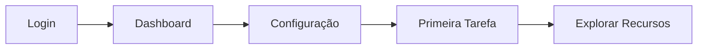
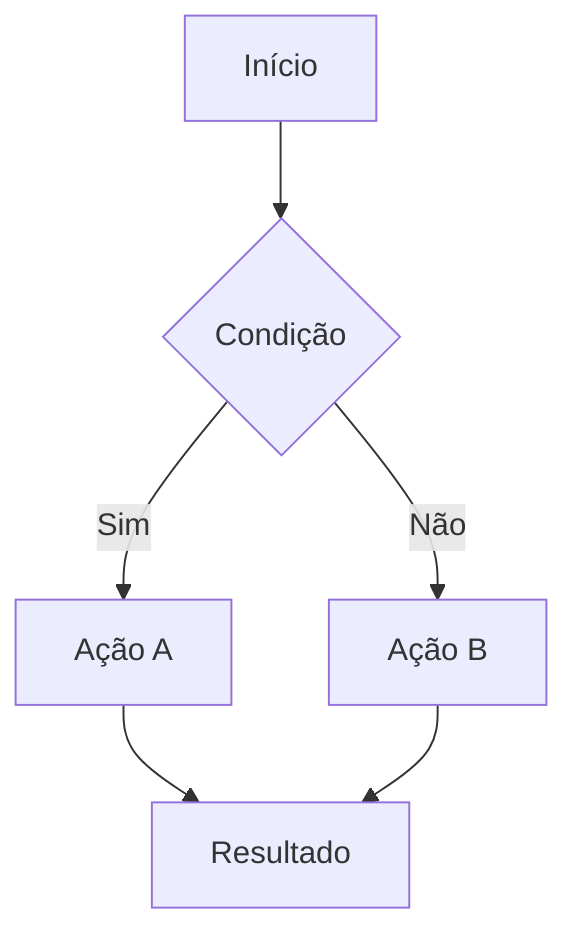

# Guia do Produto - [Nome do Produto]

<div align="center">

**Versão**: [X.Y.Z] | **Última Atualização**: [DD/MM/AAAA]

[](link-produto)
[](link-versao)
[](link-analytics)

[🚀 Acesso ao Produto](link-produto) • [📊 Dashboard](link-dashboard) • [💬 Suporte](link-suporte)

</div>

---

## 📋 Índice

- [Visão Geral](#-visão-geral)
- [Primeiros Passos](#-primeiros-passos)
- [Funcionalidades Principais](#-funcionalidades-principais)
- [Guia do Usuário](#-guia-do-usuário)
- [Casos de Uso](#-casos-de-uso)
- [Configurações](#-configurações)
- [Integrações](#-integrações)
- [Troubleshooting](#-troubleshooting)
- [FAQ](#-faq)
- [Suporte](#-suporte)

---

## 🎯 Visão Geral

### O que é o [Nome do Produto]?

[Descrição clara e concisa do produto, seu propósito e valor entregue aos usuários]

### Para quem é este produto?

- **👤 Usuário Primário**: [Descrição do usuário principal]
- **👥 Usuários Secundários**: [Outros tipos de usuários]
- **🏢 Empresas**: [Tamanho e tipo de empresa ideal]

### Principais Benefícios

| Benefício | Descrição | Impacto |
|-----------|-----------|---------|
| **⚡ [Benefício 1]** | [Descrição detalhada] | [Economia de tempo/custo] |
| **📊 [Benefício 2]** | [Descrição detalhada] | [Melhoria de processo] |
| **🔒 [Benefício 3]** | [Descrição detalhada] | [Redução de risco] |

---

## 🚀 Primeiros Passos

### Requisitos do Sistema

- **Navegador**: Chrome 90+, Firefox 88+, Safari 14+
- **Resolução**: Mínima 1024x768
- **Conexão**: Internet estável
- **Conta**: [Tipo de conta necessária]

### Acesso Inicial

#### 1. Criar Conta
```
1. Acesse [URL do produto]
2. Clique em "Criar Conta"
3. Preencha os dados obrigatórios
4. Confirme o email
5. Faça login
```

#### 2. Configuração Inicial
- **Perfil**: Complete suas informações
- **Preferências**: Configure idioma e timezone
- **Notificações**: Escolha como receber alertas
- **Integração**: Conecte sistemas externos (opcional)

### Tour Guiado



---

## ⚡ Funcionalidades Principais

### [Funcionalidade 1]

**Descrição**: [O que faz esta funcionalidade]

**Como usar**:
1. [Passo 1]
2. [Passo 2]
3. [Passo 3]

**Dicas**:
- 💡 [Dica importante 1]
- ⚠️ [Cuidado ou limitação]

### [Funcionalidade 2]

**Descrição**: [O que faz esta funcionalidade]

**Localização**: Menu → [Caminho] → [Submenu]

**Campos obrigatórios**:
- `[Campo 1]`: [Descrição]
- `[Campo 2]`: [Descrição]

### [Funcionalidade 3]

**Descrição**: [O que faz esta funcionalidade]

**Exemplo prático**:
```
Cenário: [Situação específica]
Ação: [O que fazer]
Resultado: [O que esperar]
```

---

## 📖 Guia do Usuário

### Dashboard Principal

#### Visão Geral
- **Painel Central**: [Descrição do que mostra]
- **Menu Lateral**: [Navegação principal]
- **Barra Superior**: [Ações rápidas]

#### Widgets Disponíveis
| Widget | Função | Personalização |
|--------|--------|----------------|
| **[Widget 1]** | [Função] | [Sim/Não] |
| **[Widget 2]** | [Função] | [Sim/Não] |

### Navegação

#### Menu Principal
- **🏠 Início**: Dashboard e visão geral
- **📊 [Seção 1]**: [Descrição da seção]
- **⚙️ [Seção 2]**: [Descrição da seção]
- **👤 Perfil**: Configurações pessoais

#### Atalhos de Teclado
| Atalho | Ação |
|--------|------|
| `Ctrl + N` | [Ação] |
| `Ctrl + S` | [Ação] |
| `F1` | Ajuda |

### Fluxos de Trabalho

#### Fluxo 1: [Nome do Fluxo]


**Passos detalhados**:
1. **[Passo 1]**: [Descrição detalhada]
2. **[Passo 2]**: [Descrição detalhada]
3. **[Passo 3]**: [Descrição detalhada]

---

## 💼 Casos de Uso

### Caso de Uso 1: [Nome do Caso]

**Objetivo**: [O que o usuário quer alcançar]

**Persona**: [Tipo de usuário]

**Cenário**:
> [Descrição do cenário em primeira pessoa]
> "Como [persona], eu preciso [objetivo] para [benefício]"

**Solução**:
1. [Passo específico 1]
2. [Passo específico 2]
3. [Resultado esperado]

**Tempo estimado**: [X] minutos

### Caso de Uso 2: [Nome do Caso]

**Objetivo**: [O que o usuário quer alcançar]

**Pré-requisitos**:
- [Requisito 1]
- [Requisito 2]

**Processo**:
```
Input: [O que o usuário fornece]
Processo: [O que o sistema faz]
Output: [O que o usuário recebe]
```

### Caso de Uso 3: [Nome do Caso]

**Objetivo**: [O que o usuário quer alcançar]

**Variações**:
- **Cenário A**: [Quando usar]
- **Cenário B**: [Quando usar]

---

## ⚙️ Configurações

### Configurações de Conta

#### Perfil do Usuário
- **Informações Básicas**: Nome, email, telefone
- **Foto de Perfil**: Upload de imagem (max 2MB)
- **Preferências**: Idioma, timezone, formato de data

#### Segurança
- **Senha**: Alterar senha atual
- **2FA**: Autenticação de dois fatores
- **Sessões**: Gerenciar dispositivos conectados

### Configurações do Sistema

#### Notificações
| Tipo | Email | Push | SMS |
|------|-------|------|-----|
| **Alertas Críticos** | ✅ | ✅ | ❌ |
| **Relatórios** | ✅ | ❌ | ❌ |
| **Atualizações** | ❌ | ✅ | ❌ |

#### Personalização
- **Tema**: Claro/Escuro/Auto
- **Layout**: Compacto/Padrão/Expandido
- **Dashboard**: Personalizar widgets

### Configurações Avançadas

#### API e Integrações
- **Chave API**: Gerar/renovar chave
- **Webhooks**: Configurar endpoints
- **Logs**: Visualizar histórico de API

---

## 🔗 Integrações

### Integrações Nativas

#### [Sistema 1]
**Descrição**: [O que a integração faz]

**Configuração**:
1. Acesse Configurações → Integrações
2. Selecione [Sistema 1]
3. Insira credenciais:
   - `URL`: [exemplo]
   - `Token`: [como obter]
4. Teste a conexão
5. Ative a sincronização

**Dados sincronizados**:
- [Tipo de dado 1]
- [Tipo de dado 2]

#### [Sistema 2]
**Descrição**: [O que a integração faz]

**Frequência**: [Tempo real/Horária/Diária]

### Integrações via API

#### Webhook
```json
{
  "event": "evento_tipo",
  "data": {
    "id": "123",
    "timestamp": "2024-01-01T12:00:00Z",
    "payload": {}
  }
}
```

#### REST API
```bash
# Exemplo de chamada
curl -X GET "https://api.produto.com/v1/dados" \
  -H "Authorization: Bearer SEU_TOKEN" \
  -H "Content-Type: application/json"
```

### Integrações de Terceiros

| Ferramenta | Tipo | Status | Documentação |
|------------|------|--------|--------------|
| **[Tool 1]** | CRM | ✅ Ativo | [Link] |
| **[Tool 2]** | Analytics | 🔄 Beta | [Link] |
| **[Tool 3]** | Email | 📋 Planejado | - |

---

## 🔧 Troubleshooting

### Problemas Comuns

#### Não consigo fazer login
**Sintomas**: Erro de credenciais inválidas

**Soluções**:
1. **Verificar credenciais**: Email e senha corretos
2. **Reset de senha**: Use "Esqueci minha senha"
3. **Limpar cache**: Ctrl+F5 para recarregar
4. **Verificar caps lock**: Senha é case-sensitive

#### Página não carrega
**Sintomas**: Tela branca ou erro de carregamento

**Soluções**:
1. **Verificar conexão**: Teste outros sites
2. **Atualizar navegador**: Use versão mais recente
3. **Desabilitar extensões**: Teste em modo incógnito
4. **Verificar status**: [Link para status page]

#### Dados não sincronizam
**Sintomas**: Informações desatualizadas

**Soluções**:
1. **Forçar sincronização**: Botão "Atualizar"
2. **Verificar integração**: Status da conexão
3. **Aguardar**: Sincronização pode levar até [X] minutos
4. **Contatar suporte**: Se persistir

### Códigos de Erro

| Código | Descrição | Solução |
|--------|-----------|---------|
| **E001** | [Descrição do erro] | [Como resolver] |
| **E002** | [Descrição do erro] | [Como resolver] |
| **E003** | [Descrição do erro] | [Como resolver] |

### Logs e Diagnóstico

#### Como acessar logs
1. Menu → Configurações → Diagnóstico
2. Selecione período
3. Baixe arquivo de log
4. Envie para suporte se necessário

---

## ❓ FAQ

### Geral

**P: [Pergunta frequente 1]?**
R: [Resposta detalhada]

**P: [Pergunta frequente 2]?**
R: [Resposta detalhada]

### Funcionalidades

**P: Como [ação específica]?**
R: [Passo a passo resumido]

**P: É possível [funcionalidade específica]?**
R: [Sim/Não + explicação]

### Billing e Planos

**P: Como alterar meu plano?**
R: [Processo de upgrade/downgrade]

**P: Posso cancelar a qualquer momento?**
R: [Política de cancelamento]

### Segurança

**P: Meus dados estão seguros?**
R: [Explicação sobre segurança e compliance]

**P: Vocês fazem backup dos dados?**
R: [Política de backup]

---

## 🆘 Suporte

### Canais de Atendimento

#### Suporte Técnico
- **📧 Email**: suporte@[dominio].com
- **💬 Chat**: Disponível no produto (9h-18h)
- **📞 Telefone**: [número] (casos urgentes)
- **🎫 Tickets**: Sistema interno de tickets

#### Recursos de Autoajuda
- **📚 Base de Conhecimento**: [Link]
- **🎥 Vídeos Tutoriais**: [Link]
- **👥 Comunidade**: [Link para fórum]
- **📖 Blog**: [Link para blog]

### SLA de Suporte

| Prioridade | Tempo de Resposta | Resolução |
|------------|-------------------|-----------|
| **🔴 Crítica** | 1 hora | 4 horas |
| **🟠 Alta** | 4 horas | 24 horas |
| **🟡 Média** | 24 horas | 72 horas |
| **🟢 Baixa** | 72 horas | 1 semana |

### Como Abrir um Ticket

1. **Acesse**: Menu → Suporte → Novo Ticket
2. **Categoria**: Selecione o tipo de problema
3. **Prioridade**: Avalie a urgência
4. **Descrição**: Seja específico sobre o problema
5. **Anexos**: Inclua screenshots se relevante
6. **Enviar**: Você receberá um número de protocolo

### Informações Úteis para Suporte

Sempre inclua:
- **Navegador e versão**
- **Sistema operacional**
- **Passos para reproduzir**
- **Mensagens de erro**
- **Screenshots ou vídeos**

---

## 📊 Recursos Adicionais

### Treinamentos

- **🎓 Curso Básico**: [Link] - 2 horas
- **🎓 Curso Avançado**: [Link] - 4 horas
- **🎓 Certificação**: [Link] - Disponível

### Documentação Técnica

- **📋 API Reference**: [Link]
- **🔧 Guia de Integração**: [Link]
- **📊 Relatórios Customizados**: [Link]

### Comunidade

- **👥 Fórum de Usuários**: [Link]
- **💬 Slack/Discord**: [Link]
- **📱 Grupo WhatsApp**: [Link]

---

<div align="center">

**Mantido por**: Equipe de Produto - [email-produto]  
**Última Atualização**: [DD/MM/AAAA]  
**Versão do Guia**: [X.Y.Z]

---

**Precisa de ajuda?** [📧 Contate o Suporte](mailto:suporte@dominio.com)

</div>