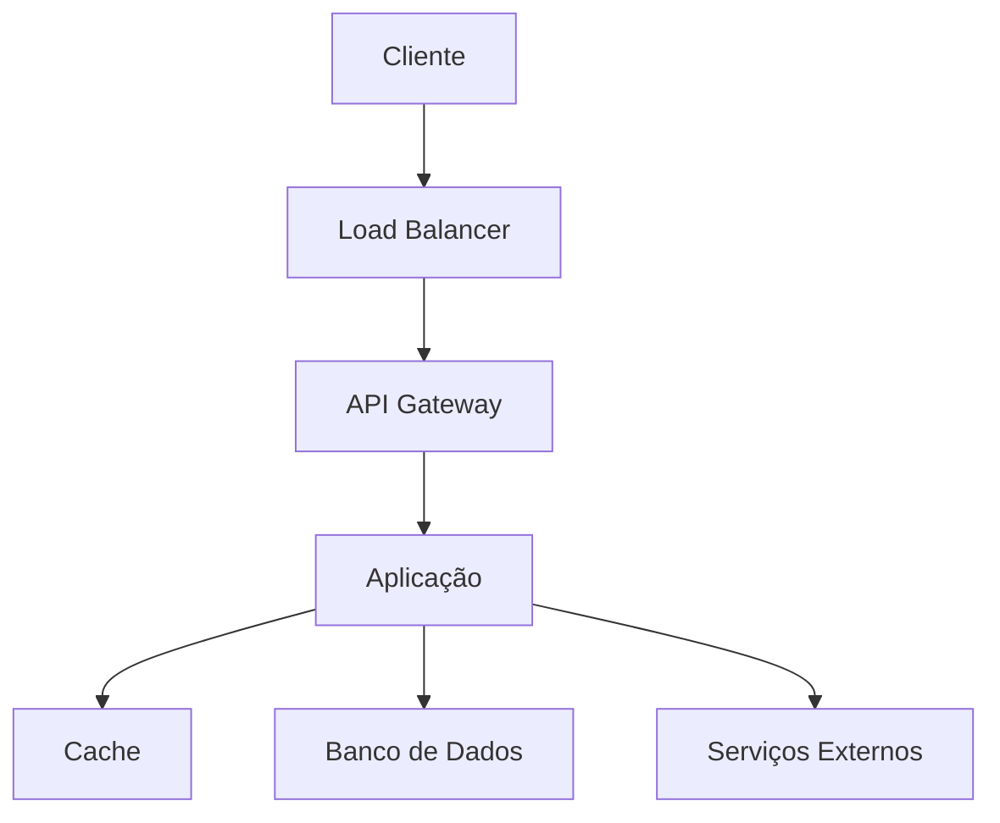

# [Nome do Projeto]

<div align="center">


**[Tagline/Descrição breve do projeto]**

[](https://github.com/usuario/repo/actions)
[](https://codecov.io/gh/usuario/repo)
[](LICENSE)
[](https://github.com/usuario/repo/releases)
[](https://github.com/usuario/repo/graphs/contributors)

[🚀 Demo](link-para-demo) • [📖 Documentação](link-para-docs) • [🐛 Reportar Bug](link-para-issues) • [💡 Solicitar Feature](link-para-feature-request)

</div>

---

## 📋 Índice

- [Sobre o Projeto](#-sobre-o-projeto)
- [Funcionalidades](#-funcionalidades)
- [Tecnologias](#-tecnologias)
- [Pré-requisitos](#-pré-requisitos)
- [Instalação](#-instalação)
- [Uso](#-uso)
- [API](#-api)
- [Configuração](#-configuração)
- [Deploy](#-deploy)
- [Testes](#-testes)
- [Contribuição](#-contribuição)
- [Roadmap](#-roadmap)
- [Licença](#-licença)
- [Contato](#-contato)
- [Agradecimentos](#-agradecimentos)

---

## 🎯 Sobre o Projeto

### Visão Geral

[Descrição detalhada do projeto, seu propósito e contexto de uso. Explique o problema que resolve e o valor que entrega.]

### Objetivos

- **Objetivo Principal**: [Objetivo principal do projeto]
- **Objetivos Específicos**:
  - [Objetivo específico 1]
  - [Objetivo específico 2]
  - [Objetivo específico 3]

### Benefícios

- ✅ **[Benefício 1]**: [Descrição do benefício]
- ✅ **[Benefício 2]**: [Descrição do benefício]
- ✅ **[Benefício 3]**: [Descrição do benefício]
- ✅ **[Benefício 4]**: [Descrição do benefício]

---

## ⚡ Funcionalidades

### Principais

- 🎯 **[Funcionalidade 1]**: [Descrição detalhada]
- 🔧 **[Funcionalidade 2]**: [Descrição detalhada]
- 📊 **[Funcionalidade 3]**: [Descrição detalhada]
- 🔒 **[Funcionalidade 4]**: [Descrição detalhada]

### Funcionalidades Avançadas

<details>
<summary>Clique para expandir</summary>

- **[Funcionalidade Avançada 1]**: [Descrição]
- **[Funcionalidade Avançada 2]**: [Descrição]
- **[Funcionalidade Avançada 3]**: [Descrição]

</details>

### Screenshots

<div align="center">

| Dashboard | Gerenciamento | Relatórios |
|-----------|---------------|------------|
|  |  |  |

</div>

---

## 🛠️ Tecnologias

### Stack Principal

| Categoria | Tecnologia | Versão | Descrição |
|-----------|------------|--------|-----------|
| **Backend** | [Tecnologia] | [Versão] | [Descrição] |
| **Frontend** | [Tecnologia] | [Versão] | [Descrição] |
| **Banco de Dados** | [Tecnologia] | [Versão] | [Descrição] |
| **Cache** | [Tecnologia] | [Versão] | [Descrição] |

### Dependências Principais

```json
{
  "dependencies": {
    "[dependencia-1]": "[versao]",
    "[dependencia-2]": "[versao]",
    "[dependencia-3]": "[versao]"
  }
}
```

### Arquitetura



---

## 📋 Pré-requisitos

### Requisitos do Sistema

- **Sistema Operacional**: [Windows/Linux/macOS] [versões]
- **Memória RAM**: [X] GB mínimo, [Y] GB recomendado
- **Espaço em Disco**: [X] GB disponível
- **Rede**: Conexão com internet para dependências

### Software Necessário

- **[Software 1]**: [Versão] ou superior - [Link para download]
- **[Software 2]**: [Versão] ou superior - [Link para download]
- **[Software 3]**: [Versão] ou superior - [Link para download]

### Verificação de Pré-requisitos

```bash
# Verificar versões instaladas
[comando-verificacao-1] --version
[comando-verificacao-2] --version
[comando-verificacao-3] --version
```

---

## 🚀 Instalação

### Instalação Rápida

```bash
# Clone o repositório
git clone https://github.com/usuario/repo.git
cd repo

# Instale as dependências
[comando-instalacao-dependencias]

# Configure o ambiente
cp .env.example .env

# Execute a aplicação
[comando-execucao]
```

### Instalação Detalhada

<details>
<summary>Clique para ver instruções detalhadas</summary>

#### 1. Clone o Repositório

```bash
git clone https://github.com/usuario/repo.git
cd repo
```

#### 2. Configure o Ambiente

```bash
# Crie o ambiente virtual (se aplicável)
[comando-ambiente-virtual]

# Ative o ambiente virtual
[comando-ativacao-ambiente]
```

#### 3. Instale as Dependências

```bash
# Instale dependências do backend
[comando-instalacao-backend]

# Instale dependências do frontend
[comando-instalacao-frontend]
```

#### 4. Configure o Banco de Dados

```bash
# Execute as migrações
[comando-migracoes]

# Popule dados iniciais (opcional)
[comando-seed]
```

#### 5. Configure Variáveis de Ambiente

```bash
# Copie o arquivo de exemplo
cp .env.example .env

# Edite as configurações
nano .env
```

</details>

### Instalação com Docker

```bash
# Clone o repositório
git clone https://github.com/usuario/repo.git
cd repo

# Execute com Docker Compose
docker-compose up -d

# Acesse a aplicação
open http://localhost:[porta]
```

### Verificação da Instalação

```bash
# Teste se a aplicação está funcionando
[comando-teste]

# Verifique os logs
[comando-logs]
```

---

## 💻 Uso

### Início Rápido

1. **Acesse a aplicação**: Abra [http://localhost:[porta]](http://localhost:[porta])
2. **Faça login**: Use as credenciais padrão ou crie uma conta
3. **Explore**: Navegue pelas funcionalidades principais

### Guia do Usuário

#### Funcionalidade Principal

```bash
# Exemplo de uso via CLI
[comando-exemplo] --parametro valor

# Exemplo de uso via API
curl -X POST http://localhost:[porta]/api/endpoint \
  -H "Content-Type: application/json" \
  -d '{"campo": "valor"}'
```

#### Casos de Uso Comuns

<details>
<summary>Caso de Uso 1: [Nome do Caso]</summary>

**Objetivo**: [Descrição do objetivo]

**Passos**:
1. [Passo 1]
2. [Passo 2]
3. [Passo 3]

**Resultado Esperado**: [Descrição do resultado]

</details>

<details>
<summary>Caso de Uso 2: [Nome do Caso]</summary>

**Objetivo**: [Descrição do objetivo]

**Passos**:
1. [Passo 1]
2. [Passo 2]
3. [Passo 3]

**Resultado Esperado**: [Descrição do resultado]

</details>

### Interface do Usuário

#### Dashboard Principal

- **Seção 1**: [Descrição da funcionalidade]
- **Seção 2**: [Descrição da funcionalidade]
- **Seção 3**: [Descrição da funcionalidade]

#### Navegação

- **Menu Principal**: Acesso às funcionalidades principais
- **Barra de Pesquisa**: Busca rápida por [itens]
- **Perfil do Usuário**: Configurações e preferências

---

## 🔌 API

### Visão Geral

A API RESTful oferece acesso programático a todas as funcionalidades do sistema.

- **Base URL**: `http://localhost:[porta]/api`
- **Formato**: JSON
- **Autenticação**: [Tipo de autenticação]
- **Rate Limiting**: [X] requisições por minuto

### Endpoints Principais

#### Autenticação

```http
POST /api/auth/login
Content-Type: application/json

{
  "email": "usuario@exemplo.com",
  "password": "senha123"
}
```

#### Recursos

```http
# Listar recursos
GET /api/recursos?page=1&limit=10

# Criar recurso
POST /api/recursos
Content-Type: application/json

{
  "nome": "Novo Recurso",
  "descricao": "Descrição do recurso"
}

# Obter recurso específico
GET /api/recursos/{id}

# Atualizar recurso
PUT /api/recursos/{id}

# Deletar recurso
DELETE /api/recursos/{id}
```

### Códigos de Resposta

| Código | Descrição |
|--------|-----------|
| 200 | Sucesso |
| 201 | Criado com sucesso |
| 400 | Requisição inválida |
| 401 | Não autorizado |
| 403 | Proibido |
| 404 | Não encontrado |
| 429 | Muitas requisições |
| 500 | Erro interno do servidor |

### Documentação Completa

📖 **[Documentação da API](link-para-docs-api)** - Swagger/OpenAPI com exemplos interativos

---

## ⚙️ Configuração

### Variáveis de Ambiente

```bash
# Configurações da aplicação
APP_NAME=[nome-da-aplicacao]
APP_ENV=[development|production]
APP_DEBUG=[true|false]
APP_URL=[url-da-aplicacao]

# Banco de dados
DB_CONNECTION=[tipo-conexao]
DB_HOST=[host]
DB_PORT=[porta]
DB_DATABASE=[nome-banco]
DB_USERNAME=[usuario]
DB_PASSWORD=[senha]

# Cache
CACHE_DRIVER=[driver-cache]
REDIS_HOST=[host-redis]
REDIS_PORT=[porta-redis]

# Segurança
JWT_SECRET=[chave-secreta]
ENCRYPTION_KEY=[chave-criptografia]

# Serviços externos
MAIL_HOST=[host-email]
MAIL_PORT=[porta-email]
MAIL_USERNAME=[usuario-email]
MAIL_PASSWORD=[senha-email]
```

### Configurações Avançadas

<details>
<summary>Configurações de Performance</summary>

```bash
# Cache
CACHE_TTL=3600
CACHE_PREFIX=app_

# Pool de conexões
DB_POOL_MIN=5
DB_POOL_MAX=20

# Workers
WORKER_PROCESSES=4
WORKER_CONNECTIONS=1000
```

</details>

<details>
<summary>Configurações de Segurança</summary>

```bash
# Rate Limiting
RATE_LIMIT_REQUESTS=100
RATE_LIMIT_WINDOW=60

# CORS
CORS_ALLOWED_ORIGINS=*
CORS_ALLOWED_METHODS=GET,POST,PUT,DELETE
CORS_ALLOWED_HEADERS=*

# SSL/TLS
SSL_ENABLED=true
SSL_CERT_PATH=/path/to/cert.pem
SSL_KEY_PATH=/path/to/key.pem
```

</details>

---

## 🚀 Deploy

### Ambientes

| Ambiente | URL | Status | Descrição |
|----------|-----|--------|-----------|
| **Desenvolvimento** | [url-dev] |  | Ambiente para desenvolvimento |
| **Homologação** | [url-hml] |  | Ambiente para testes |
| **Produção** | [url-prod] |  | Ambiente de produção |

### Deploy Local

```bash
# Build da aplicação
[comando-build]

# Execute em modo produção
[comando-producao]
```

### Deploy com Docker

```bash
# Build da imagem
docker build -t [nome-imagem] .

# Execute o container
docker run -d -p [porta-host]:[porta-container] [nome-imagem]
```

### Deploy em Nuvem

<details>
<summary>AWS</summary>

```bash
# Configure AWS CLI
aws configure

# Deploy usando [ferramenta]
[comando-deploy-aws]
```

</details>

<details>
<summary>Google Cloud</summary>

```bash
# Configure gcloud
gcloud auth login

# Deploy usando [ferramenta]
[comando-deploy-gcp]
```

</details>

<details>
<summary>Azure</summary>

```bash
# Configure Azure CLI
az login

# Deploy usando [ferramenta]
[comando-deploy-azure]
```

</details>

### CI/CD

O projeto utiliza GitHub Actions para integração e deploy contínuo:

- **Build**: Executado a cada push
- **Testes**: Executados automaticamente
- **Deploy**: Automático para homologação, manual para produção

---

## 🧪 Testes

### Executar Testes

```bash
# Todos os testes
[comando-todos-testes]

# Testes unitários
[comando-testes-unitarios]

# Testes de integração
[comando-testes-integracao]

# Testes e2e
[comando-testes-e2e]

# Cobertura de testes
[comando-cobertura]
```

### Estrutura de Testes

```
tests/
├── unit/           # Testes unitários
├── integration/    # Testes de integração
├── e2e/           # Testes end-to-end
├── fixtures/      # Dados de teste
└── helpers/       # Utilitários de teste
```

### Métricas de Qualidade

- **Cobertura de Testes**: 
- **Qualidade do Código**: 
- **Vulnerabilidades**: 

---

## 🤝 Contribuição

Contribuições são sempre bem-vindas! Veja como você pode ajudar:

### Como Contribuir

1. **Fork** o projeto
2. **Crie** uma branch para sua feature (`git checkout -b feature/AmazingFeature`)
3. **Commit** suas mudanças (`git commit -m 'Add some AmazingFeature'`)
4. **Push** para a branch (`git push origin feature/AmazingFeature`)
5. **Abra** um Pull Request

### Diretrizes

- Siga os padrões de código do projeto
- Escreva testes para novas funcionalidades
- Atualize a documentação quando necessário
- Use mensagens de commit descritivas

### Tipos de Contribuição

- 🐛 **Bug Reports**: Reporte bugs usando [GitHub Issues](link-para-issues)
- 💡 **Feature Requests**: Sugira novas funcionalidades
- 📖 **Documentação**: Melhore a documentação
- 🧪 **Testes**: Adicione ou melhore testes
- 🎨 **Design**: Melhore a interface do usuário

### Código de Conduta

Este projeto adere ao [Código de Conduta](CODE_OF_CONDUCT.md). Ao participar, você concorda em seguir estes termos.

---

## 🗺️ Roadmap

### Versão Atual: [X.Y.Z]

- ✅ [Funcionalidade implementada 1]
- ✅ [Funcionalidade implementada 2]
- ✅ [Funcionalidade implementada 3]

### Próximas Versões

#### v[X.Y.Z] - [Data Estimada]
- 🔄 [Funcionalidade em desenvolvimento 1]
- 🔄 [Funcionalidade em desenvolvimento 2]
- 📋 [Funcionalidade planejada 1]

#### v[X.Y.Z] - [Data Estimada]
- 📋 [Funcionalidade planejada 2]
- 📋 [Funcionalidade planejada 3]
- 💡 [Ideia para futuro 1]

### Backlog

- 💡 [Ideia para futuro 2]
- 💡 [Ideia para futuro 3]
- 🔬 [Pesquisa e desenvolvimento]

Veja o [Roadmap Completo](link-para-roadmap) para mais detalhes.

---

## 📊 Status do Projeto

### Métricas

| Métrica | Valor |
|---------|-------|
| **Linhas de Código** |  |
| **Commits** |  |
| **Issues Abertas** |  |
| **Pull Requests** |  |
| **Contribuidores** |  |

### Atividade Recente

- 📅 **Último Release**: [Data] - [Versão]
- 🔄 **Último Commit**: [Data]
- 🐛 **Issues Resolvidas**: [Número] esta semana
- 🚀 **Features Adicionadas**: [Número] este mês

---

## 📄 Licença

Este projeto está licenciado sob a Licença [Nome da Licença] - veja o arquivo [LICENSE](LICENSE) para detalhes.

### Resumo da Licença

- ✅ **Uso Comercial**: Permitido
- ✅ **Modificação**: Permitida
- ✅ **Distribuição**: Permitida
- ✅ **Uso Privado**: Permitido
- ❌ **Responsabilidade**: Não assumida
- ❌ **Garantia**: Não fornecida

---

## 📞 Contato

### Equipe de Desenvolvimento

- **Product Owner**: [Nome] - [email] - [LinkedIn]
- **Tech Lead**: [Nome] - [email] - [LinkedIn]
- **Desenvolvedor Principal**: [Nome] - [email] - [LinkedIn]

### Canais de Suporte

- 📧 **Email**: [email-suporte]
- 💬 **Discord**: [link-discord]
- 🐦 **Twitter**: [@usuario](link-twitter)
- 💼 **LinkedIn**: [link-linkedin]

### Links do Projeto

- 🏠 **Homepage**: [link-homepage]
- 📖 **Documentação**: [link-documentacao]
- 🐛 **Issues**: [link-issues]
- 🚀 **Releases**: [link-releases]

---

## 🙏 Agradecimentos

### Contribuidores

Obrigado a todas essas pessoas incríveis que contribuíram para este projeto:

<a href="https://github.com/usuario/repo/graphs/contributors">
  
</a>

### Inspirações e Referências

- **[Projeto/Ferramenta 1]**: [Descrição da inspiração]
- **[Projeto/Ferramenta 2]**: [Descrição da inspiração]
- **[Projeto/Ferramenta 3]**: [Descrição da inspiração]

### Tecnologias e Bibliotecas

Agradecemos às comunidades open source das tecnologias utilizadas:

- [Tecnologia 1] - [Link]
- [Tecnologia 2] - [Link]
- [Tecnologia 3] - [Link]

### Patrocinadores

<div align="center">

**Apoie este projeto**

[](link-patrocinio)

</div>

---

<div align="center">

**Feito com ❤️ pela equipe [Nome da Equipe]**

⭐ **Se este projeto te ajudou, considere dar uma estrela!** ⭐

</div>