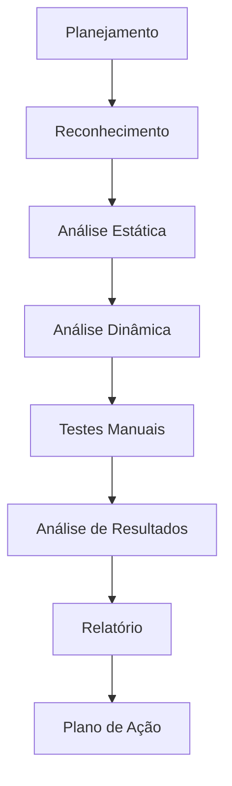
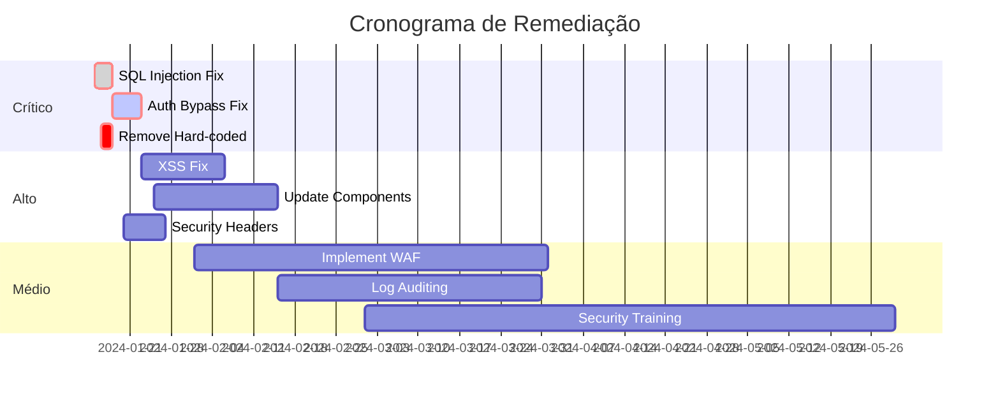

# Security Assessment - [Nome do Projeto]

<div align="center">

**Versão**: [X.Y.Z] | **Data da Avaliação**: [DD/MM/AAAA] | **Auditor**: [Nome do Auditor]

[](link-assessment)
[](https://owasp.org/Top10/)
[](link-compliance)

[📊 Dashboard](link-dashboard) • [🔍 Scan Results](link-scan) • [📋 Action Plan](link-plan)

</div>

---

## 📋 Índice

- [Resumo Executivo](#-resumo-executivo)
- [Escopo da Avaliação](#-escopo-da-avaliação)
- [Metodologia](#-metodologia)
- [Vulnerabilidades Identificadas](#-vulnerabilidades-identificadas)
- [Análise OWASP Top 10](#-análise-owasp-top-10)
- [Testes de Penetração](#-testes-de-penetração)
- [Análise de Código](#-análise-de-código)
- [Configuração de Infraestrutura](#-configuração-de-infraestrutura)
- [Compliance e Regulamentações](#-compliance-e-regulamentações)
- [Plano de Ação](#-plano-de-ação)
- [Recomendações](#-recomendações)
- [Anexos](#-anexos)

---

## 📊 Resumo Executivo

### Visão Geral

[Resumo da avaliação de segurança, principais achados e recomendações críticas]

### Score de Segurança

<div align="center">

**Score Geral: [X]/10**

| Categoria | Score | Status |
|-----------|-------|--------|
| **Autenticação** | [X]/10 |  |
| **Autorização** | [X]/10 |  |
| **Criptografia** | [X]/10 |  |
| **Validação de Entrada** | [X]/10 |  |
| **Configuração** | [X]/10 |  |

</div>

### Resumo de Vulnerabilidades

| Severidade | Quantidade | Resolvidas | Pendentes |
|------------|------------|------------|-----------|
| **🔴 Crítica** | [X] | [X] | [X] |
| **🟠 Alta** | [X] | [X] | [X] |
| **🟡 Média** | [X] | [X] | [X] |
| **🟢 Baixa** | [X] | [X] | [X] |
| **🔵 Info** | [X] | [X] | [X] |

### Principais Achados

- **🔴 [Vulnerabilidade Crítica]**: [Descrição breve]
- **🟠 [Vulnerabilidade Alta]**: [Descrição breve]
- **🟡 [Vulnerabilidade Média]**: [Descrição breve]

---

## 🎯 Escopo da Avaliação

### Aplicações Avaliadas

| Aplicação | Versão | URL | Tecnologia |
|-----------|--------|-----|------------|
| **[Nome da App]** | [X.Y.Z] | [URL] | [Flask/Vue.js] |
| **[API Backend]** | [X.Y.Z] | [URL] | [Flask-RESTX] |
| **[Frontend]** | [X.Y.Z] | [URL] | [Vue.js 3] |

### Infraestrutura

- **Servidores**: [Quantidade] servidores
- **Banco de Dados**: [Tipo e versão]
- **Load Balancer**: [Tipo]
- **CDN**: [Provedor]
- **Cloud Provider**: [AWS/Azure/GCP]

### Período de Avaliação

- **Início**: [DD/MM/AAAA]
- **Término**: [DD/MM/AAAA]
- **Duração**: [X] dias úteis

### Limitações

- [Limitação 1 do escopo]
- [Limitação 2 do escopo]
- [Limitação 3 do escopo]

---

## 🔬 Metodologia

### Frameworks Utilizados

- **OWASP Top 10 2021**: Vulnerabilidades web mais críticas
- **NIST Cybersecurity Framework**: Identificar, Proteger, Detectar, Responder, Recuperar
- **ISO 27001**: Gestão de segurança da informação
- **LGPD**: Conformidade com proteção de dados

### Ferramentas de Análise

#### Análise Estática (SAST)
- **SonarQube**: Análise de qualidade e segurança do código
- **Bandit**: Scanner de segurança para Python
- **ESLint Security**: Regras de segurança para JavaScript

#### Análise Dinâmica (DAST)
- **OWASP ZAP**: Proxy de interceptação e scanner
- **Burp Suite**: Testes de penetração web
- **Nmap**: Descoberta de rede e auditoria de segurança

#### Análise de Dependências (SCA)
- **Snyk**: Vulnerabilidades em dependências
- **Safety**: Verificação de pacotes Python
- **npm audit**: Auditoria de pacotes Node.js

### Processo de Avaliação



---

## 🚨 Vulnerabilidades Identificadas

### 🔴 Críticas

#### VULN-001: [Nome da Vulnerabilidade]
**Severidade**: Crítica  
**CVSS Score**: [X.X]  
**CWE**: [CWE-XXX]

**Descrição**:
[Descrição detalhada da vulnerabilidade]

**Localização**:
- **Arquivo**: `[caminho/para/arquivo.py]`
- **Linha**: [XXX]
- **Endpoint**: `[/api/endpoint]`

**Impacto**:
- [Impacto 1]
- [Impacto 2]
- [Impacto 3]

**Prova de Conceito**:
```bash
# Exemplo de exploração
curl -X POST "https://app.exemplo.com/api/login" \
  -H "Content-Type: application/json" \
  -d '{"username": "admin'\''--", "password": "any"}'
```

**Remediação**:
```python
# Código vulnerável
query = f"SELECT * FROM users WHERE username = '{username}'"

# Código corrigido
query = "SELECT * FROM users WHERE username = %s"
cursor.execute(query, (username,))
```

**Prazo**: [X] dias  
**Responsável**: [Nome]  
**Status**: [Pendente/Em Progresso/Resolvido]

---

### 🟠 Altas

#### VULN-002: [Nome da Vulnerabilidade]
**Severidade**: Alta  
**CVSS Score**: [X.X]

**Descrição**: [Descrição resumida]

**Impacto**: [Impacto principal]

**Remediação**: [Solução resumida]

**Prazo**: [X] dias

---

### 🟡 Médias

#### VULN-003: [Nome da Vulnerabilidade]
**Severidade**: Média  
**CVSS Score**: [X.X]

**Descrição**: [Descrição resumida]

**Remediação**: [Solução resumida]

---

## 🛡️ Análise OWASP Top 10

### A01:2021 – Broken Access Control

**Status**: ⚠️ Vulnerável  
**Achados**: [X] vulnerabilidades

**Problemas Identificados**:
- Falta de validação de autorização em endpoints sensíveis
- Exposição de IDs sequenciais permitindo enumeração
- Bypass de controle de acesso via manipulação de parâmetros

**Recomendações**:
- Implementar controle de acesso baseado em roles (RBAC)
- Validar autorização em todas as operações
- Usar UUIDs em vez de IDs sequenciais

### A02:2021 – Cryptographic Failures

**Status**: ✅ Seguro  
**Achados**: [X] vulnerabilidades menores

**Pontos Positivos**:
- HTTPS implementado corretamente
- Senhas hasheadas com bcrypt
- Tokens JWT assinados adequadamente

**Melhorias**:
- Implementar rotação automática de chaves
- Usar algoritmos mais robustos para dados sensíveis

### A03:2021 – Injection

**Status**: 🔴 Crítico  
**Achados**: [X] vulnerabilidades

**Problemas Identificados**:
- SQL Injection em endpoints de busca
- Command Injection em funcionalidade de upload
- XSS refletido em campos de entrada

**Recomendações**:
- Usar prepared statements para todas as queries
- Implementar validação rigorosa de entrada
- Sanitizar outputs antes da renderização

### A04:2021 – Insecure Design

**Status**: ⚠️ Atenção  
**Achados**: [X] problemas de design

**Problemas Identificados**:
- Falta de rate limiting em endpoints críticos
- Ausência de logs de auditoria
- Processo de recuperação de senha inseguro

### A05:2021 – Security Misconfiguration

**Status**: 🟡 Parcialmente Seguro  
**Achados**: [X] configurações inseguras

**Problemas Identificados**:
- Headers de segurança ausentes
- Informações de debug expostas em produção
- Permissões excessivas em arquivos

### A06:2021 – Vulnerable Components

**Status**: 🔴 Crítico  
**Achados**: [X] componentes vulneráveis

**Componentes Vulneráveis**:
- Flask 1.1.4 (CVE-2023-30861)
- jQuery 3.5.1 (CVE-2020-11022)
- Pillow 8.3.2 (CVE-2022-22817)

### A07:2021 – Authentication Failures

**Status**: ⚠️ Vulnerável  
**Achados**: [X] falhas de autenticação

**Problemas Identificados**:
- Ausência de bloqueio por tentativas de login
- Tokens de sessão não invalidados no logout
- Política de senhas fraca

### A08:2021 – Software Integrity Failures

**Status**: ✅ Seguro  
**Achados**: Nenhuma vulnerabilidade crítica

**Pontos Positivos**:
- Dependências verificadas com checksums
- Pipeline CI/CD com verificações de integridade

### A09:2021 – Logging Failures

**Status**: 🟡 Parcialmente Implementado  
**Achados**: [X] falhas de logging

**Problemas Identificados**:
- Logs insuficientes para auditoria
- Informações sensíveis em logs
- Falta de monitoramento em tempo real

### A10:2021 – Server-Side Request Forgery

**Status**: ⚠️ Vulnerável  
**Achados**: [X] vulnerabilidades SSRF

**Problemas Identificados**:
- Validação insuficiente de URLs externas
- Possibilidade de acesso a recursos internos

---

## 🎯 Testes de Penetração

### Metodologia

Seguindo a metodologia **OWASP Testing Guide v4.0**:

1. **Information Gathering**
2. **Configuration Management**
3. **Authentication Testing**
4. **Authorization Testing**
5. **Session Management**
6. **Input Validation**
7. **Error Handling**
8. **Cryptography**
9. **Business Logic**
10. **Client Side Testing**

### Resultados dos Testes

#### Authentication Bypass
**Teste**: Tentativa de bypass de autenticação  
**Resultado**: ❌ Falhou  
**Detalhes**: Possível bypass via manipulação de cookies

```bash
# Teste realizado
curl -X GET "https://app.exemplo.com/admin" \
  -H "Cookie: role=admin; user_id=1"
```

#### SQL Injection
**Teste**: Injeção SQL em formulários  
**Resultado**: ❌ Falhou  
**Detalhes**: Vulnerável em campo de busca

```sql
-- Payload utilizado
' UNION SELECT username, password FROM users--
```

#### Cross-Site Scripting (XSS)
**Teste**: XSS refletido e armazenado  
**Resultado**: ⚠️ Parcialmente vulnerável  
**Detalhes**: XSS refletido em parâmetros de URL

```javascript
// Payload utilizado
<script>alert('XSS')</script>
```

#### File Upload Vulnerabilities
**Teste**: Upload de arquivos maliciosos  
**Resultado**: ❌ Falhou  
**Detalhes**: Possível upload de shells PHP

---

## 🔍 Análise de Código

### Ferramentas Utilizadas

- **SonarQube**: Análise estática de qualidade
- **Bandit**: Scanner de segurança Python
- **ESLint**: Análise JavaScript/TypeScript
- **Semgrep**: Análise de padrões de segurança

### Resultados por Categoria

#### Vulnerabilidades de Segurança
```
Total: 45 issues
├── Critical: 3
├── High: 8
├── Medium: 15
├── Low: 12
└── Info: 7
```

#### Principais Padrões Inseguros

**Hard-coded Secrets**:
```python
# Encontrado em: config.py:15
SECRET_KEY = "super-secret-key-123"  # ❌ Hard-coded
DATABASE_PASSWORD = "admin123"       # ❌ Hard-coded

# Recomendação
SECRET_KEY = os.environ.get('SECRET_KEY')  # ✅ Correto
```

**SQL Injection**:
```python
# Encontrado em: models/user.py:45
query = f"SELECT * FROM users WHERE id = {user_id}"  # ❌ Vulnerável

# Recomendação
query = "SELECT * FROM users WHERE id = %s"  # ✅ Correto
cursor.execute(query, (user_id,))
```

**Weak Cryptography**:
```python
# Encontrado em: utils/crypto.py:12
import md5  # ❌ Algoritmo fraco

# Recomendação
import hashlib
hashlib.sha256(data.encode()).hexdigest()  # ✅ Correto
```

### Métricas de Qualidade

| Métrica | Valor | Threshold | Status |
|---------|-------|-----------|--------|
| **Cobertura de Testes** | 65% | 80% | ❌ |
| **Duplicação de Código** | 8% | 5% | ❌ |
| **Complexidade Ciclomática** | 12 | 10 | ❌ |
| **Débito Técnico** | 2.5h | 1h | ❌ |

---

## 🏗️ Configuração de Infraestrutura

### Análise de Servidores

#### Web Server (Nginx)
**Versão**: nginx/1.18.0  
**Status**: ⚠️ Desatualizado

**Configurações Inseguras**:
```nginx
# nginx.conf - Problemas identificados
server_tokens on;                    # ❌ Expõe versão
ssl_protocols TLSv1 TLSv1.1 TLSv1.2; # ❌ Protocolos fracos
add_header X-Frame-Options DENY;     # ❌ Header ausente
```

**Configuração Recomendada**:
```nginx
# nginx.conf - Configuração segura
server_tokens off;
ssl_protocols TLSv1.2 TLSv1.3;
ssl_ciphers ECDHE-RSA-AES256-GCM-SHA512:DHE-RSA-AES256-GCM-SHA512;

add_header X-Frame-Options DENY;
add_header X-Content-Type-Options nosniff;
add_header X-XSS-Protection "1; mode=block";
add_header Strict-Transport-Security "max-age=31536000; includeSubDomains";
```

#### Application Server (Gunicorn)
**Versão**: gunicorn 20.1.0  
**Status**: ✅ Atualizado

**Configurações Seguras**:
- Executando como usuário não-privilegiado
- Logs de acesso habilitados
- Timeout configurado adequadamente

#### Database Server (PostgreSQL)
**Versão**: PostgreSQL 13.7  
**Status**: ⚠️ Desatualizado

**Problemas Identificados**:
- Conexões não criptografadas
- Usuário com privilégios excessivos
- Backup não criptografado

### Análise de Rede

#### Portas Abertas
```bash
# Scan realizado com nmap
PORT     STATE SERVICE
22/tcp   open  ssh
80/tcp   open  http
443/tcp  open  https
5432/tcp open  postgresql  # ❌ Exposto externamente
```

#### Certificados SSL
**Domínio**: app.exemplo.com  
**Emissor**: Let's Encrypt  
**Validade**: 90 dias  
**Status**: ✅ Válido

**Configuração SSL**:
- TLS 1.2/1.3 ✅
- Perfect Forward Secrecy ✅
- HSTS habilitado ✅
- Certificate Transparency ✅

---

## 📋 Compliance e Regulamentações

### LGPD (Lei Geral de Proteção de Dados)

#### Conformidade Atual: 70%

**Requisitos Atendidos**:
- ✅ Consentimento explícito para coleta de dados
- ✅ Política de privacidade disponível
- ✅ Processo de exclusão de dados implementado
- ✅ Logs de acesso a dados pessoais

**Requisitos Pendentes**:
- ❌ Nomeação de DPO (Data Protection Officer)
- ❌ Relatório de impacto à proteção de dados
- ❌ Processo de notificação de vazamentos
- ❌ Auditoria regular de tratamento de dados

### ISO 27001

#### Controles Implementados: 65%

**Domínios Avaliados**:

| Domínio | Implementado | Parcial | Não Implementado |
|---------|--------------|---------|------------------|
| **A.5 - Políticas de Segurança** | 2 | 1 | 0 |
| **A.6 - Organização da Segurança** | 1 | 2 | 1 |
| **A.7 - Segurança de RH** | 0 | 2 | 2 |
| **A.8 - Gestão de Ativos** | 3 | 1 | 1 |
| **A.9 - Controle de Acesso** | 4 | 3 | 2 |
| **A.10 - Criptografia** | 2 | 1 | 0 |

### OWASP ASVS (Application Security Verification Standard)

#### Nível de Verificação: Nível 2 (Padrão)

**Categorias Avaliadas**:

| Categoria | Score | Status |
|-----------|-------|--------|
| **V1 - Arquitetura** | 7/10 | ⚠️ |
| **V2 - Autenticação** | 6/10 | ❌ |
| **V3 - Gestão de Sessão** | 8/10 | ✅ |
| **V4 - Controle de Acesso** | 5/10 | ❌ |
| **V5 - Validação de Entrada** | 4/10 | ❌ |

---

## 📋 Plano de Ação

### Prioridade Crítica (0-7 dias)

| ID | Vulnerabilidade | Responsável | Prazo | Status |
|----|-----------------|-------------|-------|--------|
| VULN-001 | SQL Injection em busca | Dev Team | 3 dias | 🔄 |
| VULN-002 | Authentication Bypass | Security Team | 5 dias | 📋 |
| VULN-003 | Hard-coded Secrets | DevOps Team | 2 dias | 📋 |

### Prioridade Alta (7-30 dias)

| ID | Vulnerabilidade | Responsável | Prazo | Status |
|----|-----------------|-------------|-------|--------|
| VULN-004 | XSS Refletido | Dev Team | 14 dias | 📋 |
| VULN-005 | Componentes Desatualizados | DevOps Team | 21 dias | 📋 |
| VULN-006 | Headers de Segurança | DevOps Team | 7 dias | 📋 |

### Prioridade Média (30-90 dias)

| ID | Item | Responsável | Prazo | Status |
|----|------|-------------|-------|--------|
| SEC-001 | Implementar WAF | Security Team | 60 dias | 📋 |
| SEC-002 | Auditoria de Logs | Dev Team | 45 dias | 📋 |
| SEC-003 | Treinamento de Segurança | HR Team | 90 dias | 📋 |

### Cronograma de Implementação



---

## 💡 Recomendações

### Imediatas (0-7 dias)

#### 1. Correção de Vulnerabilidades Críticas
- **SQL Injection**: Implementar prepared statements
- **Authentication Bypass**: Revisar lógica de autenticação
- **Hard-coded Secrets**: Migrar para variáveis de ambiente

#### 2. Configurações de Segurança
```python
# Configurações Flask recomendadas
app.config.update(
    SECRET_KEY=os.environ.get('SECRET_KEY'),
    SESSION_COOKIE_SECURE=True,
    SESSION_COOKIE_HTTPONLY=True,
    SESSION_COOKIE_SAMESITE='Lax',
    PERMANENT_SESSION_LIFETIME=timedelta(hours=1)
)
```

### Curto Prazo (7-30 dias)

#### 1. Implementar Security Headers
```nginx
add_header Content-Security-Policy "default-src 'self'; script-src 'self' 'unsafe-inline'";
add_header X-Frame-Options DENY;
add_header X-Content-Type-Options nosniff;
add_header Referrer-Policy strict-origin-when-cross-origin;
```

#### 2. Atualizar Componentes
```bash
# Atualizar dependências Python
pip install --upgrade flask==2.3.3
pip install --upgrade pillow==10.0.1

# Atualizar dependências JavaScript
npm update jquery@3.7.1
npm update vue@3.3.4
```

#### 3. Implementar Rate Limiting
```python
from flask_limiter import Limiter
from flask_limiter.util import get_remote_address

limiter = Limiter(
    app,
    key_func=get_remote_address,
    default_limits=["200 per day", "50 per hour"]
)

@app.route('/api/login', methods=['POST'])
@limiter.limit("5 per minute")
def login():
    # Implementação do login
    pass
```

### Médio Prazo (30-90 dias)

#### 1. Web Application Firewall (WAF)
- Implementar AWS WAF ou Cloudflare
- Configurar regras OWASP Core Rule Set
- Monitoramento de ataques em tempo real

#### 2. Sistema de Monitoramento
```python
# Implementar logging de segurança
import logging
from flask import request

security_logger = logging.getLogger('security')

@app.before_request
def log_security_events():
    if request.endpoint in ['login', 'admin']:
        security_logger.info(f"Access attempt: {request.remote_addr} -> {request.endpoint}")
```

#### 3. Backup e Disaster Recovery
- Backup automatizado e criptografado
- Testes regulares de recuperação
- Plano de continuidade de negócios

### Longo Prazo (90+ dias)

#### 1. Security by Design
- Threat modeling para novas funcionalidades
- Security champions program
- Secure coding guidelines

#### 2. Compliance Framework
- Certificação ISO 27001
- Auditoria externa anual
- Programa de bug bounty

#### 3. Zero Trust Architecture
- Microsegmentação de rede
- Autenticação multifator obrigatória
- Monitoramento comportamental

---

## 📎 Anexos

### Anexo A: Ferramentas Utilizadas

| Ferramenta | Versão | Propósito | Licença |
|------------|--------|-----------|---------|
| **OWASP ZAP** | 2.12.0 | DAST Scanner | Apache 2.0 |
| **SonarQube** | 9.9 | SAST Analysis | LGPL |
| **Burp Suite** | 2023.10 | Manual Testing | Commercial |
| **Nmap** | 7.94 | Network Scanning | GPL |
| **Snyk** | 1.1200.0 | Dependency Scan | Commercial |

### Anexo B: Configurações Recomendadas

#### Flask Security Configuration
```python
# config/security.py
import os
from datetime import timedelta

class SecurityConfig:
    # Session Security
    SECRET_KEY = os.environ.get('SECRET_KEY')
    SESSION_COOKIE_SECURE = True
    SESSION_COOKIE_HTTPONLY = True
    SESSION_COOKIE_SAMESITE = 'Lax'
    PERMANENT_SESSION_LIFETIME = timedelta(hours=1)
    
    # CSRF Protection
    WTF_CSRF_ENABLED = True
    WTF_CSRF_TIME_LIMIT = 3600
    
    # Security Headers
    SECURITY_HEADERS = {
        'Strict-Transport-Security': 'max-age=31536000; includeSubDomains',
        'X-Content-Type-Options': 'nosniff',
        'X-Frame-Options': 'DENY',
        'X-XSS-Protection': '1; mode=block'
    }
```

#### Nginx Security Configuration
```nginx
# /etc/nginx/conf.d/security.conf
server {
    # SSL Configuration
    ssl_protocols TLSv1.2 TLSv1.3;
    ssl_ciphers ECDHE-RSA-AES256-GCM-SHA512:DHE-RSA-AES256-GCM-SHA512;
    ssl_prefer_server_ciphers off;
    
    # Security Headers
    add_header Strict-Transport-Security "max-age=31536000; includeSubDomains" always;
    add_header X-Frame-Options DENY always;
    add_header X-Content-Type-Options nosniff always;
    add_header X-XSS-Protection "1; mode=block" always;
    add_header Referrer-Policy "strict-origin-when-cross-origin" always;
    
    # Hide Server Information
    server_tokens off;
    
    # Rate Limiting
    limit_req_zone $binary_remote_addr zone=login:10m rate=5r/m;
    limit_req_zone $binary_remote_addr zone=api:10m rate=100r/m;
}
```

### Anexo C: Checklist de Segurança

#### Desenvolvimento Seguro
- [ ] Validação de entrada implementada
- [ ] Sanitização de saída implementada
- [ ] Prepared statements para queries
- [ ] Controle de acesso em todos os endpoints
- [ ] Logs de auditoria implementados
- [ ] Tratamento seguro de erros
- [ ] Criptografia para dados sensíveis
- [ ] Validação de uploads de arquivo

#### Configuração Segura
- [ ] HTTPS obrigatório
- [ ] Headers de segurança configurados
- [ ] Cookies seguros configurados
- [ ] Rate limiting implementado
- [ ] Firewall configurado
- [ ] Monitoramento ativo
- [ ] Backup automatizado
- [ ] Logs centralizados

#### Processo de Segurança
- [ ] Code review obrigatório
- [ ] Testes de segurança automatizados
- [ ] Análise de dependências
- [ ] Treinamento de segurança
- [ ] Incident response plan
- [ ] Vulnerability disclosure policy
- [ ] Regular security assessments
- [ ] Compliance monitoring

---

<div align="center">

**Preparado por**: [Nome do Auditor] - [Certificações]  
**Revisado por**: [Nome do Revisor] - [Data]  
**Aprovado por**: [Nome do Aprovador] - [Data]

---

**Confidencial**: Este documento contém informações sensíveis de segurança  
**Classificação**: [Interna/Confidencial/Restrita]

</div>